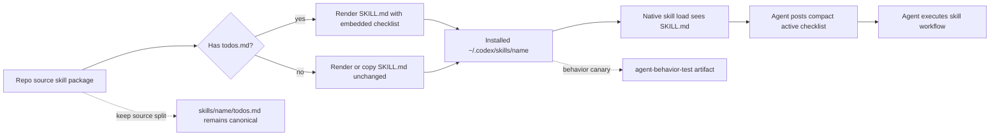

# TASK-0181: embed skill todos during install

## Summary
Agents are still treating `todos.md` as an optional progressive load even
though Codexter uses it as the anti-forgetting execution checklist for each
skill. Ship an install-time rendered skill package that embeds each local
skill's `todos.md` into the installed `SKILL.md`, while keeping the repo source
split into `SKILL.md` plus `todos.md` for maintenance.

This ticket also tightens the shipped global `AGENTS.md` skill-loading rule so
agents surface the active checklist visibly, and adds behavior tests that prove
a fresh agent run can see and report the checklist from the installed skill
body.

## Scope
- In:
  - render installed skill packages so `SKILL.md` includes an embedded
    `todos.md` section when a repo-owned skill has one
  - keep source `skills/<name>/SKILL.md` and `skills/<name>/todos.md`
    separate in the repository
  - update both full install and selected-skill install paths to use the same
    renderer
  - keep `todos.md` present in the installed package for humans and existing
    registry logic, but make `SKILL.md` self-contained enough for first load
  - add deterministic tests for the renderer and installer paths
  - update `templates/global/AGENTS.md` so agents announce the invoked skill and
    show a compact active checklist instead of silently reading or skipping it
  - document the source-vs-installed skill contract in `docs/skills/README.md`
    and install docs
  - use `agent-behavior-test` as the proof lane for visible checklist behavior
- Out:
  - no direct edits to installed external skills under `~/.codex/skills/*`
  - no hidden runtime parser, checklist state machine, or persisted todo status
  - no requirement that external-source skills must grow local `todos.md`
  - no mandate that every final answer dumps a giant checklist
  - no change to native Codex skill discovery semantics beyond installed file
    contents

## Plan
- `Change:` replace skill-directory symlink install with a rendered install for
  skills. The rendered `SKILL.md` is source `SKILL.md` plus a clearly marked
  embedded checklist copied from `todos.md`.
- `Why:` the current contract depends on agents making a second file-read call
  after loading a skill. In practice, agents skip that step often enough that
  `todos.md` cannot be trusted as the workflow spine.
- `First-principles basis:`
  - `Objective:` make the skill's required execution checklist available at
    first load.
  - `Need:` Codexter skills are workflows, not just descriptions. If the
    checklist is missed, the skill becomes aspirational prose.
  - `Assumptions:` Codex native skill loading reliably includes the selected
    `SKILL.md` body, but does not reliably force companion-file loading.
  - `Root cause:` `todos.md` is a required execution contract stored behind
    progressive disclosure, while the global prompt only asks agents to load it
    as a behavior rule.
  - `Constraints:` keep source files maintainable; avoid hand-concatenating
    todos into every repo `SKILL.md`; preserve generated registry behavior.
  - `First viable slice:` install-time renderer plus tests and docs; no runtime
    engine or checklist parser.
  - `Proof/falsification:` an installed skill's `SKILL.md` contains the embedded
    checklist, the source `SKILL.md` remains unpolluted, installer tests pass,
    and a fresh behavior-test run visibly reports the checklist.
  - `Tradeoff:` installed skills become rendered artifacts rather than direct
    symlinks, so edits require rerunning install to refresh the live Codex home.
  - `Non-goals:` this ticket does not solve hidden chain-of-thought inspection
    or force agents to update checkbox state mechanically inside the source
    `todos.md`.
- `Before -> After:`
  - Before: full install symlinks `skills/<name>/` into `~/.codex/skills/`; a
    triggered skill may load only `SKILL.md`, leaving `todos.md` unseen.
  - After: install writes or refreshes a rendered skill directory under
    `~/.codex/skills/<name>/`; first-loaded `SKILL.md` includes the embedded
    checklist, and `todos.md` remains available as the canonical source.
- `Touch:`
  - `bin/install_selected_skills.py` - add or call shared rendering logic
    instead of symlinking selected skill directories directly.
  - `install.sh` - route full skill install through the same rendered package
    path; preserve non-skill symlinks.
  - `bin/test_install_selected_skills.py` - add tests for embedded checklist
    rendering, source split preservation, dry-run behavior, backup behavior,
    and prune behavior.
  - `templates/global/AGENTS.md` - update skill-loading rule to show a compact
    active checklist when a skill is invoked.
  - `AGENTS.md` - mirror only the local policy delta needed for developing
    Codexter itself.
  - `docs/skills/README.md` - document `source SKILL.md + todos.md -> rendered
    installed SKILL.md` as the install contract.
  - `docs/skills/AGENTS.md` - add module-local note for renderer tests when
    skill checklist contracts change.
  - `README.md` - update install section if the user-facing install behavior
    changes from symlinked skills to rendered skills.
  - `docs/features/registry.jsonl` - add a proposed or implemented feature row
    for embedded skill checklist install, depending on build outcome.
  - `docs/HISTORY.md` - log the shipped install behavior change after
    implementation.
  - `docs/MEMORY.md` - add an invariant if this becomes the durable skill
    packaging rule.
  - `tickets/TASK-0181/artifacts/agent-behavior-test/` - store behavior-test
    prompt, logs, final report, and score.
- `Inspect:`
  - `install.sh`
  - `bin/install_selected_skills.py`
  - `bin/test_install_selected_skills.py`
  - `templates/global/AGENTS.md`
  - `docs/skills/README.md`
  - `docs/skills/AGENTS.md`
  - `skills/skill-maintenance/SKILL.md`
  - `skills/agent-behavior-test/SKILL.md`
  - `bin/sync_skill_registry.py`
  - `docs/features/registry.jsonl`
  - `docs/MEMORY.md`
  - `docs/LESSONS.md`
- `Signature delta:`
  - `bin/install_selected_skills.py / render_skill_package(src: Path, dest: Path, backup_root: Path, dry_run: bool): str`
  - `bin/install_selected_skills.py / render_skill_markdown(skill_md: str, todos_md: str | None, source_label: str): str`
  - `install.sh / install_skill_dir(src, dest): void`
  - `templates/global/AGENTS.md / Skill Loading: visible active checklist rule`
- `Type Sketch:`

```ts
type SkillSourcePackage = {
  name: string;
  skillMd: Path;
  todosMd?: Path;
  otherFiles: Path[];
  source: "local" | "external";
};

type RenderedSkillPackage = {
  name: string;
  targetDir: Path;
  renderedSkillMd: string;
  copiedFiles: Path[];
  embeddedTodos: boolean;
};

type BehaviorTestReport = {
  skill: string;
  promptPath: string;
  eventLogPath: string;
  checklistVisible: boolean;
  checklistItemsSeen: number;
  verdict: "pass" | "fail";
};
```

- `Typed flow example:`

```text
Source:
  skills/harness-advisor/SKILL.md
  skills/harness-advisor/todos.md

Install:
  render_skill_markdown(SKILL.md, todos.md, "skills/harness-advisor/todos.md")

Installed:
  ~/.codex/skills/harness-advisor/SKILL.md
    --- frontmatter unchanged ---
    # Harness Advisor
    ...
    ## Embedded Skill Checklist
    Source: skills/harness-advisor/todos.md
    - [ ] State the Codexter improvement request...
    ...
  ~/.codex/skills/harness-advisor/todos.md
    unchanged copy for humans/tools

Fresh agent:
  Invokes harness-advisor -> reads installed SKILL.md -> sees checklist without
  second file read -> posts compact active checklist in commentary -> executes.
```

- `Execution steps:`
  1. Extract or add shared skill rendering functions in
     `bin/install_selected_skills.py` so both selected-skill install and full
     install can call one implementation.
  2. Render `SKILL.md` by preserving frontmatter and body exactly, then append a
     generated section with stable begin/end markers and the raw `todos.md`
     content.
  3. Copy the rest of the skill directory into the target package, including
     `todos.md`, references, scripts, templates, tests, and README files.
  4. Replace full-install skill symlinking in `install.sh` with the renderer,
     while keeping agents, rules, bins, hooks, and global AGENTS symlinked.
  5. Update selected-skill installer tests to assert embedded checklist
     behavior and no source mutation.
  6. Add dry-run tests so previews report render/install actions without
     writing target files.
  7. Update global and local AGENTS skill-loading wording to require a compact
     visible active checklist when a skill is invoked.
  8. Update skill docs and feature registry.
  9. Run deterministic checks.
  10. Run one `agent-behavior-test` canary against an installed rendered skill
      and store the report in ticket artifacts.
- `Recommendation:` implement rendered installed skill packages plus visible
  checklist prompting. Do not manually concatenate source skill files.
- `Options considered:`
  1. Strengthen `AGENTS.md` only.
     - Pros: tiny change, no install churn, no migration risk.
     - Cons: still depends on agent compliance with an extra file-read step;
       does not fix the root context-loading failure.
  2. Manually merge every `todos.md` into source `SKILL.md`.
     - Pros: first-load context becomes reliable immediately.
     - Cons: bloats source skills, duplicates checklist content, harms
       maintainability, and makes registry/todo hygiene worse.
  3. Keep repo source split, render installed `SKILL.md` with embedded todos,
     and prove behavior with an agent-behavior test.
     - Pros: first-load reliability, maintainable source, one renderer to test,
       and visible proof that fresh agents follow the checklist.
     - Cons: installed skills are no longer direct symlinks; live local changes
       require rerunning install.
- `Blast radius:`
  - install behavior for all repo-owned skills
  - selected-skill installer and plugin/developer fallback flow
  - expectations around live editing installed skill files
  - skill-maintenance docs and registry assumptions
  - agent behavior around visible checklists
- `Risks:`
  - rendered install may accidentally omit scripts/references if copy logic is
    too narrow
  - backups/pruning can become unsafe if rewritten carelessly
  - source and installed skill content can drift unless docs say rerun install
  - embedding all todos increases first-load token cost for large skills
  - another active agent is already editing `install.sh` and skill registry
    surfaces, so implementation should merge carefully

## Gap Analysis
- `Current state:`
  - `templates/global/AGENTS.md` already says to load `todos.md` near the start
    when a skill has one.
  - `install.sh` full install symlinks each `skills/<name>/` directory into the
    target Codex home.
  - `bin/install_selected_skills.py` selected install also symlinks selected
    skill directories.
  - `docs/skills/README.md` treats `todos.md` as a checklist source and
    registry input, not as installed first-load content.
  - The skill registry records `has_todos`, but that does not force runtime
    loading.
- `Production expectation:`
  - If a checklist is required for correct operation, it should be in the first
    context load or mechanically verified by a test.
  - Install artifacts should be generated from source of truth, not hand-edited.
  - Agent-facing instructions should ask for observable checkpoints when
    compliance matters.
- `Missing gaps:`
  - No rendered skill artifact path.
  - No tests proving `todos.md` becomes first-load context.
  - No behavior canary proving a fresh agent reports or follows the active
    checklist.
  - No install docs explaining that rendered skills require reinstall to
    refresh.
  - No feature registry row for checklist embedding.
- `Comparable implementations:`
  - Local precedent: `docs/skills/README.md` says registry metadata is generated
    from source files instead of hand-maintained.
  - Local precedent: `bin/install_selected_skills.py` and plugin sync scripts
    already treat skill distribution as an install/package concern.
  - Local precedent: `skills/agent-behavior-test` exists specifically to test
    visible agent behavior rather than relying on prose compliance.
- `Recommendation:` land the renderer and behavior proof now. Defer any
  structured todo parser, persisted checklist state, or native skill-loader
  integration until the simple rendered package either proves insufficient or
  too expensive.

## Diagram


## Acceptance Criteria
- [x] Full install renders local skill packages instead of symlinking skill
  directories directly.
- [x] Selected-skill install renders selected packages with identical checklist
  embedding behavior.
- [x] Rendered `SKILL.md` contains stable generated markers and an embedded copy
  of `todos.md` when source `todos.md` exists.
- [x] Source `skills/<name>/SKILL.md` files do not receive embedded todos.
- [x] Installed skill package still includes `todos.md` and all non-generated
  skill support files.
- [x] Dry-run output previews rendered skill installs without creating target
  files.
- [x] Backup/prune behavior remains covered by tests.
- [x] Global skill-loading instructions require a compact visible active
  checklist for invoked skills.
- [x] Docs explain that installed rendered skills must be refreshed by rerunning
  install after source skill edits.
- [x] One behavior-test canary shows a fresh agent can see/report a skill
  checklist without relying on an extra `todos.md` file read.

## Verification
- `Tests:`
  - `python3 bin/test_install_selected_skills.py`
  - `python3 skills/skill-maintenance/scripts/check_skills.py --write`
  - `python3 docs/features/validate_features.py`
  - `python3 tickets/scripts/check_ticket_metadata.py`
  - `git diff --check`
- `Manual checks:`
  - run selected-skill install to a temp target and inspect the rendered
    `SKILL.md`
  - run full install to a temp target and inspect at least one rendered skill
    with todos and one skill without todos
  - confirm repo source skill files were not modified by rendering
- `Evidence required:`
  - command outputs in the ticket Evidence section
  - temp target file snippets or artifact paths proving embedded checklist
  - `agent-behavior-test` prompt, event log/report, and score
  - fresh review result covering implementation-plan, integration-readiness,
    and evidence-quality

## Proof Contract
- `Metrics:`
  - `Primary metric:` rendered_skill_todo_embedding_pass
  - `Direction:` pass/fail
  - `Verify:` `python3 bin/test_install_selected_skills.py`
  - `Guard:` `python3 skills/skill-maintenance/scripts/check_skills.py --write`
  - `Min acceptable result:` pass
  - `Autoresearch warranted:` no
  - `Autoresearch session:` none
- `Review Rubrics:`
  - `implementation-plan >= 4.0`
  - `integration-readiness >= 4.0`
  - `evidence-quality >= 4.0`
  - Hard gates: rendered install does not mutate source skill files; installed
    packages preserve support files; behavior proof is visible and replayable.
- `Required Evidence:`
  - installer/unit test output
  - skill-maintenance check output
  - feature registry validation output
  - ticket metadata validation output
  - behavior-test artifact folder
  - review artifact

## Autonomy Readiness
- `Human inputs/assets:` none beyond approval of the rendered-install strategy.
- `Credentials / external access:` none.
- `Compute/runtime needs:` local Python and shell only; behavior test may use
  local `codex exec` if available, otherwise record tool gap and use a bounded
  native subagent report.
- `Tooling gaps:` renderer needs to be implemented or extracted; behavior-test
  runner may need temp target support in its prompt.
- `QA risks:` high risk of accidentally changing installer backup/prune
  semantics; medium risk of missing support files; medium risk of token bloat
  from large embedded checklists.
- `Human gates:` approval before implementation because install behavior changes
  from live symlink packages to rendered artifacts.
- `Agent decision boundaries:` do not patch `~/.codex/skills/*` directly; build
  source renderer and test temp installs first.

## Execution Profile Hints
- `Likely size:` normal
- `Goal recommendation:` recommend
- `Compute hint:` local_shared
- `Planning hint:` impl_plan
- `Proof weight:` tests
- `Batchability:` single-ticket
- `Batch reason:` changes overlap install behavior, global prompt policy, and
  behavior proof; keep one coherent ticket to avoid partial packaging drift

## Evidence Checklist
- [x] Test output: `python3 bin/test_install_selected_skills.py`
- [x] Test output: `python3 skills/skill-maintenance/scripts/check_skills.py --write`
- [x] Test output: `python3 docs/features/validate_features.py`
- [x] Test output: `python3 tickets/scripts/check_ticket_metadata.py`
- [x] Artifact: temp install inspection with embedded `todos.md`
- [x] Artifact: behavior-test report
- [x] Artifact: review JSON or Markdown result

## Refs
- `templates/global/AGENTS.md`
- `install.sh`
- `bin/install_selected_skills.py`
- `docs/skills/README.md`
- `skills/agent-behavior-test/SKILL.md`
- `docs/MEMORY.md#MEM-0028`
- `docs/MEMORY.md#MEM-0063`

## Evidence
- `Artifacts:`
  - `tickets/TASK-0181/artifacts/review/2026-05-25-planning-review.json`
  - `tickets/TASK-0181/artifacts/review/2026-05-25-impl-review.json`
  - `tickets/TASK-0181/artifacts/review/2026-05-25-final-validation-review.json`
  - `tickets/TASK-0181/artifacts/agent-behavior-test/prompt.md`
  - `tickets/TASK-0181/artifacts/agent-behavior-test/rendered-target/skills/advise/SKILL.md`
  - `tickets/TASK-0181/artifacts/agent-behavior-test/run/score.json`
  - `tickets/TASK-0181/artifacts/agent-behavior-test/run/events.jsonl`
  - `tickets/TASK-0181/artifacts/agent-behavior-test/run/last-message.txt`
- `Commands:`
  - `python3 bin/test_install_selected_skills.py` -> pass, 10 tests
  - `bash install.sh --skills-only --target "$tmp/codex" --skills advise` plus
    Python marker assertions -> pass
  - `bash install.sh --target "$tmp/codex"` with temp local config plus Python
    marker assertions -> pass
  - `python3 skills/skill-maintenance/scripts/check_skills.py --write` -> pass,
    75 skill rows
  - `python3 docs/features/validate_features.py` -> pass, 33 records
  - `python3 tickets/scripts/check_ticket_metadata.py` -> pass, 22 ticket files
    checked
  - `git diff --check` -> pass
  - `python3 skills/agent-behavior-test/scripts/run_codex_exec_behavior_test.py --cwd . --prompt-file tickets/TASK-0181/artifacts/agent-behavior-test/prompt.md --out tickets/TASK-0181/artifacts/agent-behavior-test/run` -> pass
  - `2026-05-25 05:50 +0800` fresh validation rerun:
    - `python3 bin/test_install_selected_skills.py` -> pass, 10 tests
    - `python3 skills/skill-maintenance/scripts/check_skills.py --write` ->
      pass, 75 skill rows, 72 local todos, 3 external missing todos
    - `python3 docs/features/validate_features.py` -> pass, 33 records
    - `python3 tickets/scripts/check_ticket_metadata.py` -> pass, 22 ticket
      files checked
    - `git diff --check` -> pass
- `Runtime decision:`
  - `Best:` shared checkout, shared runtime
  - `Runtime record:` none
  - `QA target:` none
  - `Why:` single-writer local validation only; no PR branch or live
    frontend/backend QA target required.
- `Result summary:` rendered skill install is implemented for full and
  selected-skill installs. Source skills remain split, installed `SKILL.md`
  files embed `todos.md` with generated markers, support files still copy, and
  a fresh child-agent canary confirmed the embedded checklist was visible
  without reading `todos.md`.

## Blockers
- None for review. Publishing/commit/push is intentionally deferred because the
  current autonomous automation run forbids publishing side effects.
