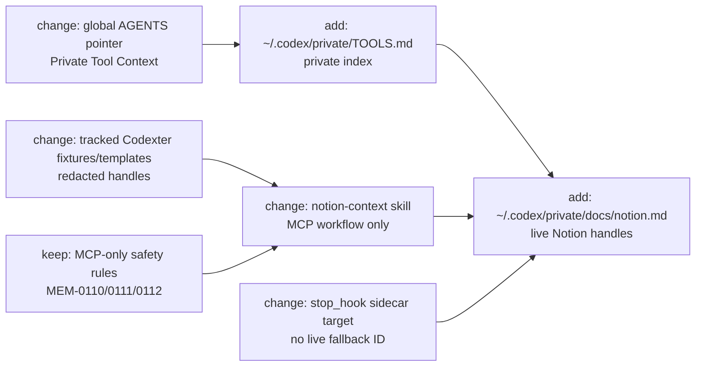

# TASK-0186: move Notion handles into private tool docs

## Summary
Refactor Notion context so reusable workflow rules stay in `notion-context`,
while Kenji-specific Notion database IDs, saved view URLs, schema caches, and
page examples live under `~/.codex/private/`. The decisive path is to add an
OpenClaw-style private `TOOLS.md` index plus focused `docs/notion.md`, then
make global agent policy and the installed `notion-context` skill point to that
private context instead of embedding personal handles in reusable skill text.

## Scope
- In:
  - create `~/.codex/private/TOOLS.md` as the local private tool-context index
  - create `~/.codex/private/docs/notion.md` for Notion data sources, views,
    private schema notes, page examples, and task-creation defaults
  - slim `/Users/kenjipcx/.codex/skills/notion-context/` so it keeps reusable
    workflow behavior and loads private handles from the private docs
  - sanitize tracked Codexter references that currently embed live Notion data
    source IDs or private Notion URLs
  - update `templates/global/AGENTS.md` with a compact pointer to private tool
    docs for user-specific handles
  - keep MCP-only Notion access, pinned-task read checks, fallback semantics,
    and capability fixtures intact
- Out:
  - no Notion mutation, saved-view edits, public API fallback, deploy, publish,
    spend, or destructive cleanup
  - no new daemon, hidden state manager, or private-doc parser
  - no broad rewrite of every skill that might someday use private handles
  - no copying private Notion page bodies into tracked Codexter docs
  - no conversion of `notion-context` into a full board adapter or task selector

## Plan
- `Change:` separate private Notion handles from reusable Notion workflow
  instructions.
- `Why:` `notion-context` currently mixes two concerns: reusable adapter
  behavior and Kenji-specific workspace identifiers. That makes skill refreshes
  risky, leaks private IDs into tracked mirrors, and encourages Codexter to
  treat personal environment data as skill logic.
- `First-principles basis:`
  - `Objective:` make Notion context portable, private, and easier to update
    without weakening the existing Notion automation safety contract.
  - `Need:` agents need canonical Notion handles at runtime, but those handles
    should not live in reusable skills or tracked templates.
  - `Assumptions:` local agents can read `~/.codex/private/*`; installed skills
    can include a small instruction to load private docs when present; tracked
    tests can use stable placeholder handles without losing safety coverage.
  - `Root cause:` the first Notion-context fixes patched the installed skill and
    repo fixtures directly because there was no private tool-context owner.
  - `Constraints:` preserve `MEM-0110`, `MEM-0111`, and `MEM-0112`; do not call
    Notion public API directly; do not store private page bodies in Git; keep
    source/installed skill boundary explicit under `MEM-0107`.
  - `First viable slice:` add private docs, point global/skill surfaces at
    them, sanitize tracked live IDs, and prove capability fixtures still pass.
  - `Proof/falsification:` grep for the live Tasks/Projects/Goals collection
    IDs in tracked Codexter files returns no live IDs, capability fixtures still
    validate/score, and the installed skill still tells agents how to perform
    MCP-only tasks/pinned-read fallbacks.
  - `Tradeoff accepted:` keep a small personalized installed skill pointer for
    now instead of building a generic config loader.
  - `Non-goals:` this ticket does not implement a Notion board adapter, change
    saved views, or make private docs a structured database.
- `Before -> After:`
  - Before: `notion-context` and tracked fixtures include live Notion source IDs
    and URLs; `config.toml.example` and `bin/stop_hook.py` contain a real
    fallback Tasks source.
  - After: private handles live under `~/.codex/private/`; reusable surfaces
    reference named handles such as `notion.tasks_source`; tracked templates use
    placeholders or env/local overrides; fallback code fails closed when the
    local value is absent.
- `Touch:`
  - `/Users/kenjipcx/.codex/private/TOOLS.md`
  - `/Users/kenjipcx/.codex/private/docs/notion.md`
  - `/Users/kenjipcx/.codex/skills/notion-context/SKILL.md`
  - `/Users/kenjipcx/.codex/skills/notion-context/index.md`
  - `/Users/kenjipcx/.codex/skills/notion-context/views.md`
  - `/Users/kenjipcx/.codex/skills/notion-context/databases/*.md`
  - `templates/global/AGENTS.md`
  - `README.md`
  - `docs/private-tool-context.md`
  - `config.toml.example`
  - `bin/stop_hook.py`
  - `tests/notion-context/tasks_this_week_fallbacks.md`
  - `tests/notion-context/*.json`
  - `docs/MEMORY.md`, `docs/HISTORY.md`, and this ticket
- `Inspect:`
  - OpenClaw `TOOLS.md` template for the skills-vs-local-specifics split
  - `/Users/kenjipcx/.codex/skills/notion-context/*`
  - `tickets/TASK-0164/ticket.md`, `tickets/TASK-0175/ticket.md`,
    `tickets/TASK-0177/ticket.md`
  - `docs/MEMORY.md`, especially `MEM-0107`, `MEM-0110`, `MEM-0111`,
    `MEM-0112`
  - `docs/TROUBLES.md` Notion connector failure entry
  - `docs/specs/harness-engineering-doctrine.md`
  - `docs/specs/first-principles-planning.md`
  - `tickets/templates/ticket.md`
- `Signature delta:`
  - `templates/global/AGENTS.md / Private Tool Context: user-specific handles -> private docs lookup rule`
  - `notion-context / load_private_notion_context(): private handle reference + fallback guidance`
  - `bin/stop_hook.py / skill_opportunity_review_input(...): notion_task_target`
    reads only env/local config and returns no real hard-coded Notion source
  - `config.toml.example / CODEXTER_SKILL_OPPORTUNITY_NOTION_TASKS_DATA_SOURCE`
    changes from live value to placeholder/commented local override
  - `tests/notion-context / capability fixtures`: live IDs become redacted
    placeholders with named-handle expectations
- `Type Sketch:`
  - `PrivateToolsIndex`: `notion_doc`, `telegram_env`, `retention_rules`
  - `PrivateNotionContext`: `sources`, `views`, `schema_notes`,
    `task_creation_defaults`, `safety_rules`
  - `NotionSourceHandle`: `handle`, `collection_url`, `database_url?`,
    `description`, `private`
  - `NotionViewHandle`: `operation`, `view_url`, `source_handle`,
    `fallback_rule`
  - `SkillOpportunityNotionTarget`: `data_source_url?`, `tag`,
    `default_status`, `configured: bool`
- `Typed flow example:`
  - Agent invokes `notion-context.tasks_this_week`.
  - Skill reads reusable MCP-only fallback rules from
    `/Users/kenjipcx/.codex/skills/notion-context/SKILL.md`.
  - Skill reads `notion.tasks.source` and `notion.tasks.this_week_view` from
    `~/.codex/private/docs/notion.md`.
  - MCP row query succeeds, so rows normalize into `Name`, `Status`,
    `Act Time`, `Project`, `Pinned`, `Tags`, `execution_context`, and `url`.
  - If the private doc is missing or MCP cannot query rows, the operation
    returns `connector_unavailable` or `private_context_missing`; it does not
    semantic-search rows, call public Notion API scripts, or mutate Notion.
- `Execution steps:`
  1. Create `~/.codex/private/docs/` and write `TOOLS.md` plus `docs/notion.md`
     with the current live Notion IDs, view URLs, schema cache, planned-week
     handle, and task-creation defaults.
  2. Patch the installed `notion-context` files to replace embedded private
     IDs with named handles and a required private-doc lookup preflight.
  3. Patch `templates/global/AGENTS.md` with a short private tool-context
     pointer and retention rule.
  4. Sanitize `config.toml.example` so the Notion data source is a local
     override placeholder, not Kenji's live Tasks source.
  5. Patch `bin/stop_hook.py` so the skill-opportunity Notion task target has
     no live hard-coded fallback; when the env var is absent, mark
     `configured: false` and let the sidecar report missing Notion task target.
  6. Replace tracked Notion fixture live IDs and URLs with placeholders or
     named handles while preserving fallback method and forbidden-action tests.
  7. Add a durable memory rule that private tool handles belong under
     `~/.codex/private/`, not reusable skills or tracked templates.
  8. Run focused tests and grep checks; then write review evidence.
- `Recommendation:` keep `notion-context` as a slim reusable MCP workflow
  skill, not as the private data store. Make `~/.codex/private/TOOLS.md` the
  private index and `~/.codex/private/docs/notion.md` the Notion handle source.
- `Options considered:`
  1. Keep everything in `notion-context`: fastest today, but it keeps private
     state in a reusable skill and repeats the reinstall/leak problem.
  2. Move all Notion behavior into private docs: maximally private, but weakens
     reusable safety rules and capability fixtures.
  3. Split workflow from handles: recommended because reusable safety logic
     remains testable while private IDs leave tracked/reusable surfaces.
- `Blast radius:` Notion planning automation, self-improvement Notion task
  proposal sidecar, capability fixtures, global agent boot context, and any
  future skill that reads tool-specific private handles.
- `Risks:`
  - agents may skip the private-doc preflight; mitigate with global pointer,
    skill preflight text, and capability fixture wording.
  - capability fixtures may become too abstract after redaction; mitigate by
    preserving operation names, fallback methods, and forbidden actions.
  - sidecar task creation may stop creating Notion tasks if env/local config is
    absent; mitigate with explicit `configured: false` proof hop rather than a
    hidden live fallback.

## Gap Analysis
- `Current state:` The installed `notion-context` skill contains live Tasks,
  Projects, and Goals data source IDs, saved view URLs, schema caches, and
  private page examples. Tracked Codexter files also contain the live Tasks ID
  in `config.toml.example`, `bin/stop_hook.py`, and Notion capability fixtures.
- `Production expectation:` Reusable skills define how tools work; local
  private docs define user-specific handles. OpenClaw's `TOOLS.md` template
  describes this split directly: skills are shared, while setup-specific
  details such as device names, SSH aliases, preferred voices, and environment
  specifics belong in local notes.
- `Missing gaps:` private tool-doc owner, global pointer, Notion handle doc,
  sanitized tracked templates, installed skill preflight, and fixture coverage
  that proves safety without embedding live IDs.
- `Comparable implementations:` OpenClaw `TOOLS.md` template:
  `https://docs.openclaw.ai/reference/templates/TOOLS`
- `Recommendation:` land the split now; defer generic config parsing,
  encrypted secret stores, and a full Notion board adapter.

## Diagram

## Acceptance Criteria
- [x] `~/.codex/private/TOOLS.md` exists and points to the focused Notion doc.
- [x] `~/.codex/private/docs/notion.md` contains the current private Notion
      source/view handles needed by `notion-context`.
- [x] Installed `notion-context` no longer embeds live Notion database IDs or
      view URLs in reusable workflow prose except as private-doc examples
      clearly marked local.
- [x] Tracked Codexter files no longer contain Kenji's live Tasks, Projects, or
      Goals collection IDs.
- [x] `config.toml.example` uses a placeholder/commented local override for the
      skill-opportunity Notion Tasks data source.
- [x] `bin/stop_hook.py` has no live Notion data source fallback; missing config
      becomes explicit sidecar context.
- [x] Capability fixtures still validate and score the Notion operations without
      using live IDs.
- [x] MCP-only, pinned-read, forbidden-action, and connector-unavailable rules
      remain intact.

## Verification
- `Tests:`
  - `python3 bin/test_check_skill_capabilities.py`
  - `python3 bin/check_skill_capabilities.py validate`
  - `python3 bin/check_skill_capabilities.py score --skill notion-context --operation tasks_this_week`
  - `python3 bin/check_skill_capabilities.py score --skill notion-context --operation pinned_tasks_read_check`
  - `python3 bin/test_stop_hook.py`
  - `python3 tickets/scripts/check_ticket_metadata.py`
- `Manual checks:`
  - `rg -n "43a439fd|ed424aa2|c91aa37d|638d85a858b04d038d8b97be1a879a1f|b2e2f5f3d6b14d01961a2bef0696d744|036b38e1faaa4ff3b62d7301b86b933a" .`
    should return no tracked live handles.
  - inspect `/Users/kenjipcx/.codex/private/TOOLS.md` and
    `/Users/kenjipcx/.codex/private/docs/notion.md`.
  - inspect `/Users/kenjipcx/.codex/skills/notion-context/SKILL.md` for the
    private-doc lookup preflight and MCP-only safety rules.
- `Evidence required:`
  - command outputs
  - grep result proving tracked live IDs are removed
  - review artifact under `tickets/TASK-0186/artifacts/review/`

## Proof Contract
- `Metrics:`
  - `Primary metric:` private_handle_leak_grep_passes
  - `Direction:` pass/fail
  - `Verify:` live-ID grep plus capability and stop-hook tests
  - `Guard:` ticket metadata and `git diff --check`
  - `Min acceptable result:` no tracked live Notion IDs; all focused tests pass
  - `Autoresearch warranted:` no
  - `Autoresearch session:` none
- `Review Rubrics:`
  - `integration-readiness >= 4.0`
  - `evidence-quality >= 4.0`
  - `spec-contract >= 4.0`
- `Required Evidence:`
  - focused test outputs
  - sanitized grep proof
  - before/after summary for private docs and reusable skill behavior
  - final review JSON

## Autonomy Readiness
- `Human inputs/assets:` none for planning; build uses existing local Notion
  handles already present in the installed skill.
- `Credentials / external access:` Notion token remains in MCP config; private
  docs store handles only, not auth tokens.
- `Compute/runtime needs:` local filesystem edits plus Python tests.
- `Tooling gaps:` no structured private-doc parser; agents read Markdown
  handles manually.
- `QA risks:` installed-skill behavior can drift from tracked fixtures if
  private docs are updated without fixture review.
- `Human gates:` approve before editing installed skill and private docs;
  approve separately before any Notion mutation, which is out of scope here.
- `Agent decision boundaries:` agents may read private docs and query Notion via
  MCP; agents may not copy private handles into tracked docs or call public API
  scripts.

## Execution Profile Hints
- `Likely size:` normal
- `Goal recommendation:` none
- `Compute hint:` local_shared
- `Planning hint:` impl_plan
- `Proof weight:` tests
- `Batchability:` single-ticket
- `Batch reason:` spans private docs, installed skill, tracked fixtures, and
  stop-hook behavior; keep as one coherent privacy/refactor loop.

## Refs
- `https://docs.openclaw.ai/reference/templates/TOOLS`
- `docs/specs/harness-engineering-doctrine.md`
- `docs/specs/first-principles-planning.md`
- `docs/MEMORY.md#MEM-0107`
- `docs/MEMORY.md#MEM-0110`
- `docs/MEMORY.md#MEM-0111`
- `docs/MEMORY.md#MEM-0112`
- `tickets/TASK-0164/ticket.md`
- `tickets/TASK-0175/ticket.md`
- `tickets/TASK-0177/ticket.md`

## Evidence
- `Artifacts:`
  - `tickets/TASK-0186/artifacts/review/2026-06-01-impl-plan-review.json`
  - `tickets/TASK-0186/artifacts/qa/2026-06-01-proof-summary.md`
  - `tickets/TASK-0186/artifacts/review/2026-06-01-implementation-review.json`
- `Commands:`
  - `python3 tickets/scripts/check_ticket_metadata.py`
  - `git diff --check -- tickets/TASK-0186/ticket.md`
  - `python3 bin/test_check_skill_capabilities.py`
  - `python3 bin/check_skill_capabilities.py validate`
  - `python3 bin/check_skill_capabilities.py score --skill notion-context --operation tasks_this_week`
  - `python3 bin/check_skill_capabilities.py score --skill notion-context --operation pinned_tasks_read_check`
  - `python3 bin/test_stop_hook.py`
  - `rg -n "43a439fd|ed424aa2|c91aa37d|638d85a858b04d038d8b97be1a879a1f|b2e2f5f3d6b14d01961a2bef0696d744|036b38e1faaa4ff3b62d7301b86b933a|364d43a23942809bb660c9d2835ab0b6" . /Users/kenjipcx/.codex/skills/notion-context`
  - `python3 bin/check_doc_parity.py`
- `Result summary:`
  - Planning ticket created in `status: review` with approval required.
  - Plan review passed with verdict `pass`, score `4.2`, and no blocking
    findings.
  - Added private tool docs at `/Users/kenjipcx/.codex/private/TOOLS.md` and
    `/Users/kenjipcx/.codex/private/docs/notion.md`.
  - Slimmed installed `notion-context` to use named private handles instead of
    live Notion IDs.
  - Added the global private tool context pointer to `templates/global/AGENTS.md`
    and the live symlinked `/Users/kenjipcx/.codex/AGENTS.md`.
  - Added `docs/private-tool-context.md` and routed it from `README.md`.
  - Sanitized tracked live IDs in `config.toml.example`, `bin/stop_hook.py`,
    `tests/notion-context/tasks_this_week_fallbacks.md`, and the feed-scout QA
    readback artifact.
  - Logged `MEM-0120` and appended a history entry for the private context
    split.
  - Focused capability tests, stop-hook tests, metadata, doc parity, diff
    check, private docs presence check, live-ID grep, and implementation review
    passed.

## Blockers
- none
