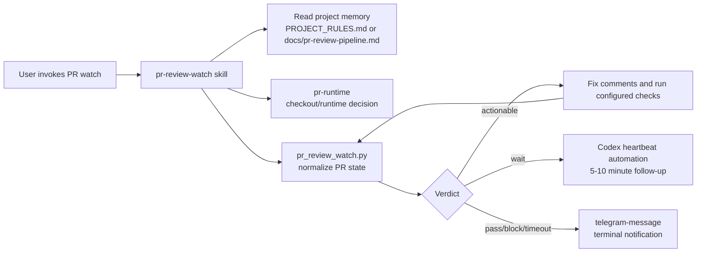

# TASK-0187: add project PR review watcher workflow

## Summary
Add a Codexter workflow for external repositories where a PR is already open
and review automation is producing comments or status checks. The workflow
should poll the PR every 5 to 10 minutes when explicitly invoked, resolve
actionable review issues until all configured agents/checks pass, and send a
Telegram notification when the loop passes, blocks, or times out.

## Scope
- In:
  - create a new `pr-review-watch` skill as the primary workflow owner
  - define a project-local PR review memory contract that external repos can
    keep in `PROJECT_RULES.md` or `docs/pr-review-pipeline.md`
  - add a small deterministic helper under `bin/` for PR state discovery and
    normalized watcher snapshots
  - wire the workflow to existing `pr-runtime` for isolated checkout decisions
    and `coderabbit-review` for explicit CodeRabbit local review passes
  - document how the workflow uses Codex app heartbeat/automation when the user
    asks to watch a PR
  - route completion/blocker notifications through the `telegram-message`
    skill when available in the installed environment
  - add tests for parser/config behavior and at least one fixture-driven watch
    pass
- Out:
  - no hidden daemon and no always-on PR watching
  - no direct edits to `~/.codex` or installed skill bodies
  - no automatic push, deploy, merge, or destructive git operations
  - no generic cloud scheduler, Symphony worker, or external queue runner
  - no attempt to support every review provider deeply in the first slice
  - no mandatory CodeRabbit run on every PR; use the repo/project pipeline
    first and CodeRabbit only when the memory contract asks for it

## Plan
- `Change:` introduce a repeatable PR watcher workflow that can discover the
  current PR review state, run the project-approved fix loop, reschedule itself
  via Codex automation, and notify on terminal states.
- `Why:` Codexter currently has pieces for PR-sized review (`coderabbit-review`)
  and isolated PR workspaces (`pr-runtime`), but no explicit way to keep
  checking a live PR until Cursor/CodeRabbit/GitHub checks are clean.
- `First-principles basis:`
  - `Objective:` remove manual review polling and repeat-fix cycles for
    external repos while keeping control visible and project-local.
  - `Need:` PR agents often report comments asynchronously, and the operator
    wants Codexter to keep resolving them without re-prompting every few
    minutes.
  - `Assumptions:` the active repo usually exposes PR truth through GitHub CLI,
    status checks, or a project-specific command; Telegram credentials live in
    the installed/private environment, not this repo.
  - `Root cause:` existing skills stop at one review pass or one runtime
    preparation pass; neither owns a durable watch loop.
  - `Constraints:` no hidden automation, no direct `~/.codex` edits, no broad
    root-policy bloat, no unsafe automatic merge/push, and project rules remain
    the source of repo-specific commands.
  - `First viable slice:` new skill plus helper, project memory template,
    parser tests, fixture watch run, and documentation that connects to
    automation/Telegram without making them always-on.
  - `Proof/falsification:` fixture PR snapshots normalize into the right
    states, missing config blocks cleanly, the watcher prompt is self-contained,
    and tests show pass/block/comment states without calling live GitHub.
  - `Tradeoff accepted:` first slice is GitHub/gh-oriented and project-config
    driven instead of a full multi-provider review orchestration service.
  - `Non-goals:` autonomous merge queue, cloud scheduler, PR creation, or a
    universal review-agent API.
- `Before -> After:`
  - Before: Codexter can prepare PR runtime state and run CodeRabbit once, but
    humans must re-check the PR and ask for each fix loop.
  - After: a user can ask Codexter to watch the active PR; Codexter reads the
    project's review memory, polls normalized PR status on a heartbeat, fixes
    actionable issues, and sends a Telegram status when done or blocked.
- `Touch:`
  - `skills/pr-review-watch/SKILL.md`
  - `skills/pr-review-watch/todos.md`
  - `skills/pr-review-watch/templates/pr-review-pipeline.md`
  - `skills/pr-review-watch/templates/codex-automation-prompt.md`
  - `bin/pr_review_watch.py`
  - `bin/test_pr_review_watch.py`
  - `docs/skills/README.md`
  - `docs/skills/registry.jsonl`
  - `docs/features/registry.jsonl`
  - `docs/HISTORY.md`
  - this ticket
- `Inspect:`
  - `skills/pr-runtime/SKILL.md`
  - `skills/coderabbit-review/SKILL.md`
  - `docs/features/registry.jsonl`
  - `docs/skills/registry.jsonl`
  - `docs/policies/README.md`
  - `docs/specs/harness-engineering-doctrine.md`
  - `skills/deep-init-project/references/PROJECT_RULES_TEMPLATE.md`
  - `templates/global/AGENTS.md`
- `Signature delta:`
  - `bin/pr_review_watch.py / discover(repo_path: Path, pr: int | None): PullRequestWatchSnapshot`
  - `bin/pr_review_watch.py / load_project_pipeline(repo_path: Path): PrReviewPipelineConfig`
  - `bin/pr_review_watch.py / classify(snapshot, config): WatchVerdict`
  - `pr-review-watch skill / run_watch_loop(repo, pr, interval): watch prompt + fix loop`
- `Type Sketch:`
  - `PrReviewPipelineConfig`: `providers`, `poll_interval_minutes`,
    `pass_conditions`, `fix_commands`, `review_commands`,
    `notification_policy`, `max_iterations`
  - `PullRequestWatchSnapshot`: `repo`, `branch`, `pr_number`, `head_sha`,
    `check_runs`, `reviews`, `review_comments`, `provider_comments`,
    `fetched_at`
  - `WatchVerdict`: `state`, `actionable_items`, `blocking_items`,
    `next_wait_minutes`, `terminal_message`
  - `ActionableReviewItem`: `provider`, `severity`, `file`, `line`,
    `body`, `url`, `suggested_action`
- `Typed flow example:`
  1. User asks: "watch this PR every 10 minutes until review agents pass."
  2. `pr-review-watch` reads `PROJECT_RULES.md` and
     `docs/pr-review-pipeline.md`.
  3. It calls `pr-runtime` if an isolated checkout is needed for the PR branch.
  4. The helper runs `gh pr view` / `gh pr checks` or fixture equivalents and
     writes a normalized snapshot.
  5. The skill fixes actionable comments, runs the configured local checks, and
     asks Codex automation for a heartbeat when the PR is not terminal.
  6. On `pass`, `blocked`, or `timeout`, it sends a compact Telegram message
     through `telegram-message` if available.
- `Execution steps:`
  1. Add `skills/pr-review-watch` with checklist, workflow, guardrails,
     outcome contract, and templates.
  2. Add `bin/pr_review_watch.py` as a deterministic snapshot/config parser
     that supports dry-run fixture inputs and live `gh` inputs.
  3. Add parser and fixture tests for no PR, missing config, failed checks,
     unresolved comments, clean pass, and blocked provider/auth states.
  4. Update skill/feature docs and registries through the existing skill
     maintenance path.
  5. Add a project memory template that external repos can copy into
     `docs/pr-review-pipeline.md`, with allowed providers, commands, and
     notification policy.
  6. Verify no always-on behavior was added to root/global AGENTS; this remains
     an explicit user-invoked watcher.
  7. Run focused tests, registry validation, and review.
- `Recommendation:` create a new `pr-review-watch` skill as the primary owner.
  Use `pr-runtime` and `coderabbit-review` as secondary skills rather than
  overloading either with polling/orchestration.
- `Options considered:`
  1. Root/global policy: discoverable every turn, but it bloats always-loaded
     context and conflicts with the no-hidden-automation policy.
  2. Extend `pr-runtime`: close to existing PR branch work, but that skill
     explicitly owns checkout/runtime records and says not to become generic
     dispatch or orchestration.
  3. New `pr-review-watch` skill: recommended because this is a repeated,
     explicit workflow with project config, polling, review-state parsing,
     automation, and notification steps.
- `Blast radius:` skill registry, feature registry, project bootstrap guidance,
  PR follow-up workflows, automation prompts, Telegram notification expectations,
  and any repo using `PROJECT_RULES.md` as review command memory.
- `Risks:`
  - watcher could become hidden autonomy; mitigate by requiring explicit user
    invocation and a visible automation prompt.
  - project-specific review providers may vary; mitigate with a memory file and
    fixture-first provider parser.
  - notifications may fail if Telegram skill/env is absent; mitigate by making
    notification best-effort and reporting the blocker in the terminal state.
  - live GitHub tests can be flaky or auth-dependent; mitigate by proving parser
    and command construction with fixtures, then doing live checks only when a
    PR context is available.

## Gap Analysis
- `Current state:` `pr-runtime` prepares safe PR workspaces and runtime records.
  `coderabbit-review` runs a heavyweight local/PR review pass. Codex app
  automations can schedule follow-ups, and installed environments may have a
  `telegram-message` skill, but Codexter has no workflow that connects these
  into a repeated PR review watch loop.
- `Production expectation:` a credible PR watcher needs explicit opt-in,
  project-local configuration, normalized provider state, a bounded retry loop,
  actionable item extraction, local verification, durable evidence, and terminal
  notifications.
- `Missing gaps:` no `pr-review-watch` owner, no project memory template, no PR
  snapshot parser, no watcher automation prompt, no Telegram completion path,
  and no fixture tests for pass/fail/block transitions.
- `Comparable implementations:` local Codexter `feed-scout` uses templates for
  scheduled automation prompts; `pr-runtime` owns isolated PR runtime state;
  `coderabbit-review` owns one explicit heavy review pass.
- `Recommendation:` land the minimal skill/helper/template slice first; defer a
  multi-provider live integration matrix and cloud scheduler.

## Diagram

## Acceptance Criteria
- [x] `pr-review-watch` skill exists with first-load checklist, guardrails,
      automation guidance, project memory contract, and outcome contract.
- [x] Project-level PR review memory template exists and explains providers,
      pass conditions, local check commands, fix loop boundaries, and Telegram
      policy.
- [x] Helper can normalize fixture PR states for clean pass, failed checks,
      unresolved comments, missing auth/config, and no active PR.
- [x] Skill registry and feature registry include the new workflow without
      duplicating `pr-runtime` or `coderabbit-review`.
- [x] No root/global policy adds hidden always-on PR automation.
- [x] Tests pass for the helper and skill registry checks.
- [x] Review passes with no hard-gate finding around hidden automation,
      unchecked external side effects, or missing evidence.

## Verification
- `Tests:`
  - `python3 bin/test_pr_review_watch.py`
  - `python3 skills/skill-maintenance/scripts/check_skills.py --write`
  - `python3 docs/features/validate_features.py`
  - `python3 tickets/scripts/check_ticket_metadata.py`
- `Manual checks:`
  - inspect `skills/pr-review-watch/SKILL.md` for explicit invocation and
    no-hidden-daemon guardrails
  - inspect `templates/global/AGENTS.md` and root `AGENTS.md` to confirm no
    always-on PR watcher policy was added
  - run the helper against fixture snapshots and confirm terminal states
- `Evidence required:`
  - command outputs
  - fixture snapshot outputs
  - review artifact under `tickets/TASK-0187/artifacts/review/`

## Proof Contract
- `Metrics:`
  - `Primary metric:` pr_review_watch_fixture_states_pass
  - `Direction:` pass/fail
  - `Verify:` `python3 bin/test_pr_review_watch.py`
  - `Guard:` skill registry, feature registry, ticket metadata, and review
  - `Min acceptable result:` all configured fixture states classify correctly
  - `Autoresearch warranted:` no
  - `Autoresearch session:` none
- `Review Rubrics:`
  - `spec-contract >= 4.0`
  - `implementation-plan >= 4.0`
  - `integration-readiness >= 4.0`
  - `evidence-quality >= 4.0`
- `Required Evidence:`
  - parser/config test output
  - registry validation output
  - review result

## Agent Contract
- `Open:` invoke `pr-review-watch` from a repo with an active PR branch.
- `Test hook:` `python3 bin/pr_review_watch.py classify --fixture <path> --json`
  after implementation.
- `Stabilize:` fixture snapshots under the skill or test fixtures; avoid live
  GitHub for unit tests.
- `Inspect:` normalized JSON snapshot and terminal `WatchVerdict`.
- `Key screens/states:` n/a.
- `QA cookbook:` none yet.
- `Taste refs:` n/a.
- `Expected artifacts:` fixture JSON output and review artifact.
- `Delegate with:` this ticket plus the target repo path/PR number.

## Autonomy Readiness
- `Human inputs/assets:` target repo path, PR number or current branch, desired
  interval, and whether Telegram notifications are wanted.
- `Credentials / external access:` GitHub CLI auth for live PR polling;
  Telegram env/skill for notifications; CodeRabbit auth only when configured.
- `Compute/runtime needs:` local shared or local worktree; use `pr-runtime` for
  existing PR branch work.
- `Tooling gaps:` live provider APIs are optional in v1; helper must support
  fixture mode first.
- `QA risks:` asynchronous PR checks and comments can change between polls;
  tests must not depend on live provider state.
- `Human gates:` pushing commits, merging, deploying, or changing billing/spend
  remains explicitly user/workflow gated.
- `Agent decision boundaries:` fix actionable review comments and run configured
  checks; do not merge, deploy, or invent new review-provider commands.

## Execution Profile Hints
- `Likely size:` normal
- `Goal recommendation:` recommend
- `Compute hint:` local_shared
- `Planning hint:` impl_plan
- `Proof weight:` tests
- `Batchability:` single-ticket
- `Batch reason:` crosses skill, helper, registry, docs, and automation prompt
  surfaces.

## Refs
- `skills/harness-advisor/SKILL.md`
- `skills/pr-runtime/SKILL.md`
- `skills/coderabbit-review/SKILL.md`
- `docs/policies/README.md`
- `docs/specs/harness-engineering-doctrine.md`
- `skills/deep-init-project/references/PROJECT_RULES_TEMPLATE.md`
- `templates/global/AGENTS.md`

## Evidence
- `Artifacts:`
  - `tickets/TASK-0187/artifacts/review/2026-06-01-pr-review-watch-placement-review.json`:
    placement review passed with overall score 4.2 and no blocking findings.
  - `tickets/TASK-0187/artifacts/qa/2026-06-01-pr-review-watch-qa.json`:
    helper, registry, feature, ticket metadata, compile, fixture classify, and
    no-root-policy checks passed.
  - `tickets/TASK-0187/artifacts/review/2026-06-01-pr-review-watch-impl-review.json`:
    implementation review passed with overall score 4.2 and no blocking
    findings.
- `Commands:`
  - `python3 tickets/scripts/check_ticket_metadata.py`: passed; 28 ticket
    files checked.
  - `python3 bin/test_pr_review_watch.py`: passed; 13 tests.
  - `python3 skills/skill-maintenance/scripts/check_skills.py --write`: passed;
    79 skill rows, skill todo tiers OK, capability fixtures OK.
  - `python3 docs/features/validate_features.py`: passed.
  - `python3 bin/pr_review_watch.py classify --fixture skills/pr-review-watch/fixtures/gh-bucket-fail.json --config skills/pr-review-watch/fixtures/pipeline-config.md --json`:
    passed; verdict `actionable`.
  - `python3 -m py_compile bin/pr_review_watch.py bin/test_pr_review_watch.py`:
    passed.
  - `rg -n "pr-review-watch|PR review watch|PR watcher|pull request.*watch" AGENTS.md templates/global/AGENTS.md`:
    passed as a negative guardrail check; no matches.
- `Result summary:`
  - Implemented the `pr-review-watch` skill, project memory template,
    heartbeat prompt, fixture set, deterministic helper, tests, skill registry
    row, feature registry row, and history entry.
  - Harness-advisor placement selected a new `pr-review-watch` skill as the
    smallest primary owner; implementation followed that placement and kept
    `pr-runtime` and `coderabbit-review` as secondary surfaces.
  - Implementation review passed; ticket is ready for closeout/documenting.

## Blockers
- none
