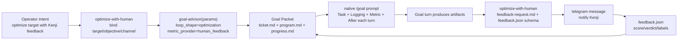

# TASK-0192: Rename with-human into optimize-with-human Goal preset

## Summary

Rename the awkward `with-human` provider surface into `optimize-with-human` and
make it an explicit Goal Advisor preset for human-feedback optimization loops.
The change keeps `goal-advisor` as the single owner of Goal architecture while
letting operators invoke a memorable shortcut for content, skill, creative, or
strategy optimization that uses Kenji's feedback through Telegram-first review
requests.

## Scope

- In:
  - Replace the source skill package `skills/with-human/` with
    `skills/optimize-with-human/`.
  - Preserve the provider behavior: create focused feedback requests,
    feedback schema/files, and optional Telegram notification.
  - Reframe the skill as a preset/router into `goal-advisor` with
    `loop_shape=optimization`, `metric_provider=human_feedback`, and
    `feedback_channel=telegram`.
  - Update active docs, specs, templates, registry rows, eval tasks, and
    installed skills to use `optimize-with-human`.
  - Keep Goal Packet files as the state owner.
- Out:
  - Do not create a second loop runtime, scheduler, or hidden automation.
  - Do not rebuild native Goal behavior.
  - Do not rename unrelated `human-feedback` prose that is not a skill/provider
    reference.
  - Do not implement live market testing or feedback ingestion automation.

## Delta

- `Change:` rename the current provider skill to `optimize-with-human`, clarify
  that it is a preset into `goal-advisor`, and make the Telegram-first feedback
  policy explicit.
- `Why:` `with-human` reads like a modifier and hides the actual job. The
  operator wants a reusable task shape for "improve this by asking me for
  labels/review" while keeping Goal Advisor as the architecture solver.
- `First-principles basis:`
  - Objective: make human-assisted optimization easy to invoke without adding a
    competing Goal loop.
  - User/system need: content and skill auto-improvement loops need Kenji's
    judgment as a high-value metric provider before benchmarks or market tests
    exist.
  - Assumptions: native Goal mode remains the only continuation engine;
    `goal-advisor` should solve loop parameters; Telegram is the default human
    communication channel when configured.
  - Root cause: the name `with-human` describes a parameter, not a reusable
    workflow. It also makes the provider boundary feel too generic.
  - Constraints: keep state in `ticket.md`, `program.md`, and `progress.md`;
    preserve `telegram-message` as the notification primitive; avoid hidden
    orchestration.
  - First viable slice: rename and reword the skill, update all active
    references, add eval coverage for the preset, reinstall, and remove the old
    installed package.
  - Proof/falsification: source and installed scans show no active
    `with-human` skill references; `goal-advisor` examples invoke
    `optimize-with-human`; skill checks and eval smoke pass.
  - Tradeoff accepted: the new name is narrower than a generic feedback
    provider, but it matches the task the operator actually wants to invoke.
  - Non-goals: no automatic polling for completed feedback, no market test
    runner, no separate autoresearch runtime.
- `Before -> After:`
  - Before: `with-human(goal_packet, artifact_refs, review_question, schema?)`
    creates a feedback request but looks like a generic provider/mode.
  - After:
    `optimize_with_human(target, objective, artifacts?, budget?, channel=telegram) -> goal_advisor_params + feedback_request_contract + goal_packet_ref`
    routes to `goal-advisor` with human-feedback policy pre-bound, then owns the
    concrete request and feedback-file contract.
- `Signature delta:`
  - `with_human(goal_packet, artifact_refs, review_question, feedback_schema?) -> feedback_request + feedback_contract`
  - `optimize_with_human(target, objective, artifacts?, budget?, channel=telegram) -> goal_advisor_params + feedback_protocol + goal_packet_ref`
  - `goal_advisor(params{loop_shape=optimization, metric_provider=human_feedback, feedback_channel=telegram}) -> goal_packet + native_goal_prompt + next_action`
- `Type Sketch:`
  - `OptimizeWithHumanParams`: `target`, `objective`, `artifact_refs`,
    `feedback_type`, `feedback_channel`, `review_question`, `feedback_schema`,
    `budget`, `goal_packet_ref`.
  - `FeedbackProtocol`: `channel`, `request_path`, `feedback_file`,
    `question`, `schema`, `pause_policy`, `resume_policy`.
- `Typed flow example:`
  1. Operator asks: "auto-improve the social-content hook skill with my
     feedback."
  2. `optimize-with-human` binds
     `{target=skills/social-content, objective=improve hook quality,
     channel=telegram, metric_provider=human_feedback}`.
  3. It routes those params to `goal-advisor`.
  4. `goal-advisor` creates or points to a Goal Packet with `program.md`
     provider `human_feedback` and Telegram feedback policy.
  5. During the Goal loop, `optimize-with-human` writes
     `feedback-request.md` and `feedback.json` schema for each artifact batch,
     then pauses until feedback exists.
  6. The next Goal turn reads `progress.md` plus feedback and chooses the next
     optimization step.
- `Recommendation:` implement the rename as a real package rename, not only a
  docs alias. Keep `human_feedback` as the abstract metric provider value while
  making `optimize-with-human` the callable skill name.
- `Options considered:`
  - Keep `with-human`: lowest churn, but preserves the confusing modifier name.
  - Rename to `human-feedback`: clean provider noun, but too generic for the
    operator's desired optimization-loop shortcut.
  - Rename to `optimize-with-human`: most opinionated and highest churn, but
    best matches the task shape and makes the skill worth calling.
- `Blast radius:` skill registry, installed skill discovery, Goal Advisor
  examples, eval tasks, ticket templates, generated graph data, and any active
  docs that describe provider names.
- `Risks:`
  - Stale installed copy may keep `with-human` discoverable unless explicitly
    removed.
  - Generated graph data may retain deleted skill nodes unless regenerated.
  - Over-narrow naming could make one-off human approval feel misplaced; keep
    normal chat, `review`, and `telegram-message` available for non-optimization
    feedback.

## Map

- `Touch:`
  - `skills/with-human/` -> `skills/optimize-with-human/`
  - `skills/goal-advisor/SKILL.md`
  - `skills/goal-advisor/eval_task.json`
  - `docs/specs/goal-loop-contract.md`
  - `docs/specs/harness-algebra.md`
  - `docs/specs/harness-techniques.md`
  - `docs/features/registry.jsonl`
  - `docs/skills/README.md`
  - `docs/skills/registry.jsonl`
  - `tickets/templates/ticket.md`
  - `tickets/templates/goal-loop/program.md`
  - `skills/telegram-message/SKILL.md`
  - active skill/docs references found by `rg`
  - generated skill-maintenance graph files after registry sync
- `Inspect:`
  - `skills/goal-advisor/SKILL.md`
  - `skills/with-human/SKILL.md`
  - `docs/specs/goal-loop-contract.md`
  - `tickets/templates/ticket.md`
  - `tickets/templates/goal-loop/program.md`
  - `tickets/README.md`
  - `docs/specs/self-improvement-contracts.md`

## Build Plan

1. Move `skills/with-human/` to `skills/optimize-with-human/`.
2. Rewrite the skill frontmatter, context, signature, todo list, examples,
   eval task, audit notes, and README around the preset/router contract.
3. Update `goal-advisor` references, routes, metric-provider labels, and
   skill-improvement examples to point at `optimize-with-human`.
4. Update Goal Packet docs/templates to use `human_feedback` as the provider
   value and `optimize-with-human` as the skill/preset that implements it.
5. Update active skill docs that reference `with-human`, especially
   `telegram-message`, `eval`, and self-improvement docs.
6. Update feature/skill registries and generated graph metadata through the
   standard sync/generation scripts.
7. Reinstall touched skills, remove `~/.codex/skills/with-human`, and verify
   `~/.codex/skills/optimize-with-human` is present.
8. Commit the implementation and generated metadata as one coherent rename
   commit unless unrelated changes appear.

## Acceptance Criteria

- [x] `skills/optimize-with-human/SKILL.md` exists and presents the new
  callable contract.
- [x] `skills/with-human/` is removed from source and installed Codex home.
- [x] `goal-advisor` references `optimize-with-human` as the human-feedback
  optimization preset and still owns Goal Packet architecture.
- [x] Goal Packet docs/templates distinguish abstract provider value
  `human_feedback` from the callable skill `optimize-with-human`.
- [x] Active source scans show no stale `with-human` skill references outside
  historical ledgers or archived material.
- [x] Registry, generated graph, and installed skill state reflect the rename.

## Verification

- `Tests:`
  - `python3 skills/skill-maintenance/scripts/check_skills.py --write`
  - `python3 bin/sync_skill_registry.py --check`
  - `python3 bin/check_skill_todo_tiers.py --allow-peer-tier3 --hardcase-on-failure`
  - `python3 bin/check_tier0_phase_protocol.py`
  - `python3 bin/check_harness_invariants.py`
  - `python3 bin/check_doc_parity.py`
  - `python3 skills/eval/tests/test_run_evals.py`
  - `python3 skills/eval/scripts/run_evals.py status --harness codex --target-root .`
- `Manual checks:`
  - `rg -n 'with-human|optimize-with-human|human_feedback|human-feedback' ...`
    confirms only intentional active references remain.
  - Inspect installed `~/.codex/skills/optimize-with-human/SKILL.md`.
  - Confirm `~/.codex/skills/with-human` is absent after reinstall.
- `Evidence required:` command outputs, stale-reference scan, installed-skill
  presence check, and commit hash.

## Proof Contract

- `Metrics:`
  - `Primary metric:` pass/fail validation and stale-reference scan
  - `Direction:` pass/fail
  - `Verify:` commands listed in `Verification`
  - `Guard:` `git diff --check` plus installed skill presence/absence check
  - `Min acceptable result:` all hard checks pass; no stale active package refs
  - `Autoresearch warranted:` no
  - `Autoresearch session:` none
- `Review Rubrics:`
  - `skill-contract: TAS-A`
  - `documentation-quality: TAS-B`
  - `integration-readiness: TAS-A`
- `Reviewer Handoff:`
  - `task_path:` `tickets/TASK-0192/ticket.md`
  - `review_focus:` planning, skill-change, docs, integration
  - `changed_files:` `skills/with-human/`, `skills/optimize-with-human/`,
    `skills/goal-advisor/SKILL.md`, Goal Packet docs/templates, registries
  - `evidence:` validation output and stale-reference scan after implementation
  - `rubric_families:` skill-contract, documentation-quality,
    integration-readiness
  - `required_tas:` skill-contract TAS-A, integration-readiness TAS-A
  - `hard_gates:` no competing loop runtime; Goal Advisor remains architecture
    owner; old package absent from installed skills
  - `expected_output:` implementation review note or chat summary
- `Required Evidence:`
  - validation command outputs
  - active source stale-reference scan
  - installed skill presence/absence check
  - generated registry/graph sync result

## Goal Packet

- `Goal packet:` none for this planning ticket
- `Program:` none
- `Progress:` none
- `Generated Goal prompt:` none
- `Metric provider:` none
- `Drift reviewer:` inline
- `Heartbeat:` none
- `Stop condition:` implementation complete after checks, install, and commit
- `Refs:` `docs/specs/goal-loop-contract.md`

## Refs

- `skills/goal-advisor/SKILL.md`
- `skills/with-human/SKILL.md`
- `docs/specs/goal-loop-contract.md`
- `docs/specs/harness-algebra.md`
- `tickets/templates/goal-loop/program.md`
- `tickets/templates/goal-loop/progress.md`

## Evidence

- `Artifacts:` none yet
- `Commands:`
  - `python3 tickets/scripts/check_ticket_metadata.py` passed during planning.
  - `python3 skills/skill-maintenance/scripts/check_skills.py --write`
  - `python3 bin/sync_skill_registry.py --check`
  - `python3 bin/check_skill_todo_tiers.py --allow-peer-tier3 --hardcase-on-failure`
  - `python3 bin/check_tier0_phase_protocol.py`
  - `python3 bin/check_harness_invariants.py`
  - `python3 bin/check_doc_parity.py`
  - `python3 skills/eval/tests/test_run_evals.py`
  - `python3 skills/eval/scripts/run_evals.py status --harness codex --target-root .`
  - `git diff --check`
  - `bash install.sh --skills-only --skills goal-advisor,optimize-with-human,telegram-message,eval,skill-maintenance --target ~/.codex`
- `Result summary:` renamed the source package to `optimize-with-human`,
  updated Goal Advisor and Goal Packet docs/templates around
  `human_feedback`, regenerated registries/graphs, installed the renamed skill,
  and removed the old installed `with-human` package.

## Blockers

- Awaiting approval to implement this rename and preset contract.
