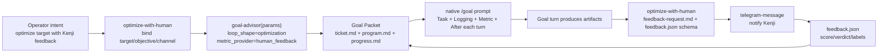

# TASK-0192: Rename with-human into optimize-with-human Goal preset

## Summary

Rename `with-human` into `optimize-with-human` so the callable surface describes
the actual reusable task: optimize a target by using Kenji's feedback as the
metric. `goal-advisor` remains the Goal architecture owner; this skill becomes
the Telegram-first human-feedback optimization preset.

## Scope

- In:
  - Replace `skills/with-human/` with `skills/optimize-with-human/`.
  - Keep human feedback as a Goal Packet metric provider, not a second loop
    runtime.
  - Make Telegram the default communication protocol when configured.
  - Update active docs, templates, registries, eval tasks, generated graph data,
    and installed skills.
- Out:
  - No hidden scheduler, polling loop, or market-test runner.
  - No native Goal runtime changes.
  - No broad rewrite of unrelated `human-feedback` prose.
  - No automatic ingestion of human feedback beyond the feedback-file contract.

## Delta

- `Before:` `with-human(goal_packet, artifact_refs, question, schema?)` created
  a feedback request, but the name read like a generic modifier and made the
  provider feel too detached from optimization loops.
- `After:`
  `optimize_with_human(target, objective, artifacts?, budget?, channel=telegram) -> goal_advisor_params + feedback_protocol + goal_packet_ref`
  routes to `goal-advisor` with human feedback pre-bound, then owns the
  concrete request, schema, and Telegram handoff.
- `Why now:` content, creative, and skill-improvement loops need a memorable
  shortcut for using Kenji as a high-value labeler before benchmarks or market
  data exist.
- `First-principles basis:`
  - `objective:` make human-assisted optimization easy to invoke without
    creating a competing continuation loop.
  - `need:` agents need a clear path from "improve this with my feedback" to a
    Goal Packet, feedback request, and resume signal.
  - `assumption:` native Goal mode remains the only formal continuation engine.
  - `root_cause:` `with-human` names a parameter, not a task.
  - `constraint:` state stays in `ticket.md`, `program.md`, `progress.md`, and
    artifacts.
  - `tradeoff:` `optimize-with-human` is narrower than `human-feedback`, but it
    names the operator workflow more clearly.
  - `non_goals:` no background feedback watcher, no automatic publishing, no
    separate autoresearch runtime.

## Program

```text
signature:
  rename_provider_skill(old, new, owner)
    -> skill_delta + docs_delta + registry_delta + install_delta + evidence

vars:
  old = skills/with-human
  new = skills/optimize-with-human
  owner = skills/goal-advisor
  notifier = skills/telegram-message
  docs = [
    docs/specs/goal-loop-contract.md,
    docs/specs/harness-algebra.md,
    docs/specs/harness-techniques.md,
    docs/skills/README.md,
    tickets/templates/ticket.md,
    tickets/templates/goal-loop/program.md
  ]

program:
  ground([old, owner, notifier, docs])
    -> current_contract

  rename_skill(old, new)
    -> skill_delta

  rewrite_contract(new,
    signature = optimize_with_human(target, objective, artifacts?, budget?, channel=telegram)
      -> goal_advisor_params + feedback_protocol + goal_packet_ref,
    owns = [feedback_policy, telegram_protocol, feedback_schema],
    delegates = [goal_advisor.goal_architecture])
    -> updated_skill

  update_refs(docs + [owner, notifier],
    from = "with-human",
    to = "optimize-with-human",
    provider_value = "human_feedback")
    -> docs_delta

  sync_registry_and_graph()
    -> registry_delta

  install_skills([new, owner, notifier])
    -> install_delta

  remove_installed(old)
    -> cleanup_delta

  verify(done_when, proof)
    -> evidence
```

## Map



- `Touch:`
  - `skills/with-human/` -> `skills/optimize-with-human/`
  - `skills/goal-advisor/SKILL.md`
  - `skills/goal-advisor/eval_task.json`
  - `skills/telegram-message/SKILL.md`
  - `docs/specs/goal-loop-contract.md`
  - `docs/specs/harness-algebra.md`
  - `docs/specs/harness-techniques.md`
  - `docs/features/registry.jsonl`
  - `docs/skills/README.md`
  - `docs/skills/registry.jsonl`
  - `tickets/templates/ticket.md`
  - `tickets/templates/goal-loop/program.md`
  - generated skill-maintenance graph files
- `Type Sketch:`
  - `OptimizeWithHumanParams`: `target`, `objective`, `artifact_refs`,
    `feedback_type`, `feedback_channel`, `review_question`, `feedback_schema`,
    `budget`, `goal_packet_ref`.
  - `FeedbackProtocol`: `channel`, `request_path`, `feedback_file`,
    `question`, `schema`, `pause_policy`, `resume_policy`.
- `Typed flow example:`
  1. Operator asks: "auto-improve the social-content hook skill with my
     feedback."
  2. `optimize-with-human` binds
     `{target=skills/social-content, objective=improve hook quality,
     channel=telegram, metric_provider=human_feedback}`.
  3. `goal-advisor` creates or points to a Goal Packet with `program.md`
     provider `human_feedback` and Telegram feedback policy.
  4. The Goal loop produces a batch of artifacts.
  5. `optimize-with-human` writes a focused `feedback-request.md` and
     `feedback.json` schema, then pauses until feedback exists.
  6. The next Goal turn reads the feedback, appends `progress.md`, and chooses
     the next optimization step.

## Done / Proof

```text
done_when:
  - source new skill exists at skills/optimize-with-human/SKILL.md
  - source old skill is absent at skills/with-human
  - installed new skill exists at ~/.codex/skills/optimize-with-human/SKILL.md
  - installed old skill is absent at ~/.codex/skills/with-human
  - goal-advisor routes human-feedback optimization to optimize-with-human
  - Goal Packet docs distinguish provider value human_feedback from callable skill optimize-with-human
  - active refs are clean outside history/archive material

proof:
  checks:
    - python3 skills/skill-maintenance/scripts/check_skills.py --write
    - python3 bin/sync_skill_registry.py --check
    - python3 bin/check_skill_todo_tiers.py --allow-peer-tier3 --hardcase-on-failure
    - python3 bin/check_tier0_phase_protocol.py
    - python3 bin/check_harness_invariants.py
    - python3 bin/check_doc_parity.py
    - python3 bin/sync_skill_plugins.py --check
    - python3 -m unittest bin/test_harness_invariants.py bin/test_sync_skill_plugins.py bin/test_check_skill_capabilities.py
    - python3 -m py_compile bin/check_harness_invariants.py bin/check_skill_capabilities.py bin/check_doc_parity.py bin/sync_skill_plugins.py skills/impl/scripts/tmux_helper.py
    - git diff --check
  scans:
    - rg active sources for stale with-human refs
    - rg active contract surfaces for stale ticket body headings
    - inspect installed skill presence/absence
  review:
    - skill-contract TAS-A
    - integration-readiness TAS-A
    - evidence-quality TAS-A
```

## State

- `next_action:` commit TASK-0192 implementation and generated metadata.
- `blocked:` none.
- `latest_verification:` 2026-06-12 checks passed; see frontmatter
  `last_verification` and linked review artifact.
- `result:` implementation complete; this ticket body is now a preview of the
  proposed compact ticket-as-program format.

## Links

- `program:` none; this was not a long-running Goal Packet ticket.
- `progress:` none; execution evidence is summarized in `last_verification`.
- `artifacts:` `tickets/TASK-0192/artifacts/review/20260612-112143-ticket-program-standard-review.md`
- `review:` `tickets/TASK-0192/artifacts/review/20260612-112143-ticket-program-standard-review.md`
- `refs:`
  - `skills/goal-advisor/SKILL.md`
  - `skills/optimize-with-human/SKILL.md`
  - `docs/specs/goal-loop-contract.md`
  - `tickets/templates/goal-loop/program.md`

## Notes

- Keep `human_feedback` as the abstract metric-provider value.
- Keep `optimize-with-human` as the callable skill/preset name.
- Normal chat, `review`, and `telegram-message` remain appropriate for
  one-off feedback that is not part of an optimization loop.
