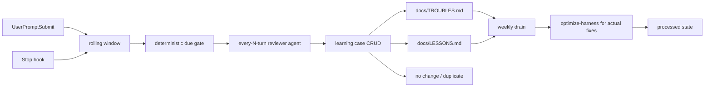

# TASK-0195: Revamp repent-style learning hook into direct lesson/trouble logging

## Summary

Revamp the deprecated repent-style self-learning idea into a bounded
every-N-turn reviewer agent. The stop hook should do deterministic boundary
work: capture bounded user/assistant exchanges, check cadence and keyword
hints, then launch a reviewer agent when due.

The spawned reviewer agent reads the last bounded window, detects troubles and
lessons, pairs resolved trouble-to-lesson cases, and writes directly to
`docs/TROUBLES.md` and `docs/LESSONS.md`.

Project bootstrap should also set up a weekly drain habit: read recent
`docs/TROUBLES.md` and `docs/LESSONS.md` rows, then invoke `optimize-harness`
only for entries that need an actual harness fix, eval, ticket, or skill change.
The drain should track processed items in runtime state instead of deleting
ledger rows from the docs, so the docs remain historical evidence while the
drain stays idempotent.

## Scope

- In:
  - Keep the existing rolling conversation window and default 10-turn cadence.
  - Keep the rolling learning window under
    `.farplane/state/message-windows/`, with legacy reads from
    `.farplane/state/self-improve/windows/`.
  - Add deterministic keyword/tag hints for correction, lesson, drift, trouble,
    forgotten-memory, and skill-opportunity signals.
  - Support an every-N-turn reviewer agent that checks the latest bounded
    window and performs structured CRUD over learning cases.
  - Reframe the old `skill-opportunity-review` sidecar away from Notion-first
    task creation toward direct local lesson/trouble logging.
  - Add a dry-run probe and tests proving capture, cadence, dedupe, and no raw
    transcript dumping into tracked docs.
  - Document the direct file logging route.
  - Add a `deep-init-project` bootstrap note/template hook for a weekly
    troubles/lessons drain into `optimize-harness`.
  - Add processed-state/dedupe rules for the weekly drain so old entries are
    not reprocessed every week.
  - Update the existing weekly Farplane memory/trouble triage automation into
    the first weekly drain runner.
- Out:
  - No automatic edits to skills, templates, or evals from the hook itself.
  - No hidden open-ended background autonomy; the reviewer agent is explicit,
    bounded, idempotent, and writes only the approved local learning surfaces.
  - No resurrected `repent` public skill.
  - No raw private transcript storage in tracked repo files.
  - No Notion dependency for the first revamp slice.
  - No `optimize-harness` invocation during the every-N-turn logging path.
  - No deletion of `docs/TROUBLES.md` or `docs/LESSONS.md` rows as the normal
    dedupe mechanism; use processed state or inline resolved markers instead.

## Delta

- `Before:`
  - Existing stop-hook self-improvement code stores rolling windows and can
    launch `skill-opportunity-applier` every 10 turns.
  - The applier is Notion-task oriented, agent-backed, and forbidden from local
    docs writes, so it does not map cleanly onto direct local learning-file
    logging.
- `After:`
  - The hook launches a bounded reviewer agent every configured N captured
    turns.
  - The reviewer performs CRUD over learning cases: create trouble rows, create
    lesson rows, pair resolved trouble-to-lesson records, and mark no-op or
    duplicate findings.
  - The reviewer writes compact, sanitized entries directly into
    `docs/TROUBLES.md` and `docs/LESSONS.md`.
- `Why now:`
  - The operator wants the old repent idea reused without bringing back a
    deprecated skill or firing agents for every learning signal.
- `First-principles basis:`
  - `objective:` catch forgotten lessons and repeated painful corrections and
    write them into the files the operator actually uses.
  - `need:` make learning visible by writing the learning files directly.
  - `assumptions:` a bounded reviewer agent can judge compact trouble/lesson
    candidates better than a deterministic hook can.
  - `root_cause:` the old approach coupled capture, analysis, task creation,
    and possible skill improvement in one sidecar.
  - `constraints:` hooks should be deterministic; tracked docs should contain
    curated lessons/troubles, not raw transcripts; Goal mode can handle
    periodic drift review when material.
  - `first_viable_slice:` every-10-turn reviewer dry run plus direct
    lesson/trouble file writes.
  - `proof_or_falsification:` simulated 10-turn windows produce deduped,
    compact doc entries when signal exists and produce no changes when weak.
  - `tradeoff:` allow a bounded agent to write canonical learning files
    directly, while forbidding broader harness edits.
  - `non_goals:` no model training, no background scheduler, no auto-PRs, no
    direct hook writes to canonical docs.

## Program

```text
signature:
  review_learning_window(window, existing_troubles, existing_lessons)
    -> trouble_delta + lesson_delta + pairings + no_change_reason?

  weekly_learning_drain(troubles, lessons)
    -> optimize_harness_issue[] + processed_state_delta + no_change_reason?

vars:
  cadence = FARPLANE_SKILL_OPPORTUNITY_APPLY_INTERVAL or 10
  window = .farplane/state/message-windows/<session>.json
  troubles = docs/TROUBLES.md
  lessons = docs/LESSONS.md
  weekly_drain_owner = deep-init-project bootstrap docs + optimize-harness
  processed = .farplane/state/self-improve/weekly-drain-processed.jsonl

program:
  ground(existing_hook, user_turn_window, learning_docs_contract)
    -> current_state

  spawn_review_agent_if_due(current_state)
    -> doc_crud

  verify(doc_crud)
    -> tests + dry_run_report + docs_delta

  weekly_drain(recent_troubles, recent_lessons)
    -> optimizer_threads_or_tickets + processed_state_delta
```

## Map

- `Touch:`
  - `bin/user_turn.py`
  - `bin/stop_hook.py`
  - `bin/self_improve_hook_probe.py`
  - `bin/test_stop_hook.py`
  - `agents/skill-opportunity-applier.toml` or replacement role docs
  - `docs/specs/self-improvement-contracts.md` if the broader contract is
    revised later
  - `docs/features/registry.jsonl`
- `Inspect:`
  - `docs/fundamentals/harness-engineering-doctrine.md`
  - `docs/specs/filesystem-lifecycle.md`
  - `docs/TROUBLES.md`
  - `docs/LESSONS.md`
- `Signature delta:`
  - `should_review_learning_window(window, cadence, keywords) -> trigger`
  - `learning_doc_crud(window, docs) -> trouble_append|lesson_append|pair|no_change`
  - `weekly_learning_drain(docs) -> optimize_harness_issue[]|no_change`
  - `mark_learning_item_processed(doc_ref, optimizer_ref, disposition) -> state_row`
- `Type Sketch:`
  - `LearningCase`: `case_id`, `kind`, `status`, `trouble_ref`,
    `lesson_ref`, `source_exchange_ids`, `resolution`, `owner`, `doc_delta`.
  - `DrainProcessedRow`: `doc_ref`, `content_hash`, `drained_at`,
    `disposition`, `optimizer_ref`, `ticket_ref`, `thread_ref`.
  - `Trigger`: `due`, `cadence`, `turn_count`, `last_review_turn_count`,
    `keyword_hits`, `reason`.



## Placement Decision

- `Primary owner:` hook/runtime code for cadence and capture; the bounded
  reviewer agent for judging and writing `docs/TROUBLES.md` /
  `docs/LESSONS.md`. `deep-init-project` owns setting up the weekly drain habit
  for new projects.
- `Rejected surfaces:`
  - `repo AGENTS.md:` useful for routing, but too broad for the capture
    mechanism.
  - `templates/global/AGENTS.md:` should not grow a special repent-like loop.
  - `new repent skill:` deprecated name and wrong abstraction; this is direct
    reviewer logging, not a new public skill.
  - `agents/*.toml as primary:` useful for the every-N-turn reviewer worker,
    but the feature still needs hook/runtime cadence and tests.
  - direct `docs/TROUBLES.md` / `docs/LESSONS.md` hook writes without a
    reviewer agent: too much judgment in deterministic hook code.
- `Secondary sync points:`
  - Feature registry/spec updates remain follow-up scope if the broader
    self-improvement contract is revised.
  - `deep-init-project` should include a weekly drain note for
    troubles/lessons to `optimize-harness`.
  - Existing weekly Farplane memory/trouble triage automation should become the
    first live weekly drain runner.
  - Existing probe should expose status, simulate, and docs-dry-run commands.

## Done / Proof

```text
done_when:
  - every-N-turn reviewer mode can create/update/pair/close learning cases from
    the latest bounded window
  - keyword hints can make review triggers more specific without replacing
    reviewer judgment
  - dry-run probe shows proposed `docs/TROUBLES.md` and `docs/LESSONS.md`
    deltas
  - deep-init-project generated guidance includes a weekly
    troubles/lessons-to-optimize-harness drain
  - weekly automation prompt is updated to dedupe via processed state and spawn
    optimizer follow-up work for actionable issues
  - tests prove disabled, not-due, due, and privacy/sanitization behavior

proof:
  checks:
    - python3 bin/test_stop_hook.py
    - python3 bin/test_runtime_state.py
    - python3 bin/test_farplane_telemetry_status.py
    - python3 tickets/scripts/check_ticket_metadata.py
    - git diff --check
  manual:
    - python3 bin/self_improve_hook_probe.py --session-id learning-low-turn --interval 2 simulate --turns 2 --dry-run
    - python3 bin/self_improve_hook_probe.py --session-id learning-live-low-turn --interval 1 simulate --turns 1 --live
    - inspect generated docs deltas and confirm they are compact, sanitized,
      deduped, and paired when applicable.
  review:
    - rubric: harness-placement
      required_tas: TAS-A
    - rubric: runtime-safety
      required_tas: TAS-A
  evidence:
    - `.farplane/state/learning-reviews/2026-06-12T143039.935931Z-learning-low-turn/report.json`
      dry-run report
    - `.farplane/state/learning-reviews/2026-06-12T143156.917819Z-learning-live-low-turn/report.json`
      live docs-updated report
    - automation update receipt for weekly Farplane memory/trouble triage
```

## Run Hints

- `Likely size:` normal
- `Goal recommendation:` recommend
- `Compute hint:` local_shared
- `Planning hint:` light
- `Proof weight:` tests
- `Batchability:` single-ticket
- `Batch reason:` hook cadence, reviewer contract, docs, and tests form one proof
  surface.
- `Human inputs/assets:` none required.
- `Credentials / external access:` none.
- `Compute/runtime needs:` local Python and Codex hook fixture tests.
- `Tooling gaps:` none for the implemented local docs slice.
- `QA risks:` avoid writing raw transcripts or letting hook judgment become a
  hidden autonomous loop.
- `Drain risks:` if every logged issue spawns a new optimizer thread, thread
  volume can explode; cap per weekly run and mark overflow as deferred.
- `Human gates:` none for normal logging; later skill/prompt/eval fixes still
  route through explicit work.
- `Agent decision boundaries:` reviewer may edit only `docs/TROUBLES.md` and
  `docs/LESSONS.md` for this loop.

## State

- `next_action:` archive after commit/review if no follow-up scope is needed.
- `blocked:` false.
- `latest_verification:` focused hook, runtime-state, telemetry, ticket metadata,
  and diff checks passed on 2026-06-12.
- `result:` implemented local docs learning reviewer with dry-run and live proof.

## Links

- `program:` none
- `progress:` none
- `artifacts:` none yet
- `review:` none yet
- `refs:`
  - `bin/stop_hook.py`
  - `bin/user_turn.py`
  - `docs/specs/filesystem-lifecycle.md`
  - `skills/deep-init-project/SKILL.md`
  - `docs/features/registry.jsonl#FEAT-0012`
  - `docs/features/registry.jsonl#FEAT-0039`

## Notes

The elegant path is not to revive repent as a public skill. Reuse its useful
instinct: every N turns, review recent work for pain and forgotten lessons, then
write the actual learning files:

```text
review_recent_turns(window) -> docs/TROUBLES.md + docs/LESSONS.md + no_change
```
