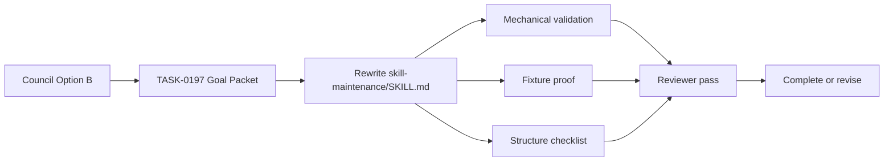

# TASK-0197: Rewrite skill-maintenance as behavior-delta compression

## Summary

Rewrite `skills/skill-maintenance/SKILL.md` from a verbose two-signature
checklist into a conservative behavior-delta entrypoint. The rewrite should
bind variables like `edited_skill`, `expected_behavior`, `current_behavior`,
`mode`, and `evidence`, use readable pseudocode for branch routing, and keep
every-invocation hard gates inline.

This is a prototype-first live skill rewrite: do not call it complete until the
skill-system validators, skill-maintenance eval review, fixture proof, structure
checklist, and reviewer pass show that safety behavior was preserved.

## Scope

- In:
  - Rewrite `skills/skill-maintenance/SKILL.md` around one primary
    behavior-delta signature.
  - Preserve audit as a mode/output path rather than a second equal top-level
    signature.
  - Add explicit branches for `edited_skill.eval_task` changes, installed-copy
    differences, bulk rollout, template-version changes, and
    registry/frontmatter changes.
  - Move verbose rationale, rare recipes, and detailed rubric guidance into
    references when first-load sufficiency remains intact.
  - Update or create a skill-local audit for the rewrite.
  - Validate with mechanical checks, fixture proof, structure checklist, and
    reviewer pass.
- Out:
  - No new automatic eval-to-checklist script in this ticket.
  - No broad migration of other skills to the new style.
  - No changes to installed `~/.codex/skills` as source of truth unless needed
    only for final live-copy inspection after repo-source validation.
  - No weakening of source ownership, registry sync, audit, review, or
    prototype-before-bulk gates.

## Delta

- `Before:` `skill-maintenance` has two equal signatures,
  `maintain_skills(...)` and `audit_skill_structure(...)`, plus a broad
  prose-heavy todo list and Core Rules section near the first-load size limit.
- `After:` `skill-maintenance` has one behavior-delta entrypoint,
  mode-based pseudocode todos, explicit variables, and branch-specific
  reference loading while preserving hard gates and proof obligations.
- `Why now:` the deliberative council selected Option B after comparing
  operator value, engineering risk, evidence skepticism, and systems fit.
- `First-principles basis:`
  - `objective:` make the frequent skill-update entrypoint faster, sharper, and
    safer to run from files alone.
  - `need:` skill maintenance is now a transformation over `edited_skill`; its
    todo list should expose state variables and branches instead of forcing
    agents through broad prose every time.
  - `assumptions:` compact behavior-delta shape improves scan cost only if hard
    gates remain inline and proof catches semantic regressions.
  - `root_cause:` two signatures and verbose first-load rules make the skill
    feel split-brained and expensive for routine updates.
  - `constraints:` validator-compatible headings and checklist markers remain;
    proof gates remain explicit; no installed-copy source edits.
  - `first_viable_slice:` rewrite only `skill-maintenance` and prove it against
    existing fixture/eval/checklist surfaces.
  - `proof_or_falsification:` fail or hold if the compact draft skips
    sandboxing, source ownership, registry sync, audit records, eval-to-QA sync,
    reinstall checks, or reviewer routing.
  - `tradeoff:` accept a slightly more abstract first-load todo in exchange for
    clearer state and branch routing.
  - `non_goals:` no script-assisted detection until the human-readable contract
    proves stable.

## Program

See [program.md](program.md) for the Goal loop configuration.

```text
signature:
  skill_maintenance(expected_behavior, current_behavior, edited_skill, mode?, evidence?)
    -> updated_skill | audit_record | blocked_report

vars:
  edited_skill = skills/skill-maintenance
  expected_behavior = conservative behavior-delta compression
  current_behavior = verbose two-signature checklist entrypoint
  mode = structure_update
  evidence = council synthesis + existing eval/checklist/validator surfaces

program:
  ground(ticket, council_artifacts, current_skill)
    -> rewrite_constraints

  rewrite(rewrite_constraints)
    -> SKILL.md_delta + reference_delta? + audit_delta

  verify(done_when, proof)
    -> mechanical_evidence + fixture_evidence + reviewer_verdict
```

## Map

- `Touch:`
  - `skills/skill-maintenance/SKILL.md`
  - `skills/skill-maintenance/references/*` if detail moves out of first load
  - `skills/skill-maintenance/audits/YYYY-MM-DD-*.md`
  - `docs/skills/registry.jsonl`
  - `tickets/TASK-0197/progress.md`
- `Inspect:`
  - `experiments/decisions/2026-06-13-skill-maintenance-rewrite-council/context.md`
  - `experiments/decisions/2026-06-13-skill-maintenance-rewrite-council/synthesis.md`
  - `skills/skill-maintenance/eval_task.json`
  - `skills/skill-maintenance/references/skill-structure-checklist.md`
  - `skills/skill-maintenance/tests/fixtures/bad-skill-repo`
  - `skills/optimize-harness/SKILL.md`
  - `docs/specs/self-improvement-contracts.md`
  - `docs/skills/best-practices.md`
- `Signature delta:`
  - `skill_maintenance(expected_behavior, current_behavior, edited_skill, mode?, evidence?) -> updated_skill | audit_record | blocked_report`
  - `audit` becomes a mode/output path, not a second equal top-level signature.
- `Type Sketch:`
  - `EditedSkill`: `path`, `SKILL.md`, `references`, `eval_task`,
    `qa_checklist`, `audits`, `registry_row`.
  - `MaintenanceMode`: `structure_update`, `metadata_update`,
    `eval_to_qa_sync`, `audit`, `bulk_rollout`, `registry_validation`.
  - `BehaviorDelta`: `expected_behavior`, `current_behavior`, `owner_surface`,
    `proof_required`, `risks`.
- `Typed flow example:`
  - Input: `edited_skill=skills/skill-maintenance`,
    `expected_behavior=behavior-delta entrypoint`.
  - Branch: `mode=structure_update`, `edited_skill.eval_task unchanged`.
  - Output: compact `SKILL.md`, possible reference movement, audit note,
    regenerated registry, proof rows.



## Done / Proof

```text
done_when:
  - skills/skill-maintenance/SKILL.md has one primary behavior-delta signature
  - todo list binds edited_skill, expected_behavior, current_behavior, mode, evidence
  - todo list uses readable if/else branches for owner-surface routing
  - explicit branches cover eval_task changed, installed copy differs, bulk rollout, template version changed, and registry/frontmatter changed
  - audit behavior remains first-class as a mode/output path
  - hard gates remain inline: source ownership, prototype-before-bulk, registry sync, template-version truth, validator command, audit-or-skip reason, reinstall when live behavior matters, reviewer routing for material changes
  - verbose detail is moved only when first-load sufficiency remains intact
  - skill-local audit records before/after behavior, risk, proof, and evidence gaps

proof:
  checks:
    - python3 skills/skill-maintenance/scripts/check_skills.py --write
    - python3 skills/skill-maintenance/scripts/check_skills.py --template-version 0.2.0
    - python3 -m json.tool skills/skill-maintenance/eval_task.json
    - git diff --check
  manual:
    - review all existing skills/skill-maintenance/eval_task.json cases against the rewritten skill contract
    - perform a sandbox fixture repair or dry-run proof against skills/skill-maintenance/tests/fixtures/bad-skill-repo
    - run skills/skill-maintenance/references/skill-structure-checklist.md against the draft and record pass/violation/unknown
  review:
    - rubric: skill-contract
      required_tas: TAS-A
    - rubric: integration-readiness
      required_tas: TAS-A
    - rubric: evidence-quality
      required_tas: TAS-A
  evidence:
    - tickets/TASK-0197/progress.md
    - skills/skill-maintenance/audits/YYYY-MM-DD-*.md
    - reviewer receipt or explicit blocker
```

## Run Hints

- `Likely size:` normal
- `Goal recommendation:` required
- `Budget hint:` one focused Goal execution window; use reviewer subagent for
  final material review; no external spend.
- `Compute hint:` local_shared
- `Planning hint:` light
- `Proof weight:` tests + review
- `Batchability:` single-ticket
- `Batch reason:` this is one meta-skill rewrite with tightly coupled proof.
- `Human inputs/assets:` none required; council synthesis already selected
  Option B.
- `Credentials / external access:` none.
- `Compute/runtime needs:` local Python and native reviewer lane if available.
- `Tooling gaps:` semantic eval runner may not prove all safety behavior; use
  fixture proof and reviewer to cover semantic gaps.
- `QA risks:` compact wording could pass validators while weakening safety.
- `Human gates:` no approval required to implement; do not broaden to scripts
  or other skills without a follow-up.
- `Agent decision boundaries:` preserve hard gates; no installed-copy source
  edits; no hidden automation.

## Goal Packet

- `Goal packet:` active
- `Program:` `tickets/TASK-0197/program.md`
- `Progress:` `tickets/TASK-0197/progress.md`
- `Files:` `tickets/TASK-0197/ticket.md`,
  `tickets/TASK-0197/program.md`, `tickets/TASK-0197/progress.md`,
  `experiments/decisions/2026-06-13-skill-maintenance-rewrite-council/context.md`,
  `experiments/decisions/2026-06-13-skill-maintenance-rewrite-council/synthesis.md`,
  `skills/skill-maintenance/SKILL.md`,
  `skills/skill-maintenance/eval_task.json`,
  `skills/skill-maintenance/references/skill-structure-checklist.md`
- `Generated Goal prompt:` see `program.md`
- `Metric provider:` `hybrid`
- `Feedback preset:` `none`
- `Drift reviewer:` `goal-drift-reviewer`
- `Heartbeat:` none
- `Stop condition:` complete only after Done / Proof conditions are satisfied
  and reviewer pass is recorded, or blocked with attempted paths and one
  missing input.
- `Refs:` `docs/specs/goal-loop-contract.md`,
  `tickets/templates/goal-loop/program.md`,
  `tickets/templates/goal-loop/progress.md`

## State

- `next_action:` complete; optional follow-up only for unrelated global
  `--template-version 0.2.0` cleanup if that becomes a release gate.
- `blocked:` false
- `latest_verification:` proof stack rerun 2026-06-13 17:54 +0800; reviewer
  returned TAS-A for `skill-contract`, `integration-readiness`, and
  `evidence-quality`; drift review found no scope drift after reviewer pass.
- `result:` complete.

## Links

- `program:` `tickets/TASK-0197/program.md`
- `progress:` `tickets/TASK-0197/progress.md`
- `artifacts:` `tickets/TASK-0197/artifacts/`
- `review:` none yet
- `refs:`
  - `experiments/decisions/2026-06-13-skill-maintenance-rewrite-council/context.md`
  - `experiments/decisions/2026-06-13-skill-maintenance-rewrite-council/synthesis.md`

## Notes

- The evidence-skeptic council dissent is binding for rollout: this is not done
  merely because the new `SKILL.md` is shorter. It must prove semantic safety.
