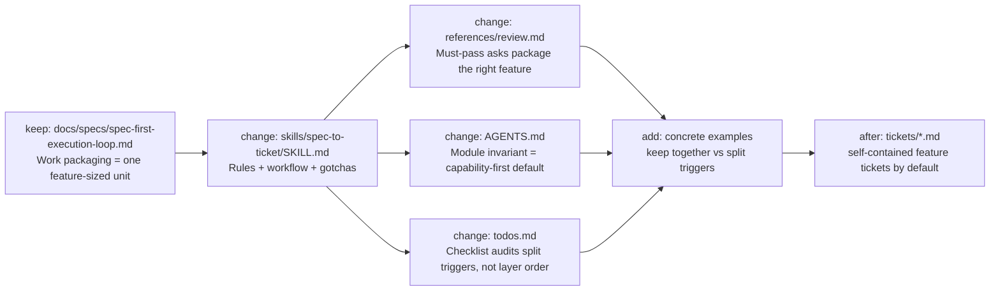
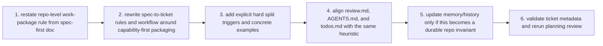

# TASK-0068: make spec-to-ticket capability-first

## Summary
Align `spec-to-ticket` with the repo's feature-sized work-package contract so
greenfield fullstack work defaults to one self-contained capability ticket
instead of being split by layer.

## Scope
- In:
  - change the default `spec-to-ticket` packaging rule from layer-first to
    capability-first
  - encode the four hard split triggers agreed in deep-interview
  - align the module's review and todo surfaces with the new packaging rule
  - add concrete examples so the planner sees when to keep one ticket intact
    versus split
  - update durable memory/history if the new sizing rule is promoted as a repo
    invariant
- Out:
  - changing `impl-plan` or `$impl` execution behavior
  - adding a numeric sizing engine or scoring program
  - broad changes to ticket template metadata
  - implementing any product feature tickets generated by the new guidance

## User Story
- `Actor:` Codexter operator using `spec-to-ticket` to turn approved specs into executable work
- `Need:` tickets to map to self-contained feature assignments instead of backend/frontend micro-slices
- `Outcome:` ticket sets match how a strong fullstack engineer would own, implement, and prove a coherent feature

## User Pain / JTBD
- `Current pain:` `spec-to-ticket` keeps underestimating model capability by decomposing one coherent feature into schema/backend/UI/integration microtickets
- `Why now:` current agents are strong enough to carry a whole greenfield feature in one ticket, and humans can test a feature-shaped ticket more easily than a layer-shaped one

## Non-Goals
- `Do not solve:` brownfield execution risk beyond the agreed split triggers, automatic ticket sizing math, or a brand-new planning framework outside the existing `spec-to-ticket` module

## High-Fidelity Example
- `Example flow/artifact:` a greenfield ingestion feature with an endpoint, parsing pipeline, chunking, embeddings, vector search, full-text search, basic operator UI, and tests should stay one ticket when it is one human-testable capability; the same work should split only if it also includes a shared search platform abstraction, a risky migration/backfill, a separately blocking external dependency, or unresolved feasibility work

## What Good Looks Like
- `Quality bar:` the skill defaults to "largest coherent feature that still fits one build loop," names the split triggers explicitly, and leaves reviewers with no ambiguity about when to keep backend and frontend together

## Proof Target
- `Reviewer-visible proof:` the `spec-to-ticket` skill text, review guide, and local todo/invariant surfaces all state the same capability-first packaging rule and include a concrete bundled example plus split-trigger counterexamples

## Plan

### Human

#### Decision
- `Req:` change `spec-to-ticket` so it emits ambitious self-contained feature tickets by default instead of fragmenting one coherent greenfield feature into layer tickets
- `Best:` keep the existing `spec-first` work-package model and rewrite only the `spec-to-ticket` module surfaces to default to capability-first packaging with four explicit hard split triggers
- `Why:` the repo already says one work package should usually equal one meaningful feature; the breakage is local to the skill contract and its review checklist, so the smallest real fix is to align those surfaces instead of inventing a new router
- `Tradeoff accepted:` this will tolerate larger individual tickets, so the text must be precise enough to prevent swinging from microtickets to vague mega-projects
- `Not chosen:` a greenfield/brownfield router adds branching without solving the core misalignment; a numeric scorecard looks rigorous but would likely invite gaming and still need the same qualitative split rules

#### Diagram
- `Required:` yes
- `Legend:` keep | change | add | remove

- `Tier 2:` optional only if implementation discovers the examples need a separate decision tree; otherwise Tier 1 is enough

#### Signature Sketch
- `docs/specs/spec-first-execution-loop.md / work package default: one feature -> one meaningful capability`
- `skills/spec-to-ticket/SKILL.md / packaging rules(spec slice): capability-first ticket set`
- `skills/spec-to-ticket/SKILL.md / split trigger gate(ticket candidate): split only on shared-platform | migration/backfill | external dependency | unresolved feasibility`
- `skills/spec-to-ticket/references/review.md / ticket-set review(ticket set): reject fake layer splits and vague mega-scope`
- `skills/spec-to-ticket/AGENTS.md / module invariants: capability-first default + explicit dependency order only after a real split`
- `skills/spec-to-ticket/todos.md / author checklist: prove coherent feature boundary with examples`

#### B -> A
- `Before:` `spec-first` docs say feature-sized work packages, but `spec-to-ticket` still hard-codes `schema -> backend -> UI -> integration` and reviews tickets as if smaller is always safer
- `After:` `spec-to-ticket` starts from the largest coherent feature ticket, keeps backend and frontend together when they serve one human-testable capability, and splits only on the four explicit hard triggers
- `Outcome:` planning output looks like work assigned to a strong fullstack engineer, and the resulting tickets are easier for humans to validate as one feature

#### Proof
- `P1:` `skills/spec-to-ticket/SKILL.md` replaces layer-first defaulting with capability-first wording plus the four hard split triggers
- `P2:` `references/review.md`, `AGENTS.md`, and `todos.md` all reinforce the same rule and include at least one bundled feature example plus split-trigger counterexamples
- `Risk:` the rewrite could over-correct into "one ticket per big idea" language that hides multi-loop scope
- `Rollback:` keep `one ticket = one build loop` and the existing feature-sized work-package contract intact, and limit changes to the `spec-to-ticket` module surfaces plus any necessary durable memory/history writeback

#### Ask
- `Ready: yes`
- `Next:` on approval, move this ticket to `status: building`, rewrite the `spec-to-ticket` module text surfaces in one pass, then run `review` against the updated contract before claiming the policy is live

### Agent

#### Delta
- `Touch:` `skills/spec-to-ticket/SKILL.md`, `skills/spec-to-ticket/references/review.md`, `skills/spec-to-ticket/AGENTS.md`, `skills/spec-to-ticket/todos.md`, and durable docs only if the sizing rule is promoted as new memory/history
- `Keep:` `docs/specs/spec-first-execution-loop.md` as the repo-level source of truth, existing ticket template metadata, and the requirement that one ticket still fit one build/review loop
- `Change:` default packaging heuristic, review prompts, and author checklist language so feature coherence is primary and dependency order only matters after a real split trigger fires
- `Delete/Avoid:` avoid inventing a new scoring engine, avoid touching runtime/execution skills, and avoid reintroducing layer-by-layer decomposition as the safe default

#### Execution Plan

```pseudo
confirm repo-level contract already prefers feature-sized work packages
rewrite spec-to-ticket default from layer order to largest coherent feature
encode the four hard split triggers exactly as approved
add one bundled greenfield example and split-trigger counterexamples
align review and todo surfaces so they challenge fake layer splits and vague mega-scope
record durable memory/history only if the change rises to invariant level
```

#### Risk / Rollback
- `Primary risk:` the text may become too permissive and justify oversized tickets that hide multiple build loops
- `Containment:` keep explicit "one build loop" language, require concrete examples, and make the review guide fail both fake micro-splits and vague too-big tickets
- `Rollback:` revert the `spec-to-ticket` module docs to the prior revision without affecting runtime or ticket metadata contracts

#### Plan Review
- `Refs:` `docs/prd.md`, `docs/specs/spec-first-execution-loop.md`, `skills/spec-to-ticket/SKILL.md`, `skills/spec-to-ticket/references/review.md`, `skills/spec-to-ticket/AGENTS.md`, `skills/spec-to-ticket/todos.md`, `docs/MEMORY.md`, `docs/TROUBLES.md`
- `Checks:` scope = one commit; proof = observable text-surface alignment; guardrails = explicit split triggers plus one-build-loop limit; diagram = useful; signatures = real seams; rollback = clear
- `Fixes:` kept the repo-level spec doc as a kept source instead of reopening broader planning surfaces; narrowed the implementation slice to the `spec-to-ticket` module and its durable writeback only

#### Options Appendix
- `Option 1:` rewrite `spec-to-ticket` to be capability-first with explicit split triggers and aligned supporting surfaces
- `Pros:` smallest real change, directly fixes the failure mode, preserves the existing repo-level work-package philosophy, and gives the model concrete examples
- `Cons:` still relies on textual heuristics rather than a formal sizing algorithm
- `Why not chosen:` recommended
- `Option 2:` add a greenfield versus brownfield packaging router on top of the current skill
- `Pros:` makes the environment distinction explicit and could later branch into richer brownfield heuristics
- `Cons:` extra branching surface, more prompt complexity, and the current failure would still exist inside the greenfield path unless the same heuristic rewrite happens anyway
- `Why not chosen:` it treats the symptom as routing when the core issue is the default rule inside `spec-to-ticket`
- `Option 3:` create a numeric ticket-sizing scorecard or matrix
- `Pros:` could look systematic and might help future audits
- `Cons:` likely brittle, gameable, and more verbose than the actual decision requires; still needs examples and explicit split triggers underneath
- `Why not chosen:` too much ceremony for a policy that is better expressed as a capability-first default with hard exceptions

#### Delegation
- `Need:` Not needed
- `Why:` this is a bounded docs-and-skill-contract planning slice inside one module
- `Artifact:` none

#### Ticket Move
- `Now:` `status: done`, `phase: complete`
- `On approval:` already implemented
- `Follow-ups:` none unless implementation reveals a separate brownfield-specific heuristic worth isolating later
- `Blocked in building?:` no

## Acceptance Criteria
- [x] AC-1: `skills/spec-to-ticket/SKILL.md` defaults to one self-contained feature-sized ticket instead of layer-first decomposition
- [x] AC-2: the four hard split triggers are stated explicitly and are the only default reasons to split a coherent feature ticket
- [x] AC-3: `skills/spec-to-ticket/references/review.md`, `skills/spec-to-ticket/AGENTS.md`, `skills/spec-to-ticket/README.md`, and `skills/spec-to-ticket/todos.md` all reinforce the same capability-first rule
- [x] AC-4: the rewritten guidance includes bundled greenfield feature examples and split-trigger counterexamples
- [x] AC-5: the new durable rule is logged in `docs/MEMORY.md` and `docs/HISTORY.md`

## Working Notes
- Deep-interview outcome: default unit should be a self-contained feature-sized ticket, closer to "one small project" or "one strong fullstack engineer assignment" than one architectural layer.
- Agreed hard split triggers only:
  - shared platform work reused by multiple future features
  - risky migration, backfill, or rollout work
  - external dependency or provisioning work that can block independently
  - unresolved feasibility that needs an investigation/proof step first
- The policy should optimize for human-testable feature coherence, not tiny GitHub diffs.
- This ticket intentionally keeps the repo-level `spec-first` doc as source truth and treats the local `spec-to-ticket` contract as the misaligned surface to fix.
- Live module surfaces aligned:
  - `SKILL.md`
  - `README.md`
  - `references/review.md`
  - `AGENTS.md`
  - `todos.md`
- Durable writeback added:
  - `docs/MEMORY.md` with `MEM-0041`
  - `docs/HISTORY.md`

## Inspiration
- Operator feedback on 2026-04-13: current `spec-to-ticket` output underestimates model capability and over-splits coherent greenfield fullstack features.

## Implementation Notes
- Touched areas:
  - `skills/spec-to-ticket/*`
  - `docs/MEMORY.md` and `docs/HISTORY.md` only if the implementation promotes a new invariant
- Reused patterns:
  - keep repo-level policy in canonical docs and align local skill surfaces to it
  - use diagram-first `Human` lane plus lower `Agent` lane for approval
- Guardrails:
  - one commit
  - one build loop
  - no runtime or ticket-metadata contract drift

## Evidence
- [x] Tests
- [ ] Typecheck
- [ ] Lint
- [x] QA / manual verification
- Verification notes:
  - `rg` found no remaining layer-first or dependency-ordered split wording inside `skills/spec-to-ticket/`.
  - `python3 tickets/scripts/check_ticket_metadata.py` passed before archive.
  - `git diff --check` passed on all changed files.
  - Manual inspection confirmed the module README now matches the live skill contract instead of drifting behind it.

## Review Packet
- Scores use the anchored `1.0`-to-`5.0` rubric scale.
- `work_type:` `["skills", "docs", "planning-contracts"]`
- `search_scope:` `{changed_files: ["skills/spec-to-ticket/SKILL.md", "skills/spec-to-ticket/README.md", "skills/spec-to-ticket/references/review.md", "skills/spec-to-ticket/AGENTS.md", "skills/spec-to-ticket/todos.md", "docs/MEMORY.md", "docs/HISTORY.md", "tickets/archive/TASK-0068-make-spec-to-ticket-capability-first.md"], related_files: ["docs/specs/spec-first-execution-loop.md", "docs/prd.md", "docs/TROUBLES.md"], invariants_checked: ["MEM-0028", "MEM-0041"], docs_checked: ["docs/specs/spec-first-execution-loop.md", "skills/spec-to-ticket/SKILL.md", "skills/spec-to-ticket/README.md", "skills/spec-to-ticket/references/review.md", "skills/spec-to-ticket/AGENTS.md", "skills/spec-to-ticket/todos.md", "docs/MEMORY.md", "docs/HISTORY.md"]}`
- `reviewed_at:` `2026-04-13 19:45 +0100`
- `rubrics_used:` `["spec-contract", "integration-readiness", "evidence-quality"]`
- `overall_score:` `4.5`
- `overall_threshold:` `4.0`
- `overall_verdict:` `pass`
- `rerun_required:` `false`
- `evidence_quality:` `pass`
- `integration_readiness:` `pass`
- `traceability:` `pass`
- `freshness:` `pass`
- `hard_gate_failures:` `[]`
- `finding_log:` `[]`
- `blocking_findings:` `[]`
- `rubric_sections:`
  - `{name: "spec-contract", score: 4.5, threshold: 4.0, pass: true, dimension_scores: {story-coherence: 4.5, parallelization-fit: 4.6, slice-sizing: 4.4, acceptance-testability: 4.4, scope-clarity: 4.5}, findings: ["The rewritten skill contract now matches the repo-level feature-sized work-package rule and names the hard split triggers explicitly."], next_action: "None."}`
  - `{name: "integration-readiness", score: 4.4, threshold: 4.0, pass: true, dimension_scores: {integration-safety: 4.5, contract-correctness: 4.5, dependency-readiness: 4.2, coupling-risk: 4.3, merge-readiness: 4.5}, findings: ["The skill, module docs, todo checklist, and durable memory/history surfaces agree on the new sizing rule, so there is no obvious neighboring contract drift left in the touched scope."], next_action: "None."}`
  - `{name: "evidence-quality", score: 4.4, threshold: 4.0, pass: true, dimension_scores: {sufficiency: 4.3, reproducibility: 4.5, traceability: 4.5, consistency: 4.4, inspectability: 4.4}, findings: ["Search, metadata validation, diff hygiene, and direct inspection give enough traceable proof for this contract-only change."], next_action: "None."}`
- `next_action:` `archive the completed ticket`

## Blockers
- none

## Handoff
- Current state: `spec-to-ticket` now defaults to capability-first packaging, the module docs/checklists are aligned, and the durable sizing invariant is logged as `MEM-0041`
- Resume from: no further work required

## Writeback
- Update this ticket as work progresses.
- If the ticket changes queue state, update `status` and `phase` in frontmatter. Do not move the file.
- When implementation and verification pass, move `phase` to `documenting`, write durable docs, then move the ticket into `tickets/archive/` or set `status: done` briefly if you intentionally keep a short-lived visible completion state first.
