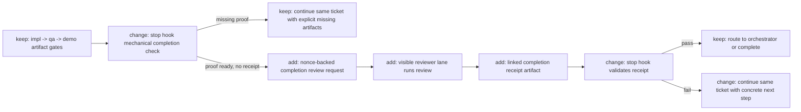

# TASK-0087: enforce qa routing and visible completion review receipts

## Summary
Tighten the completion contract so Stop hook keeps doing deterministic artifact
and phase checks, but no longer hides the final completion judgment inside a
background `codex exec` pass. Instead, the live lane must run a visible
completion review, write a ticket-scoped receipt artifact keyed by a Stop-hook
nonce, and Stop hook only passes when that linked receipt is fresh, matches the
nonce, says the user ask is satisfied, and the next final response echoes
`COMPLETION_PASSWORD: <nonce>`.

## Scope
- In:
  - deterministic Stop-hook gating for phase, artifact, and receipt
    prerequisites
  - a visible completion-review request and receipt flow keyed by a nonce
  - a Stop-hook-issued completion password that only appears once a live
    `impl` ticket run reaches final completion review
  - ticket-scoped receipt artifacts under `tickets/TASK-XXXX/artifacts/review/`
  - reviewer-lane and `review`-skill writeback rules for final completion
    receipts
  - targeted doc, prompt, and test updates for the new completion path
- Out:
  - making Python Stop hook spawn Codex native subagents directly
  - replacing `impl -> qa -> demo` execution-phase mechanics
  - a hosted artifact service or approval database
  - a broader redesign of every hidden Stop-hook role in one ticket

## Plan
- `Change:` replace the hidden completion-gate `codex exec` review pass with a
  hybrid contract: Stop hook performs only mechanical completion checks, emits
  a `completion_review_requested` continuation with a fresh nonce when the
  evidence pack is otherwise ready, and later validates a visible
  reviewer-written receipt artifact before routing to orchestrator or
  completion.
- `Why:` the current completion gate is hard to observe in the CLI and weakly
  aligned with Codexter's artifact-first model. The trust boundary should be
  inspectable: the operator should see when final review is requested, the
  reviewer should leave a durable receipt, and Stop hook should validate that
  receipt instead of secretly making the whole judgment itself.
- `Before -> After:`
  Before: Stop hook checks ticket artifacts, then runs hidden
  `completion-reviewer` `codex exec` logic for the final sufficiency decision.
  After: Stop hook checks artifacts and phases mechanically, then tells the
  live lane to run a visible completion review. The reviewer writes and links a
  nonce-matched receipt artifact, and the next Stop event validates that
  receipt before allowing completion.
- `Touch:` `bin/stop_hook.py`, `bin/test_stop_hook.py`,
  `skills/impl/scripts/tmux_helper.py`, `skills/review/SKILL.md`,
  `docs/specs/review-gates.md`, `docs/specs/orchestrator-subagent-loop.md`,
  `skills/impl/references/stop-hook-routing.md`, `tickets/templates/ticket.md`,
  `agents/completion-reviewer.toml`
- `Inspect:` `docs/MEMORY.md`, `docs/TROUBLES.md`,
  `docs/specs/review-gates.md`, `docs/specs/orchestrator-subagent-loop.md`,
  `bin/stop_hook.py`, `bin/test_stop_hook.py`,
  `skills/impl/scripts/tmux_helper.py`, `skills/review/SKILL.md`,
  `tickets/archive/TASK-0038/ticket.md`,
  `tickets/archive/TASK-0065/ticket.md`,
  `tickets/archive/TASK-0090/ticket.md`
- `Signature delta:`
  - `bin/stop_hook.py / build_completion_review_request(ticket, current_run): CompletionReviewRequest`
  - `bin/stop_hook.py / completion_review_receipt_gate(ticket, current_run): tuple[bool, str, list[str], CompletionReviewReceipt | None]`
  - `bin/stop_hook.py / continue_hook_response(...): int`
  - `skills/impl/scripts/tmux_helper.py / lane_directive(phase, worker_name, execution_phase): str`
  - `skills/review/SKILL.md / completion review receipt(active_ticket, nonce): artifact writeback contract`
- `Type Sketch:`
  - `type CompletionReviewRequest = { ticket_id: str, nonce: str, requested_at: str, artifact_root: str, last_user_turn_summary: str, required_artifacts: str[], reason: str }`
  - `type CompletionReviewReceipt = { ticket_id: str, nonce: str, reviewed_at: str, reviewer_mode: "visible_review_lane", reviewed_artifacts: str[], verdict: "pass"|"revise"|"block", satisfies_user_query: boolean, user_query_reason: str, obvious_next_step: str, review_artifact: str }`
  - `type StopHookCompletionState = { receipt_required: boolean, receipt_nonce?: str, receipt_status: "missing"|"mismatch"|"stale"|"fail"|"pass", continuation_message: str }`
- `Typed flow example:`
  - builder finishes implementation and QA or demo artifacts are already linked
    on `TASK-0087`
  - Stop hook runs mechanical gates and produces
    `CompletionReviewRequest { ticket_id: "TASK-0087", nonce: "CR-7F3K2", required_artifacts: [".../qa/result.json", ".../review/..."], reason: "run visible completion review" }`
  - the live reviewer lane runs `review`, writes
    `tickets/TASK-0087/artifacts/review/2026-04-25T015321Z-completion-receipt.json`
    containing `nonce: "CR-7F3K2"` and `verdict: "pass"`, and links it from
    the ticket `Evidence`
  - the next Stop event loads `CompletionReviewReceipt`, verifies `ticket_id`,
    `nonce`, freshness, artifact linkage, and `satisfies_user_query: true`,
    then routes forward only when the final assistant response also includes
    `COMPLETION_PASSWORD: CR-7F3K2`
- `Execution steps:`
  - 1. Add a completion-review request record and nonce generation path in
    `bin/stop_hook.py` without changing the existing impl, qa, and demo
    mechanical gates.
  - 2. Add receipt discovery and validation helpers in `bin/stop_hook.py` that
    read linked ticket artifacts, reject missing, mismatched, or stale
    receipts, and return one concrete continuation message when the receipt is
    not good enough.
  - 3. Remove hidden `completion_gate` use of
    `run_role(..., "completion-reviewer")` on completion paths, but keep any
    narrower missing-result fallback logic that still belongs inside the Stop
    hook.
  - 4. Teach the visible reviewer path to consume the nonce and write a
    ticket-scoped completion-review receipt through `skills/review` plus the
    reviewer lane instructions in `skills/impl/scripts/tmux_helper.py`.
  - 5. Update ticket template and review-gate docs so final completion review
    receipts are first-class artifacts alongside QA and demo proof, not
    chat-only behavior.
  - 6. Add targeted tests for no receipt, wrong nonce, stale receipt,
    failing receipt, and passing receipt, then rerun ticket metadata
    validation.
- `Recommendation:` keep the Stop hook as a separate deterministic process, but
  move subjective completion judgment out of hidden `codex exec` and into a
  visible receipt-gated reviewer flow. This preserves the trust boundary while
  making the decisive review observable and auditable.
- `Options considered:`
  - `Option 1:` keep hidden `codex exec` completion review and only improve
    ticket artifact writeback
  - `Pros:` smallest code delta and strongest isolation boundary
  - `Cons:` the decisive review still happens offstage and remains harder to
    debug or trust from the CLI
  - `Why not chosen:` too weak on observability
  - `Option 2:` make the Stop hook fully declarative and let the live lane
    self-manage review with no nonce or receipt contract
  - `Pros:` simplest mental model and best CLI visibility
  - `Cons:` too easy to skip or fake without a hard validation surface
  - `Why not chosen:` too weak on enforcement
  - `Option 3:` keep Stop hook mechanical and require a visible nonce-matched
    completion review receipt
  - `Pros:` best balance of observability, sequencing, and anti-cheat
    enforcement
  - `Cons:` adds one extra artifact contract and one more pass through Stop hook
  - `Why not chosen:` recommended
- `Blast radius:` Stop-hook completion routing, reviewer lane prompts, review
  skill writeback, ticket evidence linking, targeted unit tests, and docs that
  currently describe hidden completion-gate review
- `Risks:` the flow can deadlock if receipt expectations are under-specified;
  agents may try to paste the nonce into the ticket without writing a credible
  receipt; hidden and visible reviewer semantics can drift if the remaining
  Stop-hook reviewer role is not narrowed clearly

## Gap Analysis
- `Current state:` `bin/stop_hook.py` already enforces ticket-scoped artifacts,
  phase results, and hard-gate review fields, but it still runs hidden
  `codex exec` `completion-reviewer` logic on completion-like Stop paths. The
  visible reviewer lane exists through `skills/impl/scripts/tmux_helper.py` and
  `review`, yet it is not the authoritative final receipt surface for
  completion.
- `Production expectation:` a credible artifact-first harness makes the final
  completion judgment inspectable. Mechanical hooks should verify state, while
  the subjective "does this satisfy the user ask?" judgment should leave a
  visible, ticket-linked artifact that can be audited later.
- `Missing gaps:` there is no nonce or request contract, no dedicated
  completion-review receipt artifact, no Stop-hook gate for receipt freshness
  or matching, and no explicit visible-lane instruction that final completion
  review must write back a signed receipt before Stop hook may pass.
- `Comparable implementations:` existing QA and demo `result.json` artifact
  gating in `bin/stop_hook.py`, the TOML hook-role normalization in
  `tickets/archive/TASK-0038/ticket.md`, the explicit obvious-next-step
  completion gate in `tickets/archive/TASK-0065/ticket.md`, and the
  execution-phase contract in `tickets/archive/TASK-0090/ticket.md`
- `Recommendation:` land the visible completion-review receipt now, keep hidden
  Stop-hook review only where the hook still genuinely needs an internal
  same-turn missing-result judgment, and defer broader role renaming or native
  subagent hook execution until after this receipt path proves out

## Diagram
- `Required:` yes
- `Legend:` keep | change | add | remove

## Acceptance Criteria
- [x] AC-1: Stop-hook completion paths stop running hidden
      `completion-reviewer` `codex exec` for final completion judgment and
      instead emit a visible completion-review request when mechanical
      evidence and phase gates pass
- [x] AC-2: the harness defines a ticket-scoped completion-review receipt
      artifact with nonce, reviewed artifact list, verdict, user-query
      satisfaction judgment, and next-step fields
- [x] AC-3: Stop hook refuses completion when the linked receipt is missing,
      mismatched, stale, malformed, or failing, even if QA and demo artifacts
      otherwise exist
- [x] AC-4: the visible reviewer path is explicitly instructed to write and
      link the completion-review receipt before final completion may pass
- [x] AC-5: targeted tests cover receipt-missing, nonce-mismatch, stale-receipt,
      failing-receipt, and passing-receipt completion paths
- [x] AC-6: Stop hook only requests a completion password for active
      ticket-backed `impl` runs and requires a matching
      `COMPLETION_PASSWORD: <nonce>` line in the next final response before
      orchestrator routing may pass

## Verification
- `Tests:` `python3 -m unittest bin.test_stop_hook bin.test_tmux_helper`
- `Manual checks:` replay one completion-like Stop payload with linked QA or
  demo artifacts and confirm the hook asks for visible completion review plus a
  nonce/password; then attach a matching receipt artifact, include
  `COMPLETION_PASSWORD: <nonce>` in the next final response, and confirm the
  replay can advance
- `Evidence required:` targeted Stop-hook tests, one receipt-shaped fixture or
  replay artifact, and a fresh review result linked from the ticket after
  implementation

## Refs
- `docs/specs/review-gates.md`
- `docs/specs/orchestrator-subagent-loop.md`
- `skills/impl/references/stop-hook-routing.md`
- `skills/review/SKILL.md`
- `skills/visual-qa/README.md`
- `bin/stop_hook.py`
- `bin/test_stop_hook.py`
- `skills/impl/scripts/tmux_helper.py`
- `agents/completion-reviewer.toml`
- `tickets/archive/TASK-0038/ticket.md`
- `tickets/archive/TASK-0065/ticket.md`
- `tickets/archive/TASK-0090/ticket.md`

## Evidence
- `Artifacts:` `tickets/archive/TASK-0087/artifacts/review/2026-04-25T015321Z-impl-plan-review.json`, `tickets/archive/TASK-0087/artifacts/review/2026-04-25T021300Z-impl-review.json`, `tickets/archive/TASK-0087/artifacts/review/2026-04-28T225228Z-impl-review.json`, `tickets/archive/TASK-0087/artifacts/review/2026-04-28T234327Z-review.json`, `tickets/archive/TASK-0087/artifacts/review/2026-04-28T234622Z-review.json`
- `Closeout review:` `tickets/archive/TASK-0087/artifacts/review/2026-05-07-doc-router-closeout-review.json`
- `Commands:` `python3 -m py_compile bin/stop_hook.py bin/test_stop_hook.py`; `python3 -m unittest bin.test_stop_hook`; `python3 tickets/scripts/check_ticket_metadata.py`; `git diff --check -- bin/stop_hook.py bin/test_stop_hook.py docs/specs/review-gates.md skills/review/SKILL.md AGENTS.md docs/MEMORY.md docs/HISTORY.md tickets/TASK-0087/ticket.md`
- `Result summary:` Stop hook still requests a visible nonce-backed completion review receipt instead of running hidden completion-gate `codex exec`, but now only active ticket-backed `impl` loops receive that nonce/password, the hook reminds the live lane to call completion review when the password is missing, and the next final response must echo `COMPLETION_PASSWORD: <nonce>` before routing onward
- `Review status:` latest review is `pass`; password-only retries now preserve an existing acceptable receipt and ask only for the missing `COMPLETION_PASSWORD: <nonce>` echo instead of forcing another reviewer run
- `Plan review:` pass; `spec-contract` and `implementation-plan` both cleared
  the `4.0` threshold with no blocking findings; fresh implementation review
  also passed at `4.1/5.0` with no blocking findings
- `2026-04-30 live QA routing:` `bin/stop_hook.py` now prefers spawning a tmux follow-up when the next execution phase is `qa`, and the live follow-up prompt plus `skills/qa/*` explicitly require browser/tool-driving to stay in `qa-tester` rather than the coordinating lane. Verification added in `bin/test_stop_hook.py::test_build_live_followup_reason_for_qa_requires_delegated_qa_tester`.
- `2026-05-07 closeout:` archived after confirming all acceptance criteria were checked and the latest implementation review passed. No implementation was reopened during this pass.
- `2026-05-07 docs router:` README and ARCHITECTURE now define the documentation-router/ownership split and the sync rule future agents should follow when public workflow claims change.

## Blockers
- none
