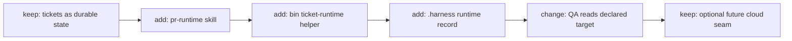

# TASK-0099: add pr runtime skill and ticket runtime launcher

## Summary
Add a discoverable `pr-runtime` skill package plus a helper-backed ticket
runtime launcher so Codexter has one explicit workflow for isolated PR follow-up
and for any case where more than one live writer would otherwise share one
filesystem, with `up` and `down` capable of actually starting and stopping the
declared runtime.

## Scope
- In:
  - a repo-owned `skills/pr-runtime/` package
  - a `bin/ticket-runtime` helper contract for isolated checkout setup and
    runtime launch/stop
  - runtime records under `.harness/state/` for ticket branch, checkout, mode,
    ports, processes, and QA targets
  - a narrow global routing rule for when isolation is required
  - canonical doc links for the shipped skill
- Out:
  - full autonomous multi-ticket dispatch
  - mandatory worktrees for every ticket
  - generic cross-repo orchestration beyond configured commands for frontend,
    backend, or compose mode
  - cloud VM execution

## Plan
- `Change:` add a `pr-runtime` skill that standardizes when to isolate a PR or
  ticket checkout, where runtime state lives, how QA discovers the right
  target, and how `bin/ticket-runtime up/down` launch and stop configured
  runtime commands instead of only persisting metadata.
- `Why:` the current repo has runtime state and GitHub PR-comment workflows, but
  no discoverable repo-native skill that says when to use an isolated checkout,
  how to track the active checkout, or how QA should find the declared target.
- `Before -> After:`
  Before: PR follow-up and concurrent-writer isolation depend on model judgment
  plus ad hoc `git worktree` usage, and runtime targets would need to be guessed
  from local context.
  After: the agent can invoke a repo-owned skill, create or reuse an isolated
  checkout when required, persist the ticket runtime record under `.harness`,
  launch configured frontend/backend or compose commands, and hand QA a
  concrete target instead of inferred ports.
- `Touch:` `skills/pr-runtime/SKILL.md`, `skills/pr-runtime/README.md`,
  `skills/pr-runtime/AGENTS.md`, `bin/ticket-runtime`, `templates/global/AGENTS.md`,
  `docs/specs/runtime-surface.md`, `README.md`
- `Inspect:` `docs/specs/harness-engineering-doctrine.md`,
  `docs/specs/runtime-surface.md`, `tickets/TASK-0081/ticket.md`, root
  `AGENTS.md`, plugin `gh-address-comments` skill contract, `tickets/templates/ticket.md`
- `Signature delta:`
  - `skills/pr-runtime/SKILL.md / choose_runtime(ticket|pr): RuntimeDecision`
  - `bin/ticket-runtime / ensure(ticket_id|branch, mode): RuntimeRecord`
  - `bin/ticket-runtime / up(ticket_id|branch): RuntimeRecord`
  - `bin/ticket-runtime / qa(ticket_id|branch): QaTargetRecord`
  - `bin/ticket-runtime / down(ticket_id|branch): RuntimeRecord`
- `Type Sketch:`
  - `RuntimeDecision = { ticket_id, branch, checkout_mode: "shared"|"worktree", runtime_mode: "shared"|"branch-runtime"|"branch-compose", needs_isolation, reason }`
  - `RuntimeRecord = { ticket_id, branch, checkout_path, checkout_mode, runtime_mode, targets: { frontend_url?, backend_url? }, ports: { frontend?, backend?, db? }, commands: { frontend_cmd?, backend_cmd?, compose_up_cmd?, compose_down_cmd? }, processes: { frontend?, backend?, compose? }, owner_session, status, updated_at }`
  - `QaTargetRecord = { ticket_id, runtime_mode, status, open_targets, artifacts_path }`
- `Typed flow example:`
  - user asks to fix PR `123`
  - `pr-runtime` resolves `branch=pr-123`, `needs_isolation=true`,
    `checkout_mode=worktree`, `runtime_mode=branch-runtime`
  - `bin/ticket-runtime up` writes `.harness/state/tickets/TASK-0099.runtime.json`
    with `checkout_path=/.../worktrees/pr-123`, assigned targets, and launched
    process metadata
  - QA reads `targets.frontend_url` and `targets.backend_url` from that record
    and writes artifacts under `tickets/TASK-0099/artifacts/qa/`
- `Recommendation:` use `skills/pr-runtime/*` as the primary owning surface,
  backed by a minimal `bin/ticket-runtime` helper and one short global routing
  rule. Do not make root policy or hook logic the primary surface.
- `Placement analysis:`
  - `skills/pr-runtime/*` should change now because the main failure is
    inconsistent procedure around isolation, state placement, and QA target
    discovery.
  - `bin/ticket-runtime` should change now as a secondary surface because the
    skill needs one concrete repo-native way to persist runtime records,
    allocate local targets, and launch/stop configured runtime commands.
  - `templates/global/AGENTS.md` should change later in a very small way only
    to add the routing rule that existing PR branches and multiple live writers
    require isolation.
  - repo-local `AGENTS.md` should not be the primary surface because this would
    bloat root policy with workflow procedure.
  - `agents/*.toml` should not be the primary surface because the problem is not
    role ownership; it is missing reusable procedure.
- `Blast radius:` GitHub PR follow-up flow, runtime docs, any future ticket
  runtime helper, and the operator-visible story for isolated checkouts
- `Risks:` the first slice could overbuild into a full runtime manager; keep the
  helper small, JSON-backed, and command-driven, and defer generic service
  orchestration or cloud execution to tickets that actually need it.

## Gap Analysis
- `Current state:` `TASK-0081` defines a broader deferred runtime direction and
  the GitHub `gh-address-comments` skill can inspect PR review context, but the
  repo has no shipped `skills/pr-runtime/` package, no helper contract for
  runtime records, and no repo-native rule for when two live writers must stop
  sharing one filesystem.
- `Production expectation:` a credible harness exposes one discoverable workflow
  for PR/ticket isolation, persists runtime metadata in a non-git path, gives QA
  a declared target instead of guessed ports, and keeps the lightest sufficient
  runtime as the default.
- `Missing gaps:` no shipped skill package, no helper-backed runtime launcher,
  no canonical QA target contract for isolated checkouts, and no narrow global
  routing rule for shared-vs-isolated writer safety.
- `Comparable implementations:` current Codexter runtime docs, `TASK-0081`,
  plugin `gh-address-comments` workflow boundaries, and the repo's skill
  packaging conventions under `skills/*`
- `Recommendation:` land the discoverable skill plus the smallest useful helper
  now; defer heavier compose orchestration, cloud runners, and generic
  dispatcher behavior into follow-ups.

## Diagram

## Acceptance Criteria
- [x] AC-1: the repo contains a discoverable `skills/pr-runtime/` package with
      clear triggers, workflow, and guardrails for isolated checkout use
- [x] AC-2: the implementation defines one helper contract that can create or
      reuse a ticket runtime record under `.harness/state/` and can launch the
      configured runtime through `up` and stop it through `down`
- [x] AC-3: the plan makes explicit that existing PR branches and concurrent
      live writers require isolated checkouts, while ordinary single-writer work
      may stay shared
- [x] AC-4: QA target discovery is explicit: the skill/helper publish declared
      frontend/backend targets instead of relying on inferred ports
- [x] AC-5: the helper persists launched process metadata or compose-command
      metadata so `status` and `down` can act on the declared runtime
- [x] AC-6: canonical docs point to the shipped skill so it is not a chat-only
      capability claim

## Verification
- `Tests:` `python3 tickets/scripts/check_ticket_metadata.py`; targeted helper
  tests for `ensure`, `up`, `down`, runtime-record persistence, and
  shared-vs-isolated selection logic
- `Manual checks:` invoke the skill contract against one PR-follow-up scenario
  and one concurrent-writer scenario and confirm the expected runtime decision
- `Evidence required:` reviewed planning ticket plus later implementation proof
  that `bin/ticket-runtime ensure` writes a runtime record and that QA can read
  the declared targets from that record

## Refs
- `AGENTS.md`
- `docs/specs/harness-engineering-doctrine.md`
- `docs/specs/runtime-surface.md`
- `tickets/TASK-0081/ticket.md`

## Evidence
- `Artifacts:` `tickets/TASK-0099/artifacts/review/2026-04-25T110500Z-impl-plan-review.json`,
  `tickets/TASK-0099/artifacts/review/2026-04-25T111800Z-impl-review.json`,
  `tickets/TASK-0099/artifacts/review/2026-04-25T002845Z-impl-review.json`,
  `tickets/TASK-0099/artifacts/review/2026-04-25T004040Z-impl-review.json`,
  `tickets/TASK-0099/artifacts/review/2026-04-25T004510Z-risk-review.json`,
  `tickets/TASK-0099/artifacts/review/2026-04-25T005132Z-impl-review.json`
- `Commands:` `python3 -m unittest bin/test_ticket_runtime.py`,
  `python3 -m py_compile bin/ticket_runtime.py bin/test_ticket_runtime.py`,
  `python3 tickets/scripts/check_ticket_metadata.py`,
  `python3 bin/check_doc_parity.py`,
  `python3 bin/check_harness_invariants.py`,
  `python3 bin/ticket_runtime.py up --ticket TASK-0099 --branch feat/task-0099 --checkout-mode shared --runtime-mode branch-runtime --reserve frontend --frontend-cmd 'MARKER=/tmp/ticket-runtime-fix.QbfrAa/frontend.marker python3 -c "from pathlib import Path; import os,time; Path(os.environ["MARKER"]).write_text(os.environ.get("PORT",""), encoding="utf-8"); time.sleep(30)"' --json`,
  `python3 bin/ticket_runtime.py qa --ticket TASK-0099 --json`,
  `python3 bin/ticket_runtime.py status --ticket TASK-0099 --json`,
  `python3 bin/ticket_runtime.py down --ticket TASK-0099 --json`,
  `cat /tmp/ticket-runtime-fix.QbfrAa/frontend.marker`,
  `cat .harness/state/ports.json`
- `Result summary:` `ticket_runtime` now keeps ports reserved when teardown
  fails, reports only live QA targets with explicit runtime status, persists
  launch-failure state honestly, and still supports the command-driven local
  runtime contract for PR follow-up and concurrent-writer isolation

## Blockers
- none
