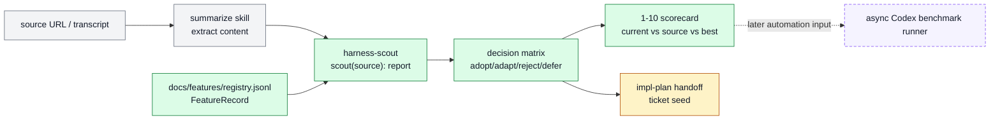

# TASK-0103: add feature registry and harness scout workflow

## Summary
Add a lightweight system of record for Codexter harness techniques and a
`harness-scout` skill that turns URLs, transcripts, blogs, and videos into
deduplicated feature decisions. The recommended path is a structured JSONL
feature registry plus human-readable Markdown summaries and scorecards, not a
database or fully async benchmark runner.

This ticket lands the first high-ROI slice: source provenance, local feature
matching, adopt/adapt/reject/defer decisions, and a simple 1-10 manual
benchmark template. It deliberately defers background Codex session launchers
until the registry and scorecard prove useful on real sources.

## Scope
- In:
  - add `docs/features/` as the canonical feature registry surface
  - add a JSONL feature registry with stable feature IDs, sources, surfaces,
    evidence, known limits, and metric fields
  - add a human-readable registry README that explains how agents use the
    structured records alongside `docs/specs/harness-techniques.md`
  - add a `harness-scout` skill for source ingestion, transcript extraction,
    local baseline search, parity/gap/best-of-worlds routing, decision matrix
    creation, and ticket handoff
  - add a skill `todos.md` checklist and compact references/templates for
    decision matrix, ticket handoff, and scorecard output
  - add one dry-run fixture based on
    `https://www.youtube.com/watch?v=2zhchG0r6iI`
  - add a lightweight benchmark scorecard template that compares current
    Codexter, source-proposed workflow, and best-of-worlds workflow on a
    1-10 rubric
  - update the canonical inventory and start-here docs so the new workflow is
    discoverable only after the skill package exists
- Out:
  - automatic creator polling, cron setup, or OpenClaw integration
  - launching background Codex sessions for benchmark variants
  - a database, vector store, or semantic-memory layer
  - automatic ticket creation from every source feature
  - copying upstream skill behavior or auto-syncing external command families
  - replacing `harness-techniques.md`; it stays the skimmable human inventory

## Plan
- `Change:` create a small structured feature registry and a `harness-scout`
  skill that converts external content into deduplicated feature decisions and
  manual benchmark scorecards.
- `Why:` Codexter already has strong Markdown inventories and synthesis skills,
  but the source, proof, local match, and performance trail for each harness
  technique is hard to query. A structured registry gives future scout passes a
  stable system of record without forcing a premature benchmark platform.
- `Before -> After:`
  - Before: features live mostly in Markdown tables, skills, tickets, and
    memory entries. Agents can search them, but duplicate detection and source
    provenance are fuzzy.
  - After: each important harness technique has a stable record with `id`,
    `name`, `status`, `surfaces`, `source_refs`, `external_refs`,
    `evidence_refs`, `known_limits`, `metrics`, and `last_verified`, while
    `harness-scout` uses those records to classify new source ideas.
- `Touch:`
  - `docs/features/README.md`
  - `docs/features/registry.jsonl`
  - `skills/harness-scout/SKILL.md`
  - `skills/harness-scout/todos.md`
  - `skills/harness-scout/references/decision-matrix.md`
  - `skills/harness-scout/references/ticket-handoff.md`
  - `skills/harness-scout/references/scorecard.md`
  - `skills/harness-scout/templates/source-run.md`
  - `experiments/harness-scout/runs/2026-05-04-self-evolving-agents/`
  - `docs/specs/harness-techniques.md`
  - `README.md`
  - `ARCHITECTURE.md`
  - `docs/HISTORY.md`
  - `docs/MEMORY.md` only if implementation introduces a durable
    invariant beyond this ticket
- `Inspect:`
  - `skills/summarize/SKILL.md`
  - `skills/parity-research/SKILL.md`
  - `skills/gap-analysis/SKILL.md`
  - `skills/best-of-worlds/SKILL.md`
  - `skills/advise/SKILL.md`
  - `skills/impl-plan/SKILL.md`
  - `skills/skill-creator/SKILL.md`
  - `docs/specs/harness-techniques.md`
  - `docs/specs/best-of-worlds-workflow.md`
  - `docs/specs/autoresearch-skill-suite.md`
  - `tickets/TASK-0082/ticket.md`
  - `experiments/README.md`
  - `docs/MEMORY.md`
  - `docs/TROUBLES.md`
- `Signature delta:`
  - `docs/features/registry.jsonl / FeatureRecord(jsonl_line): FeatureRecord`
  - `docs/features/README.md / lookup(feature_id_or_query): registry_usage`
  - `skills/harness-scout/SKILL.md / scout(source_ref): HarnessScoutReport`
  - `skills/harness-scout/todos.md / run_checklist(source_ref): DecisionMatrix`
  - `skills/harness-scout/references/decision-matrix.md / score(candidate): ScoutDecision`
  - `skills/harness-scout/references/ticket-handoff.md / handoff(decision): TicketPlanSeed`
  - `skills/harness-scout/references/scorecard.md / compare(variants): BenchmarkScorecard`
  - `skills/harness-scout/templates/source-run.md / render(run): SourceRunSummary`
- `Type Sketch:`
  - `FeatureRecord`: `id`, `name`, `status`, `category`, `surfaces[]`,
    `source_refs[]`, `external_refs[]`, `evidence_refs[]`, `known_limits`,
    `metrics[]`, `last_verified`
  - `SourceRunSummary`: `source_id`, `url`, `title`, `creator`, `captured_at`,
    `extract_command`, `content_hash`, `summary_path`, `feature_count`
  - `FeatureCandidate`: `claim`, `source_evidence`, `local_matches[]`,
    `scores`, `decision`, `reason`
  - `ScoutDecision`: `status`, `usefulness`, `novelty`, `implementation_cost`,
    `risk`, `ticket_action`, `follow_up`
  - `BenchmarkScorecard`: `task`, `variants[]`, `dimensions`, `scores`,
    `winner`, `confidence`, `notes`
- `Typed flow example:`
  1. Input source:
     `{ url: "https://www.youtube.com/watch?v=2zhchG0r6iI", kind: "youtube" }`
  2. `harness-scout` runs `summarize --extract --youtube auto --format md`
     and writes a scratch `SourceRunSummary`.
  3. It extracts candidate:
     `{ claim: "autonomous skill generation every N steps", source_evidence:
     "video discusses skill reviewer agents after repeated steps" }`.
  4. It searches `registry.jsonl`, `harness-techniques.md`, `skills/*`, and
     tickets, finding `skill-creator`, `self-improve`, and `best-of-worlds` but
     no autonomous skill reviewer loop.
  5. It scores the feature as `adapt`, with a local recommendation:
     "create a gated skill-opportunity reviewer later; do not auto-write
     skills in v1."
  6. If adopted, it seeds an `impl-plan`-shaped ticket handoff. If duplicate or
     weak, it writes the ignore reason into the source run.
- `Execution steps:`
  1. Create `docs/features/` with `README.md` and an initial
     `registry.jsonl` seeded from the highest-signal implemented techniques in
     `harness-techniques.md`.
  2. Keep `harness-techniques.md` as the human inventory and update it to point
     to the structured registry instead of duplicating full records.
  3. Create `skills/harness-scout/SKILL.md` with trigger conditions, ordered
     workflow, decision branches, gotchas, judgement questions, and outcome
     contract.
  4. Add `skills/harness-scout/todos.md` as the anti-forgetting checklist:
     ingest, extract, dedupe, local baseline, parity/gap route, score, handoff,
     and evidence/writeback.
  5. Add compact reference files for the decision matrix, ticket handoff, and
     1-10 benchmark scorecard.
  6. Add a source-run template and one fixture run for the provided YouTube
     video, including extracted feature candidates and final decisions.
  7. Add the benchmark scorecard template with three variants: current
     Codexter, source-proposed workflow, and best-of-worlds workflow.
  8. Update `README.md`, `ARCHITECTURE.md`, and `harness-techniques.md` so the
     skill and registry are discoverable after the package exists.
  9. Update `docs/HISTORY.md` for the shipped workflow. Add `docs/MEMORY.md`
     only if the implementation creates a durable rule about feature records.
  10. Run skill validation, ticket metadata validation, doc parity, harness
      invariants, and diff checks.
- `Recommendation:` implement the JSONL-plus-Markdown registry and manual
  scorecard now. Defer fully async Codex benchmark runners until the manual
  scorecard produces repeated, useful decisions.
- `Options considered:`
  - `Option 1:` Markdown-only inventory.
    - `Pros:` fastest and least machinery.
    - `Cons:` weak dedupe, weak provenance, hard to benchmark.
    - `Why not chosen:` it does not solve the system-of-record problem.
  - `Option 2:` JSONL feature registry plus Markdown summaries.
    - `Pros:` queryable enough for agents, still readable, easy to review in
      git, and compatible with current docs.
    - `Cons:` one more canonical surface to keep aligned.
    - `Why chosen:` best balance of ROI, future automation, and low overhead.
  - `Option 3:` database plus async benchmark runner.
    - `Pros:` strongest future research platform.
    - `Cons:` premature; introduces isolation, cost, scheduling, stale-state,
      scoring, and failure-recovery problems before the records prove useful.
    - `Why not chosen:` it risks building infrastructure before the workflow is
      trusted.
- `Blast radius:`
  - skill discovery and skill validation
  - canonical docs inventory and architecture maps
  - future feature-planning and source-ingestion workflow
  - experiment artifacts under `experiments/`
  - ticket planning expectations for parity-driven source ideas
- `Risks:`
  - registry drift from Markdown inventory
  - false precision from 1-10 scores
  - duplicate feature records caused by fuzzy names
  - over-promoting one creator video into local policy
  - bulky transcripts accidentally becoming durable docs
  - premature automation pressure before manual scorecards prove useful
  - claiming `harness-scout` shipped before its skill package and docs links
    exist

## Gap Analysis
- `Current state:` Codexter has `harness-techniques.md`, `README.md`,
  `ARCHITECTURE.md`, `docs/MEMORY.md`, `docs/TROUBLES.md`, `tickets/`, and
  skills such as `summarize`, `parity-research`, `gap-analysis`,
  `best-of-worlds`, `autoresearch-plan`, and `self-improve`. These surfaces are
  strong for human navigation, but they do not give each feature a stable ID,
  source trail, local match trail, evidence trail, or benchmark history.
- `Production expectation:` a credible source-ingestion workflow needs a stable
  feature system of record, dedupe keys, source provenance, local baseline
  evidence, decision labels, scorecard outputs, ticket links, and clear rules
  for what stays scratch versus durable.
- `Missing gaps:`
  - no structured feature registry
  - no stable feature IDs for dedupe and later benchmarking
  - no standard source-run ledger for video/blog/tweet ingestion
  - no skill that composes `summarize` -> local baseline -> parity/gap ->
    best-of-worlds -> ticket handoff
  - no simple 1-10 benchmark template for comparing current Codexter,
    source-proposed, and best-of-worlds variants
  - no explicit guardrail keeping bulky transcripts out of durable memory
- `Comparable implementations:`
  - provided self-evolving agents video: emphasizes memory layers, skills,
    async reviewers, searchable history, and eval-based harness improvement
  - Codexter `best-of-worlds`: already has source inventory, feature scoring,
    and adopt/adapt/reject/defer decisions
  - Codexter `autoresearch` suite: already has metric-driven sessions and
    experiment artifacts for measured improvement
  - Codexter `harness-techniques.md`: already gives a human feature inventory
    and proposed-eval suggestions
- `Recommendation:` land the registry and scout workflow now, with a manual
  scorecard. Defer async benchmark execution, semantic memory, and feed polling
  into later tickets after repeated source runs show which automation would
  remove real friction.

## Diagram

Legend: gray = keep, green = add, yellow = decision/handoff, dashed purple =
defer.

## Acceptance Criteria
- [x] AC-1: `docs/features/registry.jsonl` exists with stable feature records
  for the highest-signal current Codexter techniques and includes provenance,
  surfaces, limits, and verification fields.
- [x] AC-2: `docs/features/README.md` defines the registry contract, how it
  relates to `harness-techniques.md`, and how agents should update it.
- [x] AC-3: `skills/harness-scout/` exists as a discoverable skill package with
  `SKILL.md` and `todos.md`.
- [x] AC-4: `harness-scout` composes `summarize`, `parity-research`,
  `gap-analysis`, `best-of-worlds`, `advise`, and `impl-plan` without
  auto-syncing external behavior or creating tickets for weak duplicates.
- [x] AC-5: one dry-run fixture for the provided YouTube video produces a
  feature ledger, decision matrix, and scorecard-shaped output.
- [x] AC-6: the manual benchmark template compares current Codexter,
  source-proposed, and best-of-worlds variants on a 1-10 rubric with explicit
  confidence and anti-metric notes.
- [x] AC-7: README, ARCHITECTURE, and `harness-techniques.md` make the new
  skill and registry discoverable without removing the existing whole-system
  maps.
- [x] AC-8: validators and skill checks pass, or failures are documented with
  concrete blockers.

## Verification
- `Tests:`
  - `python3 skills/skill-creator/scripts/quick_validate.py skills/harness-scout`
  - `python3 tickets/scripts/check_ticket_metadata.py`
  - `python3 bin/check_harness_invariants.py`
  - `python3 bin/check_doc_parity.py`
  - `git diff --check`
- `Manual checks:`
  - inspect `docs/features/registry.jsonl` for valid JSONL, stable IDs, and no
    raw transcript dumps
  - inspect the YouTube fixture for source evidence, local baseline matches,
    and decisions that do not overclaim
  - verify `harness-techniques.md` stays a human inventory rather than being
    replaced by raw JSON
  - verify the scorecard does not present subjective scores as precise science
- `Evidence required:`
  - command outputs in the ticket `Evidence` section
  - links to the YouTube dry-run fixture and scorecard
  - final review artifact if the build enters `$impl`

## Autonomy Readiness
- `Human inputs/assets:` no additional input needed; the provided YouTube URL is
  the fixture source.
- `Credentials / external access:` `summarize` CLI must work locally for URL
  extraction; API keys may be needed only if the implementation reruns
  LLM-backed summarization instead of using the already captured transcript.
- `Compute/runtime needs:` local shell, repo validators, and skill validation
  only.
- `Tooling gaps:` no async benchmark runner in this ticket; do not block on
  cron, OpenClaw, Apify, or semantic search.
- `QA risks:` subjective benchmark scoring can overstate confidence; mitigate
  by including confidence, anti-metrics, and source/local evidence fields.
- `Human gates:` approval required before build because this introduces a new
  canonical docs surface and a new skill package.
- `Agent decision boundaries:` agent may add records, templates, and docs; agent
  must not create background automations, launch unmanaged Codex sessions, or
  promote raw transcripts into durable memory.

## Refs
- `skills/summarize/SKILL.md`
- `skills/parity-research/SKILL.md`
- `skills/gap-analysis/SKILL.md`
- `skills/best-of-worlds/SKILL.md`
- `skills/advise/SKILL.md`
- `skills/impl-plan/SKILL.md`
- `skills/skill-creator/SKILL.md`
- `docs/specs/harness-techniques.md`
- `docs/specs/best-of-worlds-workflow.md`
- `docs/specs/autoresearch-skill-suite.md`
- `tickets/TASK-0082/ticket.md`
- `https://www.youtube.com/watch?v=2zhchG0r6iI`

## Evidence
- `Artifacts:`
  - [impl-plan review artifact](artifacts/review/2026-05-04-1102-impl-plan-review.json)
  - [implementation review artifact](artifacts/review/2026-05-04-1123-implementation-review-pass.json)
  - [security/risk review artifact](artifacts/review/2026-05-04-1134-security-risk-review-revise.json)
  - [security/risk review pass artifact](artifacts/review/2026-05-04-1351-security-risk-review-pass.json)
  - [duplicate source pass review artifact](artifacts/review/2026-05-04-1516-harness-scout-duplicate-source-review.json)
- `Implemented artifacts:`
  - [feature registry local instructions](../../docs/features/AGENTS.md)
  - [feature registry README](../../docs/features/README.md)
  - [feature registry JSONL](../../docs/features/registry.jsonl)
  - [harness-scout skill](../../skills/harness-scout/SKILL.md)
  - [harness-scout checklist](../../skills/harness-scout/todos.md)
  - [harness-scout architecture reference](../../skills/harness-scout/references/architecture.md)
  - [harness-scout workflow reference](../../skills/harness-scout/references/workflows.md)
  - [harness-scout gotchas reference](../../skills/harness-scout/references/gotchas.md)
  - [harness-scout decision matrix reference](../../skills/harness-scout/references/decision-matrix.md)
  - [harness-scout project comparison reference](../../skills/harness-scout/references/project-comparison.md)
  - [harness-scout ticket handoff reference](../../skills/harness-scout/references/ticket-handoff.md)
  - [harness-scout scorecard reference](../../skills/harness-scout/references/scorecard.md)
  - [harness-scout source-run template](../../skills/harness-scout/templates/source-run.md)
  - [YouTube fixture source summary](../../experiments/harness-scout/runs/2026-05-04-self-evolving-agents/source-summary.md)
  - [YouTube fixture feature ledger](../../experiments/harness-scout/runs/2026-05-04-self-evolving-agents/feature-ledger.md)
  - [YouTube fixture decision matrix](../../experiments/harness-scout/runs/2026-05-04-self-evolving-agents/decision-matrix.md)
  - [YouTube fixture compact analysis](../../experiments/harness-scout/runs/2026-05-04-self-evolving-agents/compact-analysis.md)
  - [YouTube fixture scorecard](../../experiments/harness-scout/runs/2026-05-04-self-evolving-agents/scorecard.md)
  - [YouTube fixture ticket handoff](../../experiments/harness-scout/runs/2026-05-04-self-evolving-agents/handoff.md)
  - [gated skill opportunity reviewer follow-up](../TASK-0104/ticket.md)
  - [hook-based error learning reminder comparison follow-up](../TASK-0105/ticket.md)
- `Commands:`
  - `summarize "https://www.youtube.com/watch?v=2zhchG0r6iI" --extract --youtube auto --format md --timestamps --plain --max-extract-characters 10000 --timeout 3m` -> bounded transcript extract succeeded with `summarize 0.13.0`; raw transcript not stored
  - `python3 tickets/scripts/check_ticket_metadata.py` -> `ticket metadata OK (11 ticket files checked)`
  - `python3 skills/skill-creator/scripts/quick_validate.py skills/harness-scout` -> `[PASSED] Skill is valid!`
  - feature registry contract validation snippet -> `feature registry contract OK (13 records)`
  - `python3 bin/check_harness_invariants.py` -> `harness invariants OK (5 files checked, 15 agents, 13 rules)`
  - `python3 bin/check_doc_parity.py` -> `structural doc parity OK (6 files checked, 29 rules)`
  - `python3 -m py_compile skills/autoresearch-plan/scripts/init_session.py skills/best-of-worlds/scripts/init_synthesis.py skills/self-improve/scripts/init_skill_memory.py skills/skill-creator/scripts/quick_validate.py` -> passed
  - `git diff --check -- README.md ARCHITECTURE.md docs/specs/harness-techniques.md docs/features experiments/README.md experiments/harness-scout skills/harness-scout docs/HISTORY.md tickets/TASK-0103/ticket.md` -> passed
  - `git diff --check -- skills/harness-scout experiments/harness-scout docs/features docs/HISTORY.md tickets/TASK-0104/ticket.md tickets/TASK-0105/ticket.md` -> passed
- `Review:`
  - implementation review -> `pass`, score `4.2 / 5.0`, hard gates clear,
    no blocking findings
  - security/risk review -> `revise`, score `3.3 / 5.0`, hard gates failed:
    `integration-readiness`, `evidence-quality`
  - security/risk review after hardening -> `pass`, score `4.3 / 5.0`, hard
    gates clear, no blocking findings
  - duplicate source pass review -> `pass`, score `4.2 / 5.0`, hard gates
    clear, no blocking findings
- `Result summary:` implementation artifacts exist, acceptance criteria are
  satisfied, validation passes, implementation plus security/risk review pass,
  and the duplicate source run now has a compact dedupe table plus two
  approval-gated follow-up tickets.

## Blockers
- none
