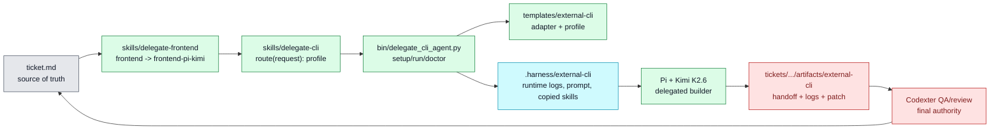

# TASK-0106: add external CLI delegation platform

## Summary
Add a general `delegate-cli` platform that lets Codexter route bounded work to
external coding-agent CLIs while keeping Codexter as the ticket owner, artifact
collector, reviewer, QA router, and final integrator. Prove the platform with
one concrete `delegate-frontend` profile that runs Pi with Kimi K2.6 for
frontend implementation and design-polish tasks.

## Scope
- In: `delegate-cli` skill, `delegate-frontend` profile skill, a local
  `bin/delegate_cli_agent.py` launcher, Pi adapter/profile templates, dry-run
  tests, docs/inventory updates after proof, and ticket-scoped artifact capture.
- In: profile schema that can later host `bog-*`, `opencode-*`, `kimi-cli-*`,
  or other CLI profiles without rewriting the launcher.
- Out: full parallel Ralph, automatic merge queues, hidden background workers,
  Kimi CLI direct integration, Bog Agents adapter implementation, push/deploy,
  or automatic acceptance of external CLI output.

## Plan
- `Change:` introduce a reusable external CLI delegation platform with one
  frontend-first Pi/Kimi profile.
- `Why:` Codexter needs a durable way to send work to the CLI/model/harness best
  suited for a task without losing ticket visibility, proof quality, or final
  review authority. Frontend is the first proving case, not the architecture's
  ceiling.
- `Before -> After:` before, Codexter can use native subagents and frontend
  skills, but cannot hand one bounded work package to a different local CLI
  with repeatable setup, prompt transfer, logging, and result capture. After,
  `delegate-cli` owns the generic profile/adapter workflow, while
  `delegate-frontend` calls the `frontend-pi-kimi` profile as the first
  production-shaped path.
- `Touch:`
  - `skills/delegate-cli/AGENTS.md`
  - `skills/delegate-cli/README.md`
  - `skills/delegate-cli/SKILL.md`
  - `skills/delegate-cli/references/architecture.md`
  - `skills/delegate-cli/references/workflows.md`
  - `skills/delegate-cli/references/gotchas.md`
  - `skills/delegate-frontend/AGENTS.md`
  - `skills/delegate-frontend/README.md`
  - `skills/delegate-frontend/SKILL.md`
  - `skills/delegate-frontend/references/architecture.md`
  - `skills/delegate-frontend/references/workflows.md`
  - `skills/delegate-frontend/references/gotchas.md`
  - `templates/external-cli/adapters/pi/README.md`
  - `templates/external-cli/profiles/frontend-pi-kimi/APPEND_SYSTEM.md`
  - `templates/external-cli/profiles/frontend-pi-kimi/prompt.md.tpl`
  - `templates/external-cli/profiles/frontend-pi-kimi/handoff.md.tpl`
  - `templates/external-cli/profiles/frontend-pi-kimi/settings.json.tpl`
  - `bin/delegate_cli_agent.py`
  - `bin/test_delegate_cli_agent.py`
  - `bin/README.md`
  - `docs/specs/harness-techniques.md`
  - `README.md`
  - `ARCHITECTURE.md`
  - `docs/HISTORY.md`
- `Inspect:` `docs/archive/research/web-research/2026-05-05_external-cli-frontend-delegation-proposal.md`,
  `docs/specs/harness-engineering-doctrine.md`, `docs/specs/runtime-surface.md`,
  `docs/specs/orchestrator-subagent-loop.md`, `tickets/README.md`,
  `tickets/templates/ticket.md`, `bin/AGENTS.md`, `bin/README.md`,
  `bin/ticket_runtime.py`, `bin/test_ticket_runtime.py`,
  `skills/pr-runtime/SKILL.md`, `skills/frontend-craft/SKILL.md`,
  `skills/skill-creator/scripts/quick_validate.py`, `docs/MEMORY.md`,
  `docs/TROUBLES.md`, and `docs/prd.md`.
- `Signature delta:`
  - `bin/delegate_cli_agent.py / main(argv: list[str] | None): int`
  - `bin/delegate_cli_agent.py / command_setup(args: argparse.Namespace): dict[str, object]`
  - `bin/delegate_cli_agent.py / command_run(args: argparse.Namespace): dict[str, object]`
  - `bin/delegate_cli_agent.py / command_doctor(args: argparse.Namespace): dict[str, object]`
  - `bin/delegate_cli_agent.py / load_profile(profile: str, root: Path): DelegateProfile`
  - `bin/delegate_cli_agent.py / build_pi_command(profile: DelegateProfile, run: DelegateRun): list[str]`
  - `bin/delegate_cli_agent.py / render_prompt(profile: DelegateProfile, run: DelegateRun): Path`
  - `bin/delegate_cli_agent.py / collect_run_artifacts(run: DelegateRun, command: Sequence[str], completed: CompletedProcess[str] | None): DelegateRunResult`
  - `skills/delegate-cli/SKILL.md / route(request): DelegateProfileDecision`
  - `skills/delegate-frontend/SKILL.md / route(frontend_request): frontend-pi-kimi handoff`
- `Type Sketch:`
  - `DelegateProfile = { name, adapter, model, thinking, skill_paths, template_dir, allowed_tools, default_checkout }`
  - `AdapterSpec = { name, executable, install_hint, command_mode, supports_json, supports_skills, env_requirements }`
  - `DelegateRun = { run_id, ticket_id?, profile, checkout_mode, checkout_path, prompt_path, artifact_dir, durable_artifact_dir?, dry_run }`
  - `DelegateRunResult = { run_id, command, exit_code, checkout_mode, checkout_path, stdout_log, stderr_log, handoff_path?, diff_stat?, status }`
  - `FrontendProfileContext = { frontend_skills, taste_refs, target_ticket, expected_handoff, forbidden_actions }`
- `Typed flow example:` user invokes `delegate-frontend` for
  `tickets/TASK-1234/ticket.md` -> skill selects
  `DelegateProfile{name:"frontend-pi-kimi", adapter:"pi", model:"openrouter/moonshotai/kimi-k2.6"}` ->
  launcher creates `DelegateRun{run_id:"20260504T175339Z-frontend-pi-kimi", checkout_mode:"worktree", artifact_dir:".harness/external-cli/runs/..."}` ->
  prompt renderer writes `prompt.md` with ticket summary, frontend skill bundle,
  forbidden actions, and handoff path -> Pi command runs or dry-runs ->
  collector writes `stdout.log`, `stderr.log`, `exit_code.txt`, optional
  `diff.patch`, and `handoff.md` -> Codexter links copied artifacts under
  `tickets/TASK-1234/artifacts/external-cli/<run-id>/` and still sends the
  resulting UI work through QA/review.
- `Execution steps:`
  1. Create `skills/delegate-cli/` as the primary public workflow with routing
     rules, setup/run/doctor usage, adapter/profile contracts, safety
     boundaries, and required result artifacts.
  2. Create `skills/delegate-frontend/` as a thin frontend profile entrypoint
     that loads `delegate-cli`, requires the current frontend skills, and
     routes frontend implementation/design-polish work to `frontend-pi-kimi`.
  3. Add Pi adapter and `frontend-pi-kimi` templates under
     `templates/external-cli/`, keeping provider/model defaults configurable
     and secrets out of tracked files.
  4. Implement `bin/delegate_cli_agent.py` with `setup`, `run`, and `doctor`
     subcommands, `--dry-run`, `--json`, `--profile`, `--ticket`,
     `--checkout shared|worktree`, `--model`, and `--artifact-dir` controls.
  5. Keep runtime state under ignored `.harness/external-cli/` and copy durable
     ticket evidence into `tickets/TASK-*/artifacts/external-cli/<run-id>/`
     when a ticket is supplied.
  6. Add unit tests for profile loading, dry-run command rendering, prompt
     rendering, artifact path calculation, missing executable/credential doctor
     output, and no-network dry-run behavior.
  7. Validate skill packages with
     `python3 skills/skill-creator/scripts/quick_validate.py`.
  8. Update `bin/README.md`, `README.md`, `ARCHITECTURE.md`, and
     `docs/specs/harness-techniques.md` only after tests prove the shipped
     surfaces exist.
  9. Append `docs/HISTORY.md` after the capability is real and discoverable;
     do not add a new durable memory rule unless implementation discovers an
     invariant future work must obey.
- `Recommendation:` build `delegate-cli` as the platform and
  `delegate-frontend` as the first profile. Do not ship a frontend-only
  one-off script.
- `Options considered:`
  1. `delegate-frontend` only: fastest, but bakes in the wrong abstraction and
     repeats plumbing for every future CLI.
  2. `delegate-cli` only: clean, but too abstract unless a concrete profile
     proves it against a real workflow.
  3. `delegate-cli` platform plus `delegate-frontend` first profile: best
     balance; one reusable contract with one useful proving path.
- `Blast radius:` skill discovery, README/ARCHITECTURE skill maps,
  `.harness/` runtime conventions, bin helper tests, ignored runtime state,
  ticket evidence layout, frontend skill routing, and future `$impl` builder
  lane handoffs.
- `Risks:` external CLI output may modify too much; profile setup may leak
  machine-local settings into Git; Pi/Kimi model ids may drift; worktree mode
  may overlap with `ticket_runtime.py` expectations; documentation could
  overstate the Bog/Kimi CLI paths before adapters exist; frontend profile
  could accidentally become the only supported delegation path unless
  `delegate-cli` remains the primary surface.

## Gap Analysis
- `Current state:` Codexter has native subagents, `$impl`, `$ralph`, ticket
  runtime helpers, frontend skill routing, and artifact-first review gates. It
  does not have a repeatable way to run another local coding-agent CLI as a
  bounded builder lane with managed skills, prompt templates, logs, and ticket
  evidence handoff.
- `Production expectation:` a credible external-agent delegation system has a
  generic adapter/profile contract, explicit install/credential doctor checks,
  dry-run command rendering, isolated checkout support, runtime logs outside
  Git, durable ticket evidence, clear forbidden actions, and review/QA
  ownership that stays with the orchestrating harness.
- `Missing gaps:` no `delegate-cli` skill, no profile schema, no launcher, no
  templates, no Pi command renderer, no doctor/dry-run tests, no external CLI
  artifact contract, no docs/inventory entries for this capability.
- `Comparable implementations:` Pi supports print/JSON/RPC modes, model
  selection, skill loading, and `AGENTS.md` context; Bog Agents CLI supports
  non-interactive and JSON modes plus richer Python/LangGraph agent middleware;
  Codexter's own `pr-runtime` and `ticket_runtime.py` show the local helper
  style for worktree/runtime records.
- `Recommendation:` land only the generic platform plus the Pi frontend profile
  now. Defer Bog Agents, direct Kimi CLI, OpenCode, and parallel dispatch
  profiles until the adapter contract passes one real smoke path.

## Diagram

## Acceptance Criteria
- [x] AC-1: `skills/delegate-cli/` is a discoverable skill with valid
  `SKILL.md`, `README.md`, `AGENTS.md`, and required references.
- [x] AC-2: `skills/delegate-frontend/` exists as a profile skill that routes
  through `delegate-cli` instead of duplicating the platform workflow.
- [x] AC-3: `bin/delegate_cli_agent.py` supports `setup`, `run`, and `doctor`
  with `--dry-run` and `--json`.
- [x] AC-4: Pi adapter/profile templates generate a reproducible
  `frontend-pi-kimi` prompt and command without requiring network access in
  dry-run mode.
- [x] AC-5: Ticket-supplied runs write runtime logs under `.harness/` and copy
  durable evidence under `tickets/TASK-*/artifacts/external-cli/<run-id>/`.
- [x] AC-6: Tests cover dry-run profile loading, command rendering, prompt
  rendering, doctor failures, and artifact path behavior.
- [x] AC-7: README, ARCHITECTURE, `bin/README.md`, and harness-techniques docs
  describe only the shipped `delegate-cli` platform and `frontend-pi-kimi`
  profile; Bog/Kimi/OpenCode adapters are named as future profiles only.

## Verification
- `Tests:` `python3 -m unittest bin.test_delegate_cli_agent`;
  `python3 -m unittest discover -s bin -p 'test_*.py'`;
  `python3 -m py_compile bin/delegate_cli_agent.py bin/test_delegate_cli_agent.py`;
  `python3 skills/skill-creator/scripts/quick_validate.py skills/delegate-cli`;
  `python3 skills/skill-creator/scripts/quick_validate.py skills/delegate-frontend`;
  `python3 tickets/scripts/check_ticket_metadata.py`;
  `python3 bin/check_doc_parity.py`;
  `python3 bin/check_harness_invariants.py`.
- `Manual checks:` run
  `python3 bin/delegate_cli_agent.py doctor --profile frontend-pi-kimi --json`
  and confirm missing executable/credentials are reported without crashing; run
  `python3 bin/delegate_cli_agent.py run --profile frontend-pi-kimi --checkout worktree --ticket tickets/TASK-0106/ticket.md --dry-run --json`
  and confirm the rendered command, prompt path, runtime path, and durable
  artifact path are correct.
- `Evidence required:` unit test output, py_compile output, skill validation
  output, ticket metadata validation output, dry-run JSON, and linked review
  artifact under `tickets/TASK-0106/artifacts/review/`.

## Autonomy Readiness
- `Human inputs/assets:` approval of this plan before build; no design assets
  required for the platform ticket.
- `Credentials / external access:` no credentials required for tests or dry-run;
  real Pi/Kimi runs need `pi` installed and an OpenRouter/Kimi-compatible auth
  path, but this ticket must not require live spend to pass.
- `Compute/runtime needs:` local Python 3, local filesystem, optional `pi`
  executable for non-dry-run doctor/manual smoke.
- `Tooling gaps:` no existing delegate CLI launcher or profile schema; the
  ticket creates them.
- `QA risks:` dry-run proof can verify orchestration and artifact capture, but
  cannot prove Kimi frontend quality. Real frontend quality remains a later
  profile smoke/eval concern.
- `Human gates:` approval before setting `status: building`; no push, deploy,
  publish, package install, or live paid model run without explicit operator
  action.
- `Agent decision boundaries:` the builder may choose exact Python helper
  function factoring and template filenames inside the planned surfaces; it may
  not replace the generic `delegate-cli` platform with a frontend-only script
  or ship unproven adapters as active capabilities.

## Refs
- [External CLI Delegation Proposal](/Users/kenjipcx/coding-harness/Codexter/docs/archive/research/web-research/2026-05-05_external-cli-frontend-delegation-proposal.md)
- [Harness Engineering Doctrine](/Users/kenjipcx/coding-harness/Codexter/docs/specs/harness-engineering-doctrine.md)
- [Runtime Surface](/Users/kenjipcx/coding-harness/Codexter/docs/specs/runtime-surface.md)
- [Orchestrator Subagent Loop](/Users/kenjipcx/coding-harness/Codexter/docs/specs/orchestrator-subagent-loop.md)
- [Pi Skills Docs](https://pi.dev/docs/latest/skills)
- [Pi Coding Agent README](https://github.com/badlogic/pi-mono/blob/main/packages/coding-agent/README.md)
- [Pi Kimi K2.6 Model Page](https://pi.dev/models/openrouter/moonshotai-kimi-k2-6)
- [Bog Agents CLI](https://pypi.org/project/bog-agents-cli/)

## Evidence
- `Artifacts:`
  - [impl-plan review](artifacts/review/2026-05-04-impl-plan-review.json)
  - [implementation review](artifacts/review/2026-05-04-impl-review.json)
  - [hardening review](artifacts/review/2026-05-04-hardening-review.json)
  - [latest external CLI dry-run artifacts](artifacts/external-cli/20260504T181200Z-frontend-pi-kimi-review-hardened)
- `Commands:`
  - `python3 -m unittest bin.test_delegate_cli_agent` -> passed,
    `Ran 10 tests ... OK`
  - `python3 -m unittest discover -s bin -p 'test_*.py'` -> passed,
    `Ran 113 tests ... OK`
  - `python3 -m py_compile bin/delegate_cli_agent.py bin/test_delegate_cli_agent.py`
    -> passed
  - `python3 skills/skill-creator/scripts/quick_validate.py skills/delegate-cli`
    -> passed, `[PASSED] Skill is valid!`
  - `python3 skills/skill-creator/scripts/quick_validate.py skills/delegate-frontend`
    -> passed, `[PASSED] Skill is valid!`
  - `python3 tickets/scripts/check_ticket_metadata.py` -> passed,
    `ticket metadata OK (12 ticket files checked)`
  - `python3 bin/check_doc_parity.py` -> passed,
    `structural doc parity OK (6 files checked, 29 rules)`
  - `python3 bin/check_harness_invariants.py` -> passed,
    `harness invariants OK (5 files checked, 15 agents, 13 rules)`
  - `python3 bin/delegate_cli_agent.py doctor --profile frontend-pi-kimi --json`
    -> passed; Pi executable, templates, and skills present, with
    `OPENROUTER_API_KEY` reported absent for live runs
  - `python3 bin/delegate_cli_agent.py run --profile frontend-pi-kimi --checkout worktree --ticket tickets/TASK-0106/ticket.md --dry-run --json`
    -> passed; rendered Pi/Kimi command and copied durable ticket artifacts
  - `python3 bin/delegate_cli_agent.py run --profile frontend-pi-kimi --run-id ../escape --dry-run --json`
    -> failed as expected with invalid run-id guard
  - `python3 bin/delegate_cli_agent.py run --profile frontend-pi-kimi --ticket TASK-NOTREAL --dry-run --json`
    -> failed as expected with missing-ticket guard
  - `python3 bin/delegate_cli_agent.py run --profile frontend-pi-kimi --run-id live-missing-env-review --json`
    -> failed as expected before invoking Pi because `OPENROUTER_API_KEY` is
    absent
  - `git diff --check -- README.md ARCHITECTURE.md bin/README.md bin/delegate_cli_agent.py bin/test_delegate_cli_agent.py docs/HISTORY.md docs/specs/harness-techniques.md skills/delegate-cli skills/delegate-frontend templates/external-cli tickets/TASK-0106/ticket.md`
    -> passed
- `Result summary:` `delegate-cli` and `delegate-frontend` are shipped as
  discoverable skills; `bin/delegate_cli_agent.py` supports doctor/setup/run,
  dry-run/live command rendering, model/thinking overrides, run-id path
  traversal guards, missing-ticket guards, live provider-env guards, worktree
  checkout mode for live runs, prompt safety-rule rendering, and ticket
  evidence copyback. Final implementation review passed at 4.2 overall before
  hardening; the follow-up hardening review passed after the risk fixes.

## Blockers
- none
