# TASK-0107: add Codexter invocation contract

## Summary
Add the local Codexter invocation contract from the Symphony-compatible system
design without creating a separate Codexter CLI or daemon. The recommended path
is a Codexter skill plus small Python contract helpers: normal Codex stays the
entrypoint, `WORKFLOW.md` becomes the repo-local policy file, filesystem
tickets normalize into `WorkItem`, compute selection becomes explicit, and each
run can write a portable `ProofPacket` that Symphony can parse later.

## Scope
- In:
  - Root `WORKFLOW.md` v1 with YAML front matter and prompt body.
  - `CodexterRunEnvelope`, `WorkItem`, `ComputeDecision`, `SkillRoute`, and
    `ProofPacket` data contracts.
  - Filesystem ticket adapter for `tickets/archive/TASK-*/ticket.md`.
  - Compute selector for `local_shared` and `local_worktree`, with blocked
    decisions for unsupported future targets.
  - Optional `compute_target` ticket frontmatter validation and docs.
  - A `skills/codexter-invocation/` package that teaches normal Codex how to
    honor an envelope and route into existing skills.
  - Contract/helper tests and a dry-run proof path.
- Out:
  - No long-running daemon.
  - No Linear, Notion, Open Claw, or remote board adapter.
  - No Symphony polling, retry, stall detection, app-server protocol work, or
    workspace cleanup ownership.
  - No public `codexter run` binary and no script that launches Codex on the
    user's behalf.
  - No parallel `$ralph` leases, merge queue, or cloud compute backend.

## Plan
- `Change:` Land a contract layer that lets a normal Codex session with
  Codexter installed interpret a run request, load repo policy, normalize one
  filesystem ticket, decide compute, route to an existing phase skill, and
  produce a machine-readable proof packet.
- `Why:` Symphony already solves polling/background-agent orchestration. Codexter
  should make itself easy for Symphony to invoke later while preserving the
  current local conversational entrypoint today.
- `Before -> After:`
  - Before: `$impl`, `$ralph`, `pr-runtime`, and `delegate-cli` have useful
    execution pieces, but there is no stable input/output contract an external
    worker can pass to Codexter-equipped Codex.
  - After: `WORKFLOW.md` plus `CodexterRunEnvelope` define the input, the helper
    validates/normalizes the ticket and compute decision, the invocation skill
    routes to existing Codexter skills, and `ProofPacket` defines the output.
- `Touch:`
  - `WORKFLOW.md` - new repo-local invocation policy and prompt body.
  - `bin/codexter_invocation.py` - new contract helper module and diagnostic
    subcommands for prepare/proof validation; not a public Codexter runner.
  - `bin/test_codexter_invocation.py` - new unit tests for workflow parsing,
    ticket normalization, compute selection, envelope parsing, and proof
    writing.
  - `tickets/scripts/check_ticket_metadata.py` - validate optional
    `compute_target` values when present.
  - `bin/test_ticket_metadata.py` - cover valid and invalid `compute_target`.
  - `tickets/templates/ticket.md` and `tickets/README.md` - document optional
    `compute_target` as ticket operational state.
  - `skills/codexter-invocation/SKILL.md`, `README.md`, `AGENTS.md`,
    `templates/run-envelope.json` - new skill package for normal Codex
    invocation.
  - `README.md`, `ARCHITECTURE.md`, `docs/specs/harness-techniques.md`,
    `docs/features/registry.jsonl` - update only after the skill/helper are
    implemented so public docs do not claim an unshipped surface.
  - `docs/specs/symphony-compatible-codexter-runner.md` - tighten any contract
    wording discovered during implementation.
- `Inspect:`
  - `docs/specs/symphony-compatible-codexter-runner.md`
  - `docs/specs/runtime-surface.md`
  - `docs/specs/harness-techniques.md`
  - `tickets/README.md`
  - `tickets/templates/ticket.md`
  - `tickets/scripts/check_ticket_metadata.py`
  - `bin/ticket_runtime.py`
  - `bin/delegate_cli_agent.py`
  - `bin/test_ticket_runtime.py`
  - `bin/test_delegate_cli_agent.py`
  - `docs/MEMORY.md` entries `MEM-0048`, `MEM-0050`, `MEM-0060`,
    `MEM-0061`, `MEM-0062`, `MEM-0073`, `MEM-0074`
- `Signature delta:`
  - `bin/codexter_invocation.py / parse_frontmatter_markdown(text: str): tuple[dict[str, object], str]`
  - `bin/codexter_invocation.py / load_workflow(path: Path, root: Path): WorkflowPolicy`
  - `bin/codexter_invocation.py / parse_run_envelope(source: str | Path, root: Path): CodexterRunEnvelope`
  - `bin/codexter_invocation.py / load_work_item(selector: WorkItemSelector, root: Path): WorkItem`
  - `bin/codexter_invocation.py / select_compute(item: WorkItem, envelope: CodexterRunEnvelope, policy: WorkflowPolicy): ComputeDecision`
  - `bin/codexter_invocation.py / route_phase(item: WorkItem, envelope: CodexterRunEnvelope, policy: WorkflowPolicy): SkillRoute`
  - `bin/codexter_invocation.py / prepare_invocation(envelope: CodexterRunEnvelope, root: Path): InvocationPlan`
  - `bin/codexter_invocation.py / write_proof_packet(result: InvocationResult, path: Path): ProofPacket`
  - `tickets/scripts/check_ticket_metadata.py / validate_ticket(path: Path): list[str]` accepts and checks optional `compute_target`.
- `Type Sketch:`
  - `WorkflowPolicy`: `workflow.name`, `workflow.version`,
    `board.adapter/source`, `compute.default/allowed/ticket_override_field`,
    `routing.phase_to_skill`, `quality.writes_proof_packet`.
  - `CodexterRunEnvelope`: `workflowPath`, `workItemId`, `workItemPath`,
    `computeTarget`, `phase`, `mode`, `requestedBy`, `requestedAt`,
    `proofPacketPath`.
  - `WorkItem`: `source`, `id`, `identifier`, `title`, `description`, `state`,
    `phase`, `status`, `dependsOn`, `blockedBy`, `ready`,
    `approvalRequired`, `requiresQa`, `requiresDemo`, `computeTarget`,
    `localTicketPath`, `artifactsPath`.
  - `ComputeDecision`: `target`, `allowed`, `reason`, `blockers`,
    `runtimeRecordPath`.
  - `SkillRoute`: `phase`, `skillName`, `ticketPath`, `handoffPrompt`,
    `requiresApprovalBeforeBuild`.
  - `ProofPacket`: `schemaVersion`, `runId`, `workItem`, `compute`, `phases`,
    `artifacts`, `commands`, `verdict`, `nextAction`, `completedAt`.
- `Typed flow example:`
  1. User or Symphony prompt references:
     `{"workflowPath":"WORKFLOW.md","workItemId":"TASK-0107","phase":"planning","mode":"local_codex","proofPacketPath":".harness/results/TASK-0107-plan.proof.json"}`.
  2. `loadWorkflow` returns filesystem board policy, allowed compute
     `["local_shared", "local_worktree"]`, and routing
     `planning -> impl-plan`.
  3. `loadWorkItem` reads `tickets/archive/TASK-0107/ticket.md` and returns
     `ready=false`, `approvalRequired=true`, `status=review`,
     `computeTarget=null`.
  4. `selectCompute` chooses `local_shared` from envelope/workflow defaults and
     returns `allowed=true` because planning is allowed before approval.
  5. `routePhase` returns `SkillRoute(skillName="impl-plan", phase="planning")`
     with a handoff prompt that says to keep the ticket in `review`.
  6. Codex follows the route by using the existing `impl-plan` skill.
  7. At the end, `writeProofPacket` emits verdict `pass` or `revise` and links
     the proof under `.harness/results/` plus ticket `Evidence`.
- `Execution steps:`
  1. Add `WORKFLOW.md` with the v1 policy from the spec and a short prompt body
     that points Codex to the invocation skill rather than duplicating all skill
     contracts.
  2. Implement `bin/codexter_invocation.py` as a small pure-Python helper with
     dataclasses or typed dictionaries, explicit errors, no network access, and
     no agent-launch behavior.
  3. Parse Markdown front matter using a constrained local parser compatible
     with the current ticket parser; support strings, booleans, flat arrays, and
     nested maps needed by `WORKFLOW.md`.
  4. Normalize filesystem tickets into `WorkItem`, reusing the existing ticket
     metadata assumptions and preserving unknown frontmatter under `metadata`.
  5. Add optional `compute_target` validation to ticket metadata and document the
     accepted values. Treat unsupported or disallowed values as a blocked
     `ComputeDecision`, not as silent fallback.
  6. Implement envelope parsing from either inline JSON or file path. Reject
     envelopes that specify neither `workItemId` nor `workItemPath`, that point
     proof output outside `.harness/results/` or the ticket artifacts tree, or
     that request a phase with no routing entry.
  7. Implement phase routing as guidance only. The helper returns the skill name
     and handoff text; normal Codex still performs the skill invocation.
  8. Implement `ProofPacket` writing and JSON schema-like validation in tests so
     external callers can parse result shape without reading the transcript.
  9. Add `skills/codexter-invocation/` with instructions for how Codex should
     accept an envelope, call the helper, route to existing skills, and write
     proof. Include a template envelope for Symphony and local prompts.
  10. Update public docs and the feature registry only after the skill and helper
      exist, marking the surface implemented with known limits: filesystem
      adapter only, local compute only, no daemon.
  11. Add focused unit tests and smoke commands, then run metadata, invariant,
      doc parity, py-compile, and git diff checks.
- `Recommendation:` Implement the skill-plus-helper contract, not a docs-only
  convention and not a daemon. This gives normal Codex a reliable playbook,
  gives tests something deterministic to validate, and gives Symphony the same
  input/output seam later.
- `Options considered:`
  - Docs-only `WORKFLOW.md`: fastest, but too easy for agents to ignore and too
    hard for Symphony to validate.
  - Skill plus helper module: best fit because Codexter is Codex plus skills,
    while the helper makes contracts testable without becoming a public runner.
  - Full local daemon/CLI runner: tempting parity with Symphony, but it repeats
    the system we want to delegate and violates the corrected boundary that
    Codexter is not a separate CLI product.
- `Blast radius:`
  - Ticket metadata validation and docs.
  - Root docs and feature inventory after the surface is real.
  - Existing `$impl`, `$ralph`, `pr-runtime`, and `delegate-cli` mental models,
    because this ticket introduces a higher-level invocation contract but must
    not replace those phase owners.
  - `.harness/` runtime/result directories.
- `Risks:`
  - Accidentally shipping a public CLI-shaped surface. Containment: helper
    subcommands are diagnostic/contract-only and never launch Codex.
  - Duplicating skill contracts inside `WORKFLOW.md`. Containment: `WORKFLOW.md`
    routes and summarizes; existing skills remain authoritative.
  - Over-validating YAML with a brittle parser. Containment: support only the v1
    shape, fail loudly on unsupported structures, and test error messages.
  - Allowing future compute targets to look available. Containment: blocked
    `ComputeDecision` for `symphony` and `codex_cloud` until adapters exist.

## Gap Analysis
- `Current state:` Codexter has strong local ticket skills, serial `$ralph`,
  isolated runtime helpers, external CLI delegation, proof/review conventions,
  and a Symphony-compatible system design. It does not yet have a single
  machine-readable request/result contract that a normal Codex session and a
  future Symphony worker can both use.
- `Production expectation:` A credible background-agent integration needs a
  stable policy file, a normalized work item model, explicit compute admission,
  deterministic routing, failure/block reasons, and a parseable result artifact.
  Symphony's spec proves this through `WORKFLOW.md`, per-issue workspaces,
  normalized issue state, retries, reconciliation, and observability.
- `Missing gaps:`
  - Missing `WORKFLOW.md` loader and v1 policy.
  - Missing `WorkItem` adapter for filesystem tickets.
  - Missing local compute admission rules.
  - Missing `CodexterRunEnvelope` and `ProofPacket`.
  - Missing Codexter skill that tells normal Codex how to honor the envelope.
  - Missing tests proving blocked/approval-gated/disallowed-compute behavior.
- `Comparable implementations:` Symphony Service Specification draft v1,
  `docs/specs/runtime-surface.md`, `bin/ticket_runtime.py`,
  `bin/delegate_cli_agent.py`, `skills/ralph/scripts/select_next_ticket.py`,
  and the existing ticket metadata validator.
- `Recommendation:` Land the local filesystem and local-compute contract now.
  Defer Linear, Notion, polling, retries, cloud execution, leases, and parallel
  queue dispatch to follow-up tickets after this contract is real.

## Diagram

```mermaid
flowchart LR
  classDef keep fill:#e5e7eb,stroke:#4b5563,color:#111827
  classDef add fill:#dcfce7,stroke:#15803d,color:#111827
  classDef gate fill:#fef3c7,stroke:#b45309,color:#111827
  classDef proof fill:#fee2e2,stroke:#b91c1c,color:#7f1d1d
  classDef future fill:#f5f3ff,stroke:#8b5cf6,color:#111827,stroke-dasharray: 5 3

  Ask["Normal Codex ask<br/>run TASK-0107"]:::keep
  Envelope["CodexterRunEnvelope<br/>parseRunEnvelope(input): envelope"]:::add
  Workflow["WORKFLOW.md<br/>loadWorkflow(path): policy"]:::add
  Ticket["tickets/archive/TASK-*/ticket.md<br/>loadWorkItem(selector): WorkItem"]:::keep
  Compute["ComputeSelector<br/>selectCompute(item, policy): decision"]:::gate
  Route["SkillRoute<br/>routePhase(item, policy): skill"]:::add
  Skills["Existing skills<br/>impl-plan / impl / qa / review"]:::keep
  Proof["ProofPacket<br/>writeProofPacket(result): json"]:::proof
  Symphony["Symphony later<br/>same envelope + proof"]:::future

  Ask --> Envelope --> Workflow --> Ticket --> Compute --> Route --> Skills --> Proof
  Symphony -. "passes envelope" .-> Envelope
  Proof -. "external caller parses" .-> Symphony
```

## Acceptance Criteria
- [x] Root `WORKFLOW.md` exists, parses, validates, and keeps skill routing
  separate from detailed skill contracts.
- [x] `bin/codexter_invocation.py` can prepare a local invocation from an inline
  or file-based `CodexterRunEnvelope` without launching Codex.
- [x] Filesystem tickets normalize into `WorkItem` with correct `ready`,
  `approvalRequired`, dependencies, blockers, QA/demo flags, artifact paths, and
  metadata preservation.
- [x] Compute selection honors envelope override, optional ticket
  `compute_target`, workflow default, workflow allowed list, and blocked future
  targets with explicit reasons.
- [x] Phase routing maps planning/building/qa/review/documenting to existing
  Codexter skills and blocks phases that are absent from `WORKFLOW.md`.
- [x] `ProofPacket` JSON can be written for pass/revise/block/failed outcomes
  and includes work item, compute decision, phase results, artifacts, commands,
  verdict, next action, and timestamp.
- [x] `skills/codexter-invocation/` exists and makes the normal-Codex workflow
  discoverable without describing Codexter as a standalone CLI.
- [x] Ticket metadata docs and validator support optional `compute_target`
  without weakening existing frontmatter invariants.
- [x] Public docs and feature registry mark the surface implemented only after
  the helper, skill, tests, and proof path exist.
- [x] The implementation explicitly states that Symphony owns future polling,
  retries, remote workspaces, and app-server session lifecycle.

## Verification
- `Tests:`
  - `python3 -m unittest bin/test_codexter_invocation.py`
  - `python3 -m unittest bin/test_ticket_metadata.py`
  - `python3 -m unittest discover -s bin -p 'test_*.py'`
- `Static checks:`
  - `python3 -m py_compile bin/codexter_invocation.py bin/test_codexter_invocation.py tickets/scripts/check_ticket_metadata.py bin/test_ticket_metadata.py`
  - `python3 tickets/scripts/check_ticket_metadata.py`
  - `python3 bin/check_harness_invariants.py`
  - `python3 bin/check_doc_parity.py`
  - `git diff --check`
- `Manual checks:`
  - Prepare a planning invocation for this ticket and confirm the output route
    is `impl-plan`.
  - Prepare a building invocation for an approval-gated ticket and confirm the
    compute/route result blocks instead of silently proceeding.
  - Prepare an invocation with `computeTarget: "symphony"` and confirm v1
    returns an explicit unsupported-target blocker.
  - Write a sample failed `ProofPacket` and confirm it is valid JSON under
    `.harness/results/` and safe to link from ticket evidence.
- `Evidence required:`
  - Unit test output.
  - Dry-run invocation JSON for one allowed planning route.
  - Dry-run invocation JSON for one blocked building route.
  - Sample proof packet JSON.
  - Fresh review artifact linked from this ticket.

## Autonomy Readiness
- `Human inputs/assets:` Approval of this plan. No external product assets.
- `Credentials / external access:` None for v1. No Linear, Notion, cloud, or
  Symphony credentials are required.
- `Compute/runtime needs:` Local Python 3 and normal Codex with Codexter
  installed. No daemon, network service, or remote worker.
- `Tooling gaps:` No `codexter-invocation` skill/helper exists yet; this ticket
  creates it. No YAML library dependency is assumed unless implementation proves
  it already exists in the host environment.
- `QA risks:` Main risk is contract drift, not UI behavior. Use unit tests,
  validator checks, and dry-run JSON artifacts.
- `Human gates:` Plan approval before build. Future publish/push remains a
  separate explicit gate.
- `Agent decision boundaries:` The builder may choose dataclasses versus typed
  dictionaries and exact helper subcommand names. The builder may not create a
  public `codexter run` product, add polling, add external adapters, or make
  Symphony/cloud execution look available in v1.

## Refs
- [Symphony-compatible Codexter invocation contract](/Users/kenjipcx/coding-harness/Codexter/docs/specs/symphony-compatible-codexter-runner.md)
- [Runtime surface](/Users/kenjipcx/coding-harness/Codexter/docs/specs/runtime-surface.md)
- [Harness techniques](/Users/kenjipcx/coding-harness/Codexter/docs/specs/harness-techniques.md)
- [Tickets README](/Users/kenjipcx/coding-harness/Codexter/tickets/README.md)
- [Harness scout handoff](/Users/kenjipcx/coding-harness/Codexter/experiments/harness-scout/runs/2026-05-05-symphony-compatible-codexter/handoff.md)

## Evidence
- `Artifacts:`
  - [planning-review.json](/Users/kenjipcx/coding-harness/Codexter/tickets/archive/TASK-0107/artifacts/review/2026-05-05-impl-plan-review.json)
  - [prepare-planning.json](/Users/kenjipcx/coding-harness/Codexter/tickets/archive/TASK-0107/artifacts/qa/prepare-planning.json)
  - [prepare-building-blocked.json](/Users/kenjipcx/coding-harness/Codexter/tickets/archive/TASK-0107/artifacts/qa/prepare-building-blocked.json)
  - [prepare-symphony-blocked.json](/Users/kenjipcx/coding-harness/Codexter/tickets/archive/TASK-0107/artifacts/qa/prepare-symphony-blocked.json)
  - [sample-proof-packet.json](/Users/kenjipcx/coding-harness/Codexter/tickets/archive/TASK-0107/artifacts/qa/sample-proof-packet.json)
  - [impl-review.json](/Users/kenjipcx/coding-harness/Codexter/tickets/archive/TASK-0107/artifacts/review/2026-05-05-impl-review.json)
- `Commands:`
  - `python3 -m unittest bin/test_codexter_invocation.py bin/test_ticket_metadata.py`
  - `python3 -m unittest discover -s bin -p 'test_*.py'`
  - `python3 -m py_compile bin/codexter_invocation.py bin/test_codexter_invocation.py tickets/scripts/check_ticket_metadata.py bin/test_ticket_metadata.py`
  - `python3 tickets/scripts/check_ticket_metadata.py`
  - `python3 bin/check_harness_invariants.py`
  - `python3 bin/check_doc_parity.py`
  - `python3 bin/codexter_invocation.py prepare --ticket TASK-0107 --phase planning --proof .harness/results/task-0107-plan.proof.json`
  - `python3 bin/codexter_invocation.py prepare --ticket TASK-0081 --phase building --proof .harness/results/task-0081-build.proof.json`
  - `python3 bin/codexter_invocation.py prepare --ticket TASK-0107 --phase planning --compute symphony --proof .harness/results/task-0107-symphony.proof.json`
  - `python3 bin/codexter_invocation.py write-proof --ticket TASK-0107 --phase planning --proof .harness/results/task-0107-sample.proof.json --verdict failed --next-action 'demonstrate failed proof packet shape' --phase-status failed`
  - `python3 -m json.tool tickets/archive/TASK-0107/artifacts/qa/prepare-planning.json >/dev/null`
  - `python3 -m json.tool tickets/archive/TASK-0107/artifacts/qa/prepare-building-blocked.json >/dev/null`
  - `python3 -m json.tool tickets/archive/TASK-0107/artifacts/qa/prepare-symphony-blocked.json >/dev/null`
  - `python3 -m json.tool tickets/archive/TASK-0107/artifacts/qa/sample-proof-packet.json >/dev/null`
  - `python3 -m json.tool .harness/results/task-0107-sample.proof.json >/dev/null`
  - `feature registry contract validation`
  - `python3 -m json.tool tickets/archive/TASK-0107/artifacts/review/2026-05-05-impl-review.json >/dev/null`
  - `python3 -m json.tool tickets/archive/TASK-0107/artifacts/review/2026-05-05-impl-plan-review.json >/dev/null`
  - `git diff --check`
- `Result summary:` Implementation review passed. The invocation contract is
  now documented, tested, and wired as a normal-Codex skill plus diagnostic
  helper, with no daemon, polling loop, or public Codexter runner added.

## Blockers
- none
