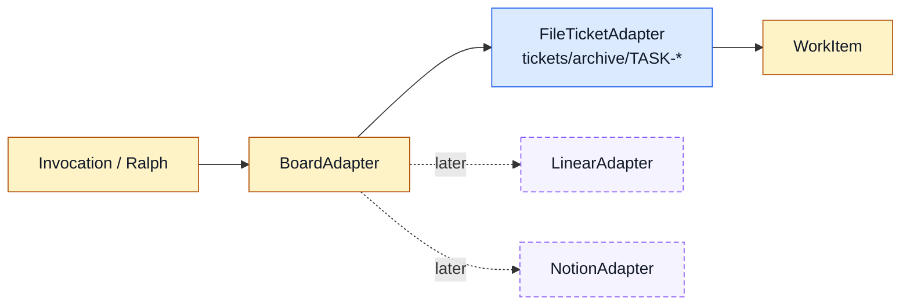

# TASK-0113: define BoardAdapter v1

## Summary
Promote the current filesystem ticket loading behavior into an explicit
`BoardAdapter` contract. The first implementation should keep filesystem
tickets as the only live adapter, but shape the interface so future Linear,
Notion, or custom-board adapters can plug in without rewriting Ralph or the
Codexter invocation helper.

## Scope
- In:
  - A documented `BoardAdapter` interface and normalized `WorkItem` contract.
  - A filesystem adapter for `tickets/archive/TASK-*/ticket.md`.
  - Read operations needed by local invocation and Ralph-like selection.
  - Evidence/writeback hooks where safe, such as appending artifact links or
    updating `next_action`, only if they reuse existing ticket metadata rules.
  - Tests proving normalization, blocker/dependency extraction, ready/approval
    behavior, and path containment.
  - Clear extension notes for Linear/Notion adapters.
- Out:
  - No real Linear or Notion API integration.
  - No remote comments/state transitions.
  - No automatic board polling.
  - No migration of every ticket file.

## Plan
- `Change:` Move from ad hoc filesystem-ticket reads toward one adapter seam.
- `Why:` We want Codexter to be usable with filesystem tickets now and Linear or
  other boards later. A clear adapter interface prevents every future caller
  from inventing its own ticket normalization rules.
- `Before -> After:`
  - Before: `bin/codexter_invocation.py`, Ralph, and ticket validators each
    understand pieces of filesystem tickets.
  - After: one adapter contract defines normalized work items and future board
    operations, with filesystem as v1.
- `Touch:`
  - `docs/specs/board-compute-orchestration.md`
  - `bin/codexter_invocation.py` or a new focused module such as
    `bin/codexter_boards.py`
  - `bin/test_codexter_invocation.py` or new `bin/test_codexter_boards.py`
  - `skills/codexter-invocation/SKILL.md`
  - `skills/ralph/SKILL.md`
  - `skills/ralph/scripts/select_next_ticket.py` only if the adapter can be
    introduced without destabilizing Ralph
  - `tickets/README.md`
  - `docs/HISTORY.md`
- `Inspect:`
  - `bin/codexter_invocation.py`
  - `tickets/scripts/check_ticket_metadata.py`
  - `skills/ralph/scripts/select_next_ticket.py`
  - `bin/ticket_runtime.py`
  - `tickets/README.md`
  - `tickets/templates/ticket.md`
- `Signature delta:`
  - `BoardAdapter.list_candidates(policy): list[WorkItem]`
  - `BoardAdapter.read_work_item(selector): WorkItem`
  - `BoardAdapter.write_evidence(item, artifact): WriteResult`
  - `FileTicketAdapter.root: Path`
  - `normalize_ticket(frontmatter, body, path): WorkItem`
- `Type Sketch:`
  - `WorkItem`: `source`, `id`, `identifier`, `title`, `description`, `phase`,
    `status`, `ready`, `approval_required`, `blocked_by`, `depends_on`,
    `requires_qa`, `requires_demo`, `compute_target`, `local_ticket_path`,
    `artifacts_path`, `metadata`.
  - `BoardAdapterKind`: `filesystem | linear | notion | custom`.
  - `WriteResult`: `ok`, `changed`, `message`, `path`.
- `Typed flow example:`
  1. `CodexterRunEnvelope` requests `TASK-0110`.
  2. Adapter registry resolves `board.adapter: filesystem`.
  3. `FileTicketAdapter.read_work_item("TASK-0110")` reads the ticket.
  4. It returns a `WorkItem` with `ready=false`, `approval_required=true`,
     `depends_on=[]`, and `artifacts_path=tickets/archive/TASK-0110/artifacts`.
  5. Compute selector blocks build but allows planning route.
- `Execution steps:`
  1. Confirm `TASK-0111` spec names the BoardAdapter contract.
  2. Add a focused adapter module or carefully refactor the helper without
     making it a large catch-all file.
  3. Keep existing `bin/codexter_invocation.py prepare` behavior stable.
  4. Add tests for ticket ID selector, ticket path selector, invalid paths,
     missing metadata, dependencies, blockers, and compute target.
  5. Add docs for future adapters and what v1 does not implement.
  6. Run unit tests, metadata, invariants, doc parity, and review.
- `Recommendation:` Build a small adapter seam around existing filesystem
  behavior before implementing Linear/Notion. Do not widen writes until reads
  and normalization are proven.
- `Options considered:`
  - Keep adapter behavior inside `codexter_invocation.py`: fastest, but it will
    grow into a mixed orchestration/helper module.
  - Extract `codexter_boards.py`: recommended if the implementation needs more
    than a few functions.
  - Jump straight to Linear: premature and risks designing around one remote
    tracker before the local interface is right.
- `Blast radius:` invocation helper, Ralph selector, ticket docs, future Linear
  adapter, source of truth for `WorkItem`.
- `Risks:`
  - Over-abstracting for imaginary adapters. Containment: implement only
    filesystem reads and minimal evidence writeback if needed.
  - Breaking Ralph. Containment: leave Ralph unchanged unless adapter reuse is
    trivial and covered by tests.

## Gap Analysis
- `Current state:` Filesystem ticket normalization exists inside the invocation
  helper, while Ralph and validators have their own local assumptions.
- `Production expectation:` A board-agnostic system needs a stable adapter
  boundary so board sources can vary without changing compute selection,
  routing, proof writing, and scheduling policy.
- `Missing gaps:`
  - No adapter registry.
  - No named filesystem adapter.
  - No shared `WorkItem` normalization module.
  - No explicit writeback contract.
  - No future adapter extension checklist.
- `Comparable implementations:` Symphony's issue tracker client contract,
  Codexter ticket metadata validator, Ralph selector, invocation helper.
- `Recommendation:` Implement the filesystem adapter as the first real
  adapter, then defer Linear/Notion.

## Diagram

## Acceptance Criteria
- [x] BoardAdapter contract is documented in the board/compute spec.
- [x] Filesystem adapter normalizes ticket files into `WorkItem`.
- [x] Existing invocation prepare behavior still works.
- [x] Tests cover valid ticket ID, valid ticket path, invalid path containment,
  blocked/approval/dependency fields, and optional `compute_target`.
- [x] Future Linear/Notion extension points are documented without claiming live
  support.

## Verification
- `Tests:`
  - adapter unit tests.
  - invocation helper tests.
  - ticket metadata validator.
- `Manual checks:`
  - Prepare a planning ticket through the adapter.
  - Confirm a path outside `tickets/` is rejected.
- `Evidence required:`
  - Test output and review artifact.

## Agent Contract
- `Open:` no UI.
- `Test hook:` adapter unit tests and invocation prepare smoke.
- `Stabilize:` use fixture tickets in temp directories.
- `Inspect:` normalized JSON output.
- `Key screens/states:` none.
- `QA cookbook:` none needed.
- `Taste refs:` none.
- `Expected artifacts:` test output and review JSON.
- `Delegate with:` this ticket plus `TASK-0111` spec.

## Autonomy Readiness
- `Human inputs/assets:` approval after spec.
- `Credentials / external access:` none.
- `Compute/runtime needs:` local Python.
- `Tooling gaps:` decide whether to extract a new module or keep helper-local.
- `QA risks:` hidden contract drift with Ralph. Search neighboring selectors.
- `Human gates:` approval before implementation.
- `Agent decision boundaries:` may refactor only as far as tests prove; may not
  add remote adapters.

## Evidence Checklist
- [x] Adapter unit test output.
- [x] Invocation smoke output.
- [x] Review JSON linked.

## Refs
- `docs/specs/board-compute-orchestration.md`
- `bin/codexter_invocation.py`
- `skills/ralph/scripts/select_next_ticket.py`
- `tickets/README.md`

## Evidence
- `Artifacts:`
  - [future-ticket-batch-review.json](/Users/kenjipcx/coding-harness/Codexter/tickets/archive/TASK-0111/artifacts/review/2026-05-05-ticket-batch-review.json)
  - [impl-review.json](/Users/kenjipcx/coding-harness/Codexter/tickets/archive/TASK-0113/artifacts/review/2026-05-05-impl-review.json)
- `Commands:`
  - `python3 -m unittest bin/test_codexter_boards.py bin/test_codexter_invocation.py`
  - `python3 -m py_compile bin/codexter_boards.py bin/test_codexter_boards.py bin/codexter_invocation.py`
  - `python3 bin/codexter_invocation.py prepare --ticket TASK-0113 --phase planning --proof .harness/results/task-0113-plan.proof.json`
  - `python3 docs/sources/validate_sources.py`
  - `python3 - <<'PY' ... feature registry status-aware validation ... PY`
  - `python3 tickets/scripts/check_ticket_metadata.py`
  - `python3 bin/check_doc_parity.py`
  - `python3 bin/check_harness_invariants.py`
  - `python3 -m unittest discover -s bin -p 'test_*.py'`
- `Result summary:`
  - Added `bin/codexter_boards.py` with `BoardAdapter`, `FileTicketAdapter`,
    `WorkItem`, `WorkItemSelector`, and explicit manual `WriteResult`.
  - Refactored `bin/codexter_invocation.py` so ticket loading comes through the
    filesystem adapter while workflow/envelope/compute/proof behavior remains
    stable.
  - Documented the v1 adapter boundary in the invocation skill, board-compute
    spec, bin docs, ticket docs, feature registry, and source registry.
  - Review passed against solo local operator, future Symphony integration,
    future external adapter, and maintainer user stories.

## Blockers
- none
