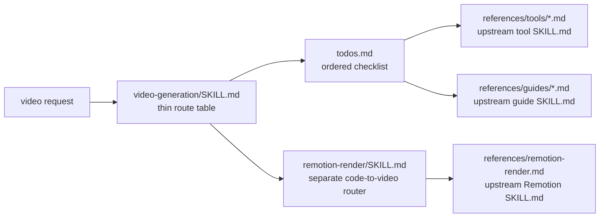

# TASK-0117: add video asset generation skills

## Summary
Redo the first asset-generation skill category so it matches the operator's
preferred skill architecture: one thin public video router, one `todos.md`
routing checklist, and reference markdown files that are the actual upstream
inference.sh `SKILL.md` sub-skills. Remove the synthetic
`architecture.md` / `workflows.md` / `gotchas.md` reference layer from the
video package.

## Scope
- In:
  - Rework `skills/video-generation/` into the active root video skill with the
    upstream umbrella model map merged into `SKILL.md`.
  - Add `skills/video-generation/todos.md` as the ordered routing checklist.
  - Replace synthetic references with upstream inference.sh `SKILL.md` content
    under `skills/video-generation/references/tools/` and
    `skills/video-generation/references/guides/`.
  - Replace the synthetic local CLI reference with upstream
    `tools/infsh-cli/SKILL.md` copied into
    `skills/video-generation/references/tools/infsh-cli.md`.
  - Keep `skills/remotion-render/` separate, but make its references align to
    the upstream `tools/video/remotion-render/SKILL.md` instead of synthetic
    architecture/gotchas/workflow docs.
  - Keep frontend asset/QA references pointing to `video-generation` and
    `remotion-render`.
  - Update README, architecture, and harness-techniques only if names or
    topology wording must change after the reference rewrite.
- Out:
  - No live video generation run.
  - No design/social/writing category skills yet.
  - No upstream inference.sh skill installation or auto-sync.
  - No hand-written provider summaries pretending to be source truth when an
    upstream `SKILL.md` can be copied into references.

## Plan
- `Change:` replace the current synthetic reference layer with upstream
  inference.sh sub-skill markdown files, and add a `todos.md` router checklist.
- `Why:` the current `architecture/workflows/gotchas` reference files are too
  generic. The useful material is already in the upstream sub-skills, and the
  Codexter skill should route to those files rather than ask an agent to read
  rewritten filler.
- `Before -> After:`
  - Before: `video-generation` has a useful public router, but references are
    synthetic (`architecture.md`, `workflows.md`, `gotchas.md`,
    `model-router.md`, `production-guides.md`, etc.).
  - After: `video-generation/SKILL.md` stays short and routes by job type;
    `todos.md` gives the step-by-step routing checklist; each model/use-case
    sub-skill is represented as a reference markdown file copied from the
    upstream `SKILL.md`.
- `Touch:`
  - `skills/video-generation/SKILL.md`
  - `skills/video-generation/todos.md`
  - `skills/video-generation/README.md`
  - `skills/video-generation/references/tools/*.md`
  - `skills/video-generation/references/guides/*.md`
  - delete/replace `skills/video-generation/references/architecture.md`
  - delete/replace `skills/video-generation/references/workflows.md`
  - delete/replace `skills/video-generation/references/gotchas.md`
  - delete/replace `skills/video-generation/references/model-router.md`
  - delete/replace `skills/video-generation/references/prompting.md`
  - delete/replace `skills/video-generation/references/production-guides.md`
  - delete/replace `skills/video-generation/references/source-notes.md`
  - delete/replace `skills/video-generation/references/inference-sh-cli.md`
  - keep or simplify `skills/video-generation/references/frontend-asset-qa.md`
  - add `skills/video-generation/references/tools/infsh-cli.md`
  - `skills/remotion-render/SKILL.md`
  - `skills/remotion-render/README.md`
  - `skills/remotion-render/references/remotion-render.md`
  - delete/replace synthetic `skills/remotion-render/references/*.md`
  - `skills/frontend-craft/SKILL.md`
  - `skills/frontend-craft/references/asset-generation.md`
  - `skills/frontend-craft/references/qa.md`
  - `skills/skill-creator/scripts/quick_validate.py`
  - `docs/HISTORY.md` after implementation lands
- `Inspect:`
  - `skills/skill-creator/SKILL.md`
  - `skills/frontend-craft/SKILL.md`
  - `skills/frontend-craft/references/asset-generation.md`
  - `skills/frontend-craft/references/qa.md`
  - upstream `inference-sh/skills/tools/video/*/SKILL.md`
  - upstream `inference-sh/skills/tools/infsh-cli/SKILL.md`
  - upstream `inference-sh/skills/guides/video/*/SKILL.md`
  - upstream `inference-sh/skills/guides/prompting/video-prompting-guide/SKILL.md`
- `Signature delta:`
  - `skills/video-generation/SKILL.md / routeVideoRequest(request): reference-slug[]`
  - `skills/video-generation/todos.md / checklist(job): ordered reference load path`
  - `skills/video-generation/references/tools/<slug>.md / upstreamSkill(): provider-specific instructions`
  - `skills/video-generation/references/tools/infsh-cli.md / upstreamSkill(): belt CLI instructions`
  - `skills/video-generation/references/guides/<slug>.md / upstreamGuide(): use-case instructions`
  - `skills/remotion-render/references/remotion-render.md / upstreamSkill(): code-to-video instructions`
- `Type Sketch:`
  - `VideoJob`: `{ intent, input_media, output_use, provider_hint, spend_gate, references_to_load }`
  - `ReferenceSlug`: `tools/<slug>.md | guides/<slug>.md`
  - `TodoStep`: `{ checkbox, routing_question, reference_file, completion_signal }`
- `Typed flow example:`
  - User asks "make a talking head product demo video" -> `VideoJob.intent =
    avatar-lipsync`, `provider_hint = p-video-avatar`, `references_to_load =
    [tools/p-video-avatar.md, guides/talking-head-production.md]`; `todos.md`
    checks portrait/script/audio, spend gate, `belt app get`, run/save, and
    frontend QA handoff if used on a web page.
- `Execution steps:`
  1. Pull/update `/tmp/inference-sh-skills` and list the exact upstream
     `SKILL.md` files.
  2. Create `references/tools/` and `references/guides/` under
     `skills/video-generation/`.
  3. Copy upstream `tools/infsh-cli/SKILL.md` into
     `references/tools/infsh-cli.md`; delete the synthetic
     `references/inference-sh-cli.md`.
  4. Merge upstream `tools/video/ai-video-generation/SKILL.md` into the active
     `video-generation/SKILL.md`, then copy each specific upstream video tool
     `SKILL.md` into a matching reference file: `google-veo.md`,
     `image-to-video.md`, `p-video.md`, `p-video-avatar.md`,
     `ai-avatar-video.md`, `happyhorse.md`, and `seedance.md`.
     Do not copy Remotion into `video-generation`; route Remotion requests to
     the separate `skills/remotion-render/SKILL.md`.
  5. Copy upstream guide `SKILL.md` files into guide references:
     `ai-marketing-videos.md`, `explainer-video-guide.md`,
     `storyboard-creation.md`, `talking-head-production.md`,
     `video-ad-specs.md`, and `video-prompting-guide.md`.
  6. Rewrite `skills/video-generation/SKILL.md` as a compact router: trigger
     rules, top-level route table, spend/tool gate, output contract, and
     instruction to load only the matching reference files.
  7. Add `skills/video-generation/todos.md` with ordered checkboxes for route
     selection, reference loading, `belt app get`/sample, spend gate, asset
     save path, and frontend QA handoff.
  8. Delete the synthetic video reference files that caused the bloat.
  9. Rework `skills/remotion-render/` so its only deep reference is the
     upstream Remotion `SKILL.md` copied as `references/remotion-render.md`;
     keep its public `SKILL.md` short.
  10. Keep frontend references concise: they should point to the owning asset
     skill and not duplicate provider details.
  11. Run validation and review.
- `Recommendation:` implement the category router plus upstream-subskill
  reference files now. Keep Remotion as a separate public skill, but make its
  reference source the upstream `remotion-render/SKILL.md`.
- `Options considered:`
  - keep current synthetic references: rejected; too bloated and not what the
    operator asked for
  - create one public skill per upstream inference.sh sub-skill: rejected; too
    much public skill context
  - thin public router plus upstream sub-skills as reference files:
    recommended; preserves upstream detail without active-skill clutter
- `Blast radius:` video skill package, Remotion skill package, frontend asset
  routing text, README/architecture only if routing names change, future
  design/social/writing category-skill pattern.
- `Risks:` upstream copied `SKILL.md` files can go stale; mitigate by recording
  source commit and keeping `belt app get` as live schema truth before runs.
  Copying verbatim upstream files may include `npx skills add` advice that is
  not Codexter-native; keep the copied reference files exact and put Codexter's
  no-auto-install caveat in the router and `todos.md` instead of modifying each
  upstream reference.

## Gap Analysis
- `Current state:` Codexter now has video and Remotion skill packages, but the
  video references are generic local summaries instead of the upstream
  sub-skills the operator wants.
- `Production expectation:` a good category-router skill keeps first-load
  instructions short, routes by request type, and loads specific provider or
  use-case references only when needed.
- `Missing gaps:` no `todos.md`; no upstream sub-skill reference files; current
  synthetic reference names invite agents to read bloat instead of exact
  provider/use-case instructions.
- `Comparable implementations:` inference.sh stores each tool/use-case as its
  own `SKILL.md`; Codexter should adapt that into references, not public
  active skills.
- `Recommendation:` replace the reference layer before creating design,
  social, or writing skills.

## Diagram


## Acceptance Criteria
- [x] AC-1: `video-generation/SKILL.md` is the active root skill and now includes
  the upstream `ai-video-generation` umbrella model map plus Codexter gates.
- [x] AC-2: `video-generation/todos.md` exists and routes to the right
  reference file by request type.
- [x] AC-3: specific video tool references are copied from upstream
  `tools/video/*/SKILL.md`; the upstream `ai-video-generation` umbrella content
  is merged into `video-generation/SKILL.md` instead of duplicated as a
  reference file.
- [x] AC-4: video guide references are copied from upstream
  `guides/video/*/SKILL.md` plus `video-prompting-guide`.
- [x] AC-5: upstream `tools/infsh-cli/SKILL.md` replaces the synthetic
  `references/inference-sh-cli.md`.
- [x] AC-6: synthetic `architecture/workflows/gotchas`-style references are
  removed from video/remotion packages; only the merged root skill, `todos.md`,
  frontend QA handoff, and specific upstream skill references remain.
- [x] AC-7: `video-generation/references/tools/` does not contain a Remotion
  tool reference; Remotion requests route directly to the separate
  `remotion-render` skill.
- [x] AC-8: `remotion-render` stays separate and uses the upstream Remotion
  `SKILL.md` as its main reference.
- [x] AC-9: frontend asset/QA references still route generated video to
  `video-generation` and code-rendered MP4 to `remotion-render`.

## Verification
- `Tests:`
  - `python3 skills/skill-creator/scripts/quick_validate.py skills/video-generation`
    -> `[PASSED] Skill is valid!`
  - `python3 skills/skill-creator/scripts/quick_validate.py skills/remotion-render`
    -> `[PASSED] Skill is valid!`
  - `python3 tickets/scripts/check_ticket_metadata.py`
    -> `ticket metadata OK`
  - `python3 bin/check_doc_parity.py` if README/ARCHITECTURE/docs inventory
    change -> `structural doc parity OK`
  - `python3 bin/check_harness_invariants.py`
    -> `harness invariants OK`
  - `python3 -m py_compile skills/skill-creator/scripts/quick_validate.py`
    -> exit `0`
- `Manual checks:`
  - `find skills/video-generation/references -maxdepth 3 -type f | sort`
    shows `references/tools/infsh-cli.md`, the 8 non-Remotion video tool
    refs, and 6 guide refs.
  - `find skills/video-generation/references/tools -maxdepth 1 -type f -name 'remotion*'`
    -> no output.
  - `rg -n "architecture\\.md|workflows\\.md|gotchas\\.md|model-router\\.md|production-guides\\.md|source-notes\\.md|inference-sh-cli\\.md" skills/video-generation skills/remotion-render`
    -> no output.
  - Run this portable parity script:
    ```bash
    python3 - <<'PY'
    from pathlib import Path

    upstream = Path("/tmp/inference-sh-skills")
    local = Path("skills/video-generation/references")

    upstream_tools = {
        p.parent.name: p
        for p in (upstream / "tools/video").glob("*/SKILL.md")
        if p.parent.name != "remotion-render"
    }
    local_tools = {
        p.stem: p for p in (local / "tools").glob("*.md")
        if p.stem != "infsh-cli"
    }
    assert set(local_tools) == set(upstream_tools), {
        "missing": sorted(set(upstream_tools) - set(local_tools)),
        "extra": sorted(set(local_tools) - set(upstream_tools)),
    }
    for slug, upstream_path in upstream_tools.items():
        assert local_tools[slug].read_text() == upstream_path.read_text(), slug

    assert (local / "tools/infsh-cli.md").read_text() == (
        upstream / "tools/infsh-cli/SKILL.md"
    ).read_text()

    upstream_guides = {
        p.parent.name: p
        for p in (upstream / "guides/video").glob("*/SKILL.md")
    }
    upstream_guides["video-prompting-guide"] = (
        upstream / "guides/prompting/video-prompting-guide/SKILL.md"
    )
    local_guides = {p.stem: p for p in (local / "guides").glob("*.md")}
    assert set(local_guides) == set(upstream_guides), {
        "missing": sorted(set(upstream_guides) - set(local_guides)),
        "extra": sorted(set(local_guides) - set(upstream_guides)),
    }
    for slug, upstream_path in upstream_guides.items():
        assert local_guides[slug].read_text() == upstream_path.read_text(), slug
    PY
    ```
    -> exit `0`, proving every copied video tool, guide, prompting, and
    `infsh-cli` reference matches upstream content exactly.
  - `test -f skills/video-generation/references/tools/infsh-cli.md`
    -> exit `0`.
  - `test -f skills/remotion-render/references/remotion-render.md`
    -> exit `0`.
  - `python3 -c 'from pathlib import Path; expected={"skills/video-generation/AGENTS.md","skills/video-generation/README.md","skills/video-generation/SKILL.md","skills/video-generation/todos.md","skills/video-generation/references/frontend-asset-qa.md","skills/video-generation/references/guides/ai-marketing-videos.md","skills/video-generation/references/guides/explainer-video-guide.md","skills/video-generation/references/guides/storyboard-creation.md","skills/video-generation/references/guides/talking-head-production.md","skills/video-generation/references/guides/video-ad-specs.md","skills/video-generation/references/guides/video-prompting-guide.md","skills/video-generation/references/tools/ai-avatar-video.md","skills/video-generation/references/tools/google-veo.md","skills/video-generation/references/tools/happyhorse.md","skills/video-generation/references/tools/image-to-video.md","skills/video-generation/references/tools/infsh-cli.md","skills/video-generation/references/tools/p-video-avatar.md","skills/video-generation/references/tools/p-video.md","skills/video-generation/references/tools/seedance.md"}; actual={str(p) for p in Path("skills/video-generation").rglob("*") if p.is_file()}; assert actual==expected, {"missing": sorted(expected-actual), "extra": sorted(actual-expected)}'`
    -> exit `0`, proving no extra synthetic video-generation files remain.
  - `python3 -c 'from pathlib import Path; expected={"skills/remotion-render/AGENTS.md","skills/remotion-render/README.md","skills/remotion-render/SKILL.md","skills/remotion-render/references/remotion-render.md"}; actual={str(p) for p in Path("skills/remotion-render").rglob("*") if p.is_file()}; assert actual==expected, {"missing": sorted(expected-actual), "extra": sorted(actual-expected)}'`
    -> exit `0`, proving no extra synthetic remotion-render references remain.
  - `wc -l skills/video-generation/SKILL.md`
    -> `131 skills/video-generation/SKILL.md`, proving the upstream umbrella
    model map moved into the active root skill.
  - `rg -n "ai-video-generation\\.md|model-picker" skills/video-generation/SKILL.md skills/video-generation/todos.md skills/video-generation/README.md`
    -> no output.
  - `rg -n "architecture|workflow|gotcha|model-router|production-guide" skills/video-generation/SKILL.md skills/video-generation/todos.md`
    -> no output except ordinary words inside copied upstream references are
    ignored because this check targets only router/todo files.
  - Run this portable Remotion parity script:
    ```bash
    python3 - <<'PY'
    from pathlib import Path
    assert Path("skills/remotion-render/references/remotion-render.md").read_text() == Path("/tmp/inference-sh-skills/tools/video/remotion-render/SKILL.md").read_text()
    PY
    ```
    -> exit `0`, proving the Remotion reference matches upstream content
    exactly.
  - `rg -n "video-generation|remotion-render" skills/frontend-craft/SKILL.md skills/frontend-craft/references/asset-generation.md skills/frontend-craft/references/qa.md`
    -> shows generated video routes to `video-generation` and code-rendered
    MP4 routes to `remotion-render`; no provider details are duplicated there.
  - `belt --help`
    -> prints inference.sh CLI usage and version `v1.9.6`.
  - `belt app list --category video`
    -> returns video app rows including `pruna/p-video-avatar` and
    `infsh/remotion-render`.
  - `belt app get pruna/p-video-avatar`
    -> returns app metadata and input schema.
  - `belt app get infsh/remotion-render`
    -> returns app metadata and input schema.
- `Evidence required:` command results and final review artifact under
  `tickets/TASK-0117/artifacts/`.

## Refs
- https://github.com/inference-sh/skills/tree/main/tools/video
- https://github.com/inference-sh/skills/tree/main/guides/video
- https://github.com/inference-sh/skills/tree/main/guides/prompting/video-prompting-guide

## Evidence
- `Commands:`
  - `python3 skills/skill-creator/scripts/quick_validate.py skills/video-generation`
    -> `[PASSED] Skill is valid!`
  - `python3 skills/skill-creator/scripts/quick_validate.py skills/remotion-render`
    -> `[PASSED] Skill is valid!`
  - `python3 tickets/scripts/check_ticket_metadata.py`
    -> `ticket metadata OK (16 ticket files checked)`
  - `python3 bin/check_harness_invariants.py`
    -> `harness invariants OK (5 files checked, 15 agents, 13 rules)`
  - `python3 bin/check_doc_parity.py`
    -> `structural doc parity OK (6 files checked, 29 rules)`
  - `python3 -m py_compile skills/skill-creator/scripts/quick_validate.py`
    -> exit `0`.
  - `find skills/video-generation/references -maxdepth 3 -type f | sort`
    -> expected upstream `tools/`, `guides/`, and `frontend-asset-qa.md` files only.
  - `find skills/video-generation/references/tools -maxdepth 1 -type f -name 'remotion*'`
    -> no output.
  - `rg -n "architecture\\.md|workflows\\.md|gotchas\\.md|model-router\\.md|production-guides\\.md|source-notes\\.md|inference-sh-cli\\.md" skills/video-generation skills/remotion-render`
    -> no output.
  - portable video reference parity script -> exit `0`.
  - portable remotion reference parity script -> exit `0`.
  - exact video-generation file whitelist assertion -> exit `0`.
  - exact remotion-render file whitelist assertion -> exit `0`.
  - `wc -l skills/video-generation/SKILL.md`
    -> `131 skills/video-generation/SKILL.md` after merging the upstream
    umbrella model map into the active root skill.
  - `rg -n "architecture|workflow|gotcha|model-router|production-guide" skills/video-generation/SKILL.md skills/video-generation/todos.md`
    -> no output.
  - `python3 - <<'PY' ...`
    -> `tool references now specific refs plus infsh-cli; umbrella moved into SKILL.md`.
  - `rg -n "ai-video-generation\\.md|model-picker" skills/video-generation/SKILL.md skills/video-generation/todos.md skills/video-generation/README.md`
    -> no output.
  - `rg -n "video-generation|remotion-render" skills/frontend-craft/SKILL.md skills/frontend-craft/references/asset-generation.md skills/frontend-craft/references/qa.md`
    -> generated video routes to `video-generation`; code-rendered MP4 routes to `remotion-render`.
  - `belt --help`
    -> printed inference.sh CLI usage for `v1.9.6`.
  - `belt app list --category video`
    -> returned video apps including `pruna/p-video-avatar` and `infsh/remotion-render`.
  - `belt app get pruna/p-video-avatar`
    -> returned app metadata, pricing, input schema, and output schema.
  - `belt app get infsh/remotion-render`
    -> returned app metadata, version `4pga3bpq`, input schema, output schema,
    run command, and sample command.
- `Result summary:` implementation now matches the corrected merged-root shape:
  `video-generation/SKILL.md` owns the upstream umbrella model map, while
  `references/tools/` contains only specific upstream tool references plus
  `infsh-cli`. Static, parity, metadata, harness, and non-spend `belt` metadata checks passed.
  `belt` briefly failed immediately after auto-updating from `v1.9.1` to
  `v1.9.6`, but the refreshed `v1.9.6` binary now returns current metadata for
  both `pruna/p-video-avatar` and `infsh/remotion-render`.
- `Artifacts:`
  - `tickets/TASK-0117/artifacts/review/2026-05-05-video-skill-review.md` (superseded)
  - `tickets/TASK-0117/artifacts/review/2026-05-06-video-skill-impl-review.md` (final pass)

## Blockers
- none
