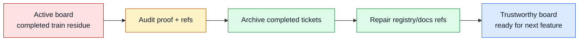

# TASK-0118: reconcile Symphony Codexter ticket train

## Summary
Cleanly close the Symphony/Codexter ticket train so the active board stops
showing completed work as active state. The recommended path is to archive the
finished train, repair evidence references that point at moved ticket files,
and leave the next implementation ticket obvious instead of making the operator
reconstruct status from chat.

## Scope
- In:
  - Audit `TASK-0107` and `TASK-0110` through `TASK-0116` for final state,
    evidence, review artifacts, commits, and blockers.
  - Move completed train tickets into `tickets/archive/` when they are no
    longer active, using `git mv` or equivalent tracked moves.
  - Fix durable references that would otherwise point at moved ticket paths,
    especially feature registry `evidence_refs`.
  - Normalize closeout fields before archive: no stale `claimed_by`, no
    `ready: true` on completed tickets, final `next_action`, and current
    `last_verification`.
  - Update `blockers.md` with final train status.
  - Add a concise `docs/HISTORY.md` closeout entry if the archive is a
    meaningful project event.
  - Run closeout checks and produce a final review artifact for this ticket.
- Out:
  - No new Symphony, Linear, Notion, cloud, or Ralph runtime implementation.
  - No changes to unrelated dirty frontend/video/delegate work already present
    in the workspace.
  - No push or deploy.
  - No archiving of `TASK-0118` itself until this reconciliation implementation
    and review are done.

## Plan
- `Change:` Convert the Symphony/Codexter train from "completed but still
  scattered across active tickets" into a clean archived set with references
  updated.
- `Why:` The architecture train landed, but the board still has misleading
  active-state residue: `TASK-0107` is `documenting/building`, and several
  completed tickets are `ready: true` with `claimed_by: codex`.
- `Before -> After:`
  - Before: active board mixes current work, completed train tickets, stale
    readiness flags, and one unfinished closeout state.
  - After: train tickets are archive-ready or archived, refs point to their
    final locations, `blockers.md` is accurate, and the next feature ticket can
    start from a trustworthy board.
- `Touch:`
  - `tickets/TASK-0107/ticket.md`
  - `tickets/TASK-0110/ticket.md` through `tickets/TASK-0116/ticket.md`
  - `tickets/archive/TASK-0107/` and `tickets/archive/TASK-0110/` through
    `tickets/archive/TASK-0116/`
  - `docs/features/registry.jsonl`
  - `docs/sources/registry.jsonl` only if archive path updates are needed
  - `docs/specs/*`, `README.md`, or `ARCHITECTURE.md` only if searches find
    hard-coded active-ticket evidence links that need archive paths
  - `docs/HISTORY.md`
  - `blockers.md`
  - `tickets/archive/TASK-0118/ticket.md`
  - `tickets/archive/TASK-0118/artifacts/review/`
- `Inspect:`
  - `tickets/README.md`
  - `skills/close-ticket/SKILL.md`
  - `docs/MEMORY.md#MEM-0058`
  - `docs/MEMORY.md#MEM-0071`
  - `docs/MEMORY.md#MEM-0074`
  - `docs/MEMORY.md#MEM-0077`
  - `docs/TROUBLES.md`
  - `docs/specs/board-compute-orchestration.md`
  - `docs/specs/symphony-compatible-codexter-runner.md`
  - `skills/ralph/references/parallel-ralph.md`
- `Signature delta:`
  - `ticket archive move / tickets/TASK-XXXX -> tickets/archive/TASK-XXXX`
  - `tickets/TASK-XXXX/ticket.md / frontmatter(state): final archived metadata`
  - `docs/features/registry.jsonl / evidence_refs[]: active paths -> archive paths`
  - `blockers.md / Active Blockers: current train blockers`
  - `docs/HISTORY.md / append(event): archive/closeout milestone`
- `Type Sketch:`
  - `CloseoutTarget`: `ticket_id`, `current_path`, `archive_path`,
    `expected_phase`, `expected_status`, `commit_refs`, `evidence_refs`,
    `needs_reference_update`.
  - `ReferencePatch`: `file`, `old_path`, `new_path`, `reason`.
  - `CloseoutResult`: `archived`, `left_active`, `checks`, `blockers`,
    `next_ticket`.
- `Typed flow example:`
  1. Input `CloseoutTarget(ticket_id="TASK-0114",
     current_path="tickets/TASK-0114/ticket.md",
     archive_path="tickets/archive/TASK-0114/ticket.md")`.
  2. Reconciliation confirms `phase=complete`, `status=done`, review artifact,
     compute artifacts, and commit evidence exist.
  3. Ticket metadata is normalized to `ready: false`, `claimed_by:` empty,
     and `next_action: archived`.
  4. Directory moves to `tickets/archive/TASK-0114/`.
  5. `docs/features/registry.jsonl` evidence refs that named
     `tickets/TASK-0114/ticket.md` update to
     `tickets/archive/TASK-0114/ticket.md`.
  6. Metadata and registry validators pass.
- `Execution steps:`
  1. Search all repo references to `TASK-0107` and `TASK-0110` through
     `TASK-0116`.
  2. Build a closeout target table with final state, artifact presence, and
     reference-update needs.
  3. For each completed ticket, normalize final frontmatter and body summary
     before moving it.
  4. Move completed tickets to `tickets/archive/` with tracked moves.
  5. Update registry and doc references from active paths to archive paths.
  6. Update `blockers.md` to say there are no active Symphony/Codexter train
     blockers or to list exact unresolved items if a check fails.
  7. Add a single `docs/HISTORY.md` closeout event if archive movement lands.
  8. Run metadata, registry, doc parity, harness invariant, and focused grep
     checks for stale active ticket paths.
  9. Run review against board trust, reference integrity, and user-story
     satisfaction.
  10. Commit only this reconciliation slice and leave unrelated dirty work
      untouched.
- `Recommendation:` Archive the completed train and update references now.
- `Options considered:`
  - Metadata-only cleanup in place: lower churn, but leaves the active board
    crowded with completed work and makes future Ralph/selector behavior harder
    to trust.
  - Archive completed train with reference repair: recommended; it matches the
    ticket lifecycle and makes active work readable again.
  - Skip cleanup and start the next feature: fastest, but preserves confusing
    board state and undermines the ticket system we just improved.
- `Blast radius:` ticket board visibility, feature/source registry references,
  docs that link evidence paths, Ralph candidate selection, and future operator
  context.
- `Risks:`
  - Broken links after archive moves. Containment: grep for old paths and run
    registry validation.
  - Accidentally staging unrelated dirty files. Containment: path-scoped git
    status, path-scoped staging, and final diff review.
  - Archiving a ticket that still has missing proof. Containment: leave that
    ticket active and record it in `blockers.md`.

## Gap Analysis
- `Current state:` The architecture work is implemented and committed, but the
  ticket board still carries closeout debt. `TASK-0107` remains
  `documenting/building`; several completed train tickets are still marked
  `ready: true` and claimed.
- `Production expectation:` A reliable board-backed harness should keep active
  tickets limited to real current work. Completed tickets should be archived or
  intentionally short-lived `done` states with accurate references and no stale
  claims.
- `Missing gaps:`
  - No final train archive pass.
  - Some completed tickets still look selectable or claimed.
  - Registry evidence refs may point to active ticket paths after archive.
  - `blockers.md` has not been reconciled after the whole train landed.
- `Comparable implementations:` Codexter ticket lifecycle, `close-ticket`
  contract, `MEM-0058`, and the newly landed board/compute specs.
- `Recommendation:` Land the reconciliation as a closeout ticket before wiring
  Ralph through `BoardAdapter` and `ComputeSelector`.

## Diagram

## Acceptance Criteria
- [x] `TASK-0107` and `TASK-0110` through `TASK-0116` are either archived or
  explicitly left active with a blocker recorded.
- [x] Completed/archived tickets do not remain `ready: true` or
  `claimed_by: codex`.
- [x] Registry and doc evidence refs point to the final ticket locations.
- [x] `blockers.md` reflects the final train status.
- [x] `docs/HISTORY.md` handling is explicit: the file already contains
  unrelated dirty append-only entries, so this closeout records the archive
  event in ticket evidence and the commit rather than staging unrelated history
  lines.
- [x] No unrelated dirty frontend/video/delegate files are staged or committed.

## Verification
- `Tests:`
  - `python3 tickets/scripts/check_ticket_metadata.py`
  - `python3 docs/sources/validate_sources.py`
  - feature registry JSONL validation
  - `python3 bin/check_doc_parity.py`
  - `python3 bin/check_harness_invariants.py`
- `Manual checks:`
  - `rg "tickets/TASK-0107|tickets/TASK-011[0-6]" docs README.md ARCHITECTURE.md skills tickets --glob '!tickets/archive/**'`
  - `git status --short` before staging and after commit to confirm unrelated
    dirty files remain outside the closeout slice.
- `Evidence required:`
  - Closeout review JSON under `tickets/archive/TASK-0118/artifacts/review/`.
  - Result summary listing archived tickets and any left-active blockers.

## Autonomy Readiness
- `Human inputs/assets:` approval of this plan before moving tickets into
  archive.
- `Credentials / external access:` none.
- `Compute/runtime needs:` local shell and Python validators only.
- `Tooling gaps:` none known.
- `QA risks:` broken evidence links or accidental staging of unrelated dirty
  files.
- `Human gates:` do not push; do not archive any ticket with missing proof
  without recording the blocker.
- `Agent decision boundaries:` may normalize and archive the completed
  Symphony/Codexter ticket train; may not implement new Symphony/Ralph features
  in this closeout ticket.

## Evidence Checklist
- [x] Archive move summary: `TASK-0107`, `TASK-0110` through `TASK-0116`,
  and this closeout ticket moved to `tickets/archive/`.
- [x] Reference repair summary: feature registry evidence refs and the
  Symphony envelope template now use archive paths.
- [x] Validation output: metadata, feature registry, source registry, doc
  parity, harness invariants, focused invocation tests, full bin unittest
  suite, stale-ref greps, and `git diff --check` passed.
- [x] Review JSON linked:
  [impl-review.json](/Users/kenjipcx/coding-harness/Codexter/tickets/archive/TASK-0118/artifacts/review/2026-05-05-impl-review.json)

## Refs
- [tickets/README.md](/Users/kenjipcx/coding-harness/Codexter/tickets/README.md)
- [close-ticket skill](/Users/kenjipcx/coding-harness/Codexter/skills/close-ticket/SKILL.md)
- [board-compute orchestration spec](/Users/kenjipcx/coding-harness/Codexter/docs/specs/board-compute-orchestration.md)
- [MEM-0058](/Users/kenjipcx/coding-harness/Codexter/docs/MEMORY.md)
- [MEM-0074](/Users/kenjipcx/coding-harness/Codexter/docs/MEMORY.md)
- [MEM-0077](/Users/kenjipcx/coding-harness/Codexter/docs/MEMORY.md)

## Evidence
- `Artifacts:`
  - [impl-plan-review.json](/Users/kenjipcx/coding-harness/Codexter/tickets/archive/TASK-0118/artifacts/review/2026-05-05-impl-plan-review.json)
  - [impl-review.json](/Users/kenjipcx/coding-harness/Codexter/tickets/archive/TASK-0118/artifacts/review/2026-05-05-impl-review.json)
- `Commands:`
  - `python3 tickets/scripts/check_ticket_metadata.py`
  - `python3 docs/features/validate_features.py`
  - `python3 docs/sources/validate_sources.py`
  - `python3 bin/check_doc_parity.py`
  - `python3 bin/check_harness_invariants.py`
  - `python3 -m unittest discover -s bin -p 'test_*.py'`
  - `git diff --check`
  - `rg -n "tickets/TASK-0107|tickets/TASK-0110|tickets/TASK-0111|tickets/TASK-0112|tickets/TASK-0113|tickets/TASK-0114|tickets/TASK-0115|tickets/TASK-0116" docs README.md ARCHITECTURE.md skills --glob '!tickets/archive/**' --glob '!**/__pycache__/**'`
  - `rg --no-ignore -n "tickets/TASK-0107|tickets/TASK-0110|tickets/TASK-0111|tickets/TASK-0112|tickets/TASK-0113|tickets/TASK-0114|tickets/TASK-0115|tickets/TASK-0116" tickets/archive/TASK-0107 tickets/archive/TASK-0110 tickets/archive/TASK-0111 tickets/archive/TASK-0112 tickets/archive/TASK-0113 tickets/archive/TASK-0114 tickets/archive/TASK-0115 tickets/archive/TASK-0116 -g 'ticket.md'`
- `Result summary:`
  - Completed Symphony/Codexter train tickets were archived and normalized:
    `TASK-0107`, `TASK-0110`, `TASK-0111`, `TASK-0112`, `TASK-0113`,
    `TASK-0114`, `TASK-0115`, `TASK-0116`, and `TASK-0118`.
  - `docs/features/registry.jsonl` and
    `skills/codexter-invocation/templates/symphony-run-envelope.json` now
    point at final archive ticket paths.
  - Archived ticket markdown evidence links now point at archive paths, and the
    previously ignored `TASK-0111` batch-review artifact is preserved with the
    archived train.
  - `docs/features/validate_features.py` was added because the previous
    README-only feature validator did not understand `SRC-*` source references
    or the existing `designed` feature status.
  - `docs/HISTORY.md` was not staged for this closeout because it already has
    unrelated dirty append-only entries; this preserves the "do not stage
    unrelated dirty files" requirement.

## Blockers
- None for this ticket. `blockers.md` records the resolved/avoided closeout
  issue and the unrelated dirty workspace was kept outside this slice.
