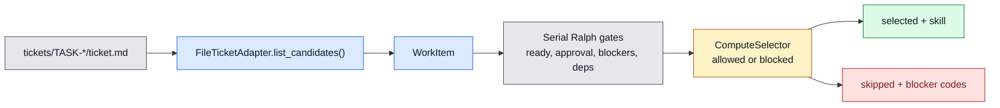

# TASK-0119: route Ralph selection through BoardAdapter and ComputeSelector

## Summary
Make serial `$ralph` consume the same normalized board and compute primitives
that the Symphony/Codexter work just introduced. The recommended path is to
keep Ralph serial and read-only, but replace its duplicated ticket parser and
compute-blind eligibility checks with `FileTicketAdapter` and
`ComputeSelector` so local runs, future shared boards, and future Symphony
workers agree on the same work-item and compute rules.

## Scope
- In:
  - Refactor `skills/ralph/scripts/select_next_ticket.py` so active candidate
    reading goes through `FileTicketAdapter.list_candidates()`.
  - Preserve archived-ticket dependency satisfaction by loading archive
    tickets through the same adapter contract or a narrow adapter-backed helper.
  - Apply `select_compute()` during Ralph eligibility and expose compute
    decisions in selected/skipped JSON output.
  - Keep the current serial phase handoff policy:
    `planning -> impl-plan`, `building -> impl`, `documenting -> close-ticket`.
  - Keep the helper read-only: no ticket mutations, no Codex launch, no
    worktree creation, no proof writing.
  - Add selector tests for adapter-backed normalization, compute blockers,
    worktree runtime hints, future-target blocking, and current selection
    compatibility.
  - Update `skills/ralph/SKILL.md`, `skills/ralph/README.md`, and `bin/README.md`
    only where the selector contract changes.
- Out:
  - No parallel Ralph.
  - No lease registry, merge queue, batch QA, stale-worker recovery, or
    worktree-lane launching.
  - No Linear, Notion, GitHub, Symphony, or Codex cloud adapter
    implementation.
  - No automatic fallback from an unsupported compute target to
    `local_shared`.
  - No changes to unrelated active tickets such as `TASK-0085`.

## Plan
- `Change:` Rebase Ralph candidate selection on Codexter's canonical
  `WorkItem` and `ComputeDecision` contracts while preserving the existing
  serial dispatcher behavior.
- `Why:` The closeout train landed BoardAdapter and ComputeSelector, but
  `$ralph` still duplicates filesystem ticket parsing and ignores compute
  admission. That makes the dispatcher the last major local surface still
  outside the new board/compute architecture.
- `Before -> After:`
  - Before: Ralph parses ticket frontmatter itself, builds `TicketCard`, and
    decides eligibility without knowing whether the ticket's requested compute
    target is allowed.
  - After: Ralph lists normalized filesystem `WorkItem`s, checks the same
    compute policy that invocation/Symphony shims use, and reports compute
    blockers instead of silently selecting a ticket that cannot run.
- `Touch:`
  - `skills/ralph/scripts/select_next_ticket.py`
  - `skills/ralph/scripts/test_select_next_ticket.py`
  - `skills/ralph/SKILL.md`
  - `skills/ralph/README.md`
  - `bin/README.md`
  - `docs/specs/board-compute-orchestration.md` only if the conformance row
    needs a minor proof update after implementation.
  - `tickets/archive/TASK-0119/artifacts/selector/`
  - `tickets/archive/TASK-0119/artifacts/review/`
- `Inspect:`
  - `bin/codexter_boards.py`
  - `bin/codexter_compute.py`
  - `bin/codexter_invocation.py`
  - `bin/test_codexter_boards.py`
  - `bin/test_codexter_compute.py`
  - `skills/ralph/scripts/select_next_ticket.py`
  - `skills/ralph/scripts/test_select_next_ticket.py`
  - `skills/ralph/references/parallel-ralph.md`
  - `docs/specs/board-compute-orchestration.md`
  - `docs/specs/symphony-compatible-codexter-runner.md`
  - `WORKFLOW.md`
  - `docs/MEMORY.md#MEM-0074`
  - `docs/MEMORY.md#MEM-0077`
- `Signature delta:`
  - `skills/ralph/scripts/select_next_ticket.py / load_workflow_policy(root: Path): RalphWorkflowPolicy`
  - `skills/ralph/scripts/select_next_ticket.py / load_board(root: Path, policy: RalphWorkflowPolicy): RalphBoard`
  - `skills/ralph/scripts/select_next_ticket.py / candidate_from_work_item(item: WorkItem, board: RalphBoard): RalphCandidate`
  - `skills/ralph/scripts/select_next_ticket.py / compute_for_candidate(candidate: RalphCandidate, policy: RalphWorkflowPolicy): ComputeDecision`
  - `skills/ralph/scripts/select_next_ticket.py / eligible(candidate: RalphCandidate, board: RalphBoard, policy: RalphWorkflowPolicy): Eligibility`
  - `skills/ralph/scripts/select_next_ticket.py / select_next_ticket(board: RalphBoard): dict[str, object]`
  - `skills/ralph/scripts/select_next_ticket.py / main(): int`
- `Type Sketch:`
  - `RalphWorkflowPolicy`: `board_source`, `archive_source`,
    `workflow_default_compute`, `workflow_allowed_compute`,
    `active_phases`, `phase_actions`.
  - `RalphBoard`: `active_items: list[WorkItem]`,
    `archived_items: list[WorkItem]`, `completed_ids: set[str]`.
  - `RalphCandidate`: `item: WorkItem`, `path`, `phase`, `status`,
    `priority`, `dependency_waivers`, `resolved_dependencies`.
  - `Eligibility`: existing fields plus `compute: dict | null`,
    `blocker_codes: list[str]`, and `required_setup: list[str]`.
  - `SelectorResult`: existing selected/skipped shape preserved, with selected
    and skipped rows carrying optional `compute` details.
- `Typed flow example:`
  1. `FileTicketAdapter(root, "tickets/")` returns
     `WorkItem(identifier="TASK-0085", phase="building", status="building",
     ready=true, compute_target=null)`.
  2. `RalphWorkflowPolicy` reads `WORKFLOW.md` and gets
     `workflow_default_compute="local_shared"` and
     `workflow_allowed_compute=("local_shared", "local_worktree")`.
  3. `RalphCandidate` computes `resolved_dependencies=()` because the ticket
     has no dependencies.
  4. `select_compute(candidate.item, phase="building", workflow_default,
     workflow_allowed, root, resolved_dependencies)` returns
     `allowed=true`, `target="local_shared"`, and the runtime hint
     `runs in the current checkout`.
  5. `eligible()` keeps the existing serial gates, adds the allowed compute
     result, and returns `recommended_skill="impl"`.
  6. JSON output remains compatible:
     `status="selected"`, `selected_ticket_id="TASK-0085"`,
     `recommended_skill="impl"`, plus `selected.compute.target="local_shared"`.
  7. If a ready ticket requests `compute_target: symphony`, the same flow
     returns `eligible=false`, reason `compute blocked: ... unsupported_target`,
     and no fallback ticket execution happens.
- `Execution steps:`
  1. Add a lightweight import path in `select_next_ticket.py` so the script can
     import `bin/codexter_boards.py`, `bin/codexter_compute.py`, and, if useful,
     `codexter_invocation.load_workflow` without requiring package install.
  2. Introduce `RalphWorkflowPolicy` with defaults that match `WORKFLOW.md`:
     board source `tickets/`, archive source `tickets/archive/`, active phases
     `planning/building/documenting`, allowed compute
     `local_shared/local_worktree`, default compute `local_shared`.
  3. Replace the duplicated active ticket reader with
     `FileTicketAdapter(root, policy.board_source).list_candidates(...)`.
  4. Load archived tickets with `FileTicketAdapter(root, policy.archive_source)`
     when the archive directory exists; derive `completed_ids` from archived
     items plus active items whose phase/status are complete/done.
  5. Keep dependency waiver detection local to Ralph by reading the ticket body
     for waiver lines, but attach waivers to `RalphCandidate` instead of a
     separate parser-only `TicketCard`.
  6. Call `select_compute()` after existing ready/approval/blocker/claim/phase
     gates pass, using `completed_ids` plus waivers as
     `resolved_dependencies`.
  7. Treat compute denial as a selector skip with explicit reason, blocker
     codes, required setup, runtime hints, and `needs_human` only when the
     denial requires operator action.
  8. Preserve the current CLI text output and enrich JSON output without
     breaking existing keys.
  9. Add tests for:
     - default local_shared eligible selection still works,
     - approval/human gates still stop,
     - archived dependency satisfaction still works,
     - `compute_target: symphony` is skipped with `unsupported_target`,
     - `compute_target: local_worktree` skips without a runtime record and
       exposes the `ticket_runtime.py ensure` setup hint,
     - `local_worktree` selects when the runtime record exists,
     - `selected.compute.target` appears in JSON output.
  10. Capture one selector JSON proof artifact under
      `tickets/archive/TASK-0119/artifacts/selector/`.
  11. Update Ralph docs to say the selector now uses BoardAdapter and
      ComputeSelector, while the public dispatcher remains serial.
  12. Run targeted and repo-local checks, then review the ticket against
      serial Ralph, future Symphony compatibility, and operator safety.
- `Recommendation:` Implement adapter-backed selection plus compute admission
  now. This is the smallest useful bridge between the completed
  Symphony/Codexter contract work and a future parallel or external runner.
- `Options considered:`
  - Keep the existing Ralph selector: lowest churn, but preserves duplicate
    parsing and lets compute-target tickets drift away from invocation policy.
  - Adapter-only selector refactor: improves normalization, but still misses
    the user's main compute-selection requirement.
  - Adapter plus ComputeSelector: recommended; it keeps Ralph serial while
    aligning it with the new board/compute architecture.
  - Parallel Ralph implementation: too much scope; blocked by lease registry,
    worktree lanes, merge policy, proof collection, and batch QA.
- `Blast radius:` Ralph selector output, Ralph docs, active board selection,
  compute-target tickets, future `$ralph` unattended runs, and tests that depend
  on selector JSON.
- `Risks:`
  - Import coupling from `skills/ralph/scripts` into `bin/` becomes brittle.
    Containment: use a small root/bin path bootstrap and test the script as a
    standalone executable.
  - Selector output changes could break old consumers. Containment: keep
    existing top-level keys and add compute fields additively.
  - Archived dependency behavior regresses when moving off the old parser.
    Containment: keep an explicit archive fixture test.
  - Compute admission blocks more tickets than before. Containment: blockers
    are visible in skipped rows with setup hints and no silent fallback.

## Gap Analysis
- `Current state:` `FileTicketAdapter` and `ComputeSelector` exist and are used
  by the invocation helper. Serial Ralph still owns a duplicate parser,
  duplicate `TicketCard` model, and compute-blind eligibility.
- `Production expectation:` A reliable board-backed dispatcher should use the
  same normalized work-item model as the rest of the system and should reject
  unsupported compute targets before it recommends a phase skill.
- `Missing gaps:`
  - Ralph candidate loading is not adapter-backed.
  - Ralph output cannot explain compute blockers or setup hints.
  - Future `local_worktree`, Symphony, or cloud compute targets can enter the
    board without Ralph showing why they are not runnable locally.
  - Existing selector tests prove old gates but not board/compute contract
    alignment.
- `Comparable implementations:` Symphony's scheduler preflight and claim gates,
  Codexter's `bin/codexter_invocation.py prepare`, `bin/codexter_boards.py`,
  `bin/codexter_compute.py`, and the current serial Ralph selector.
- `Recommendation:` Land serial selector alignment first; keep leases,
  worktrees, merge policy, and batch QA as future parallel-Ralph tickets.

## Diagram

## Acceptance Criteria
- [x] Ralph active candidate loading uses `FileTicketAdapter`/`WorkItem` rather
  than its duplicate frontmatter-only `TicketCard` parser for active tickets.
- [x] Ralph still satisfies dependencies from archived completed tickets.
- [x] Selector JSON preserves existing top-level keys and adds compute details
  for selected and compute-blocked skipped rows.
- [x] `local_shared` eligible tickets behave as before.
- [x] `local_worktree` tickets are skipped until the runtime record exists and
  include a clear setup hint.
- [x] `symphony` and `codex_cloud` tickets are skipped with explicit
  unsupported-target blockers and no fallback to local compute.
- [x] Ralph docs state that the selector is still read-only and serial.
- [x] No parallel dispatch, lease registry, worktree launch, or external board
  adapter ships in this ticket.

## Verification
- `Tests:`
  - `python3 skills/ralph/scripts/test_select_next_ticket.py`
  - `python3 -m py_compile skills/ralph/scripts/select_next_ticket.py`
  - `python3 -m unittest bin/test_codexter_boards.py`
  - `python3 -m unittest bin/test_codexter_compute.py`
  - `python3 -m unittest discover -s bin -p 'test_*.py'`
- `Manual checks:`
  - `python3 skills/ralph/scripts/select_next_ticket.py --root . --json`
  - fixture or real-board command proving a compute-blocked skipped row.
  - `rg -n "TicketCard|parse_frontmatter|parse_scalar" skills/ralph/scripts/select_next_ticket.py`
    should show only deliberately retained waiver/body parsing, not duplicate
    active ticket normalization.
- `Evidence required:`
  - Selector JSON artifact showing a normal selected ticket with
    `compute.target`.
  - Selector JSON artifact or test assertion showing `symphony` blocked without
    fallback.
  - Review artifact under `tickets/archive/TASK-0119/artifacts/review/`.

## Autonomy Readiness
- `Human inputs/assets:` user approval provided by `$impl` request; no further
  human input needed.
- `Credentials / external access:` none.
- `Compute/runtime needs:` local Python only. `local_worktree` tests should use
  fixture runtime records, not real worktree creation.
- `Tooling gaps:` none for serial selection; future parallel work still needs
  leases, write scopes, worktree lanes, proof collection, and batch QA.
- `QA risks:` selector regressions can make Ralph pick the wrong active ticket
  or stop too early. Use fixture tests plus one real-board selector JSON run.
- `Human gates:` no new human gate remains for this ticket. The selector proof
  was run read-only and did not start `$ralph`.
- `Agent decision boundaries:` may refactor the selector internals and add
  additive JSON fields; may not add background agents, hidden queue state,
  automatic Codex launch, parallel dispatch, or external board adapters.

## Evidence Checklist
- [x] Normal selector JSON:
  [current-board-selector.json](/Users/kenjipcx/coding-harness/Codexter/tickets/archive/TASK-0119/artifacts/selector/current-board-selector.json)
- [x] Compute-blocked selector JSON:
  covered by `test_future_compute_targets_are_skipped_without_local_fallback`
  and `test_local_worktree_requires_runtime_record_and_setup_hint`.
- [x] Test output:
  commands listed below passed.
- [x] Review JSON linked:
  [2026-05-05-impl-review.json](/Users/kenjipcx/coding-harness/Codexter/tickets/archive/TASK-0119/artifacts/review/2026-05-05-impl-review.json)

## Refs
- [board-compute orchestration](/Users/kenjipcx/coding-harness/Codexter/docs/specs/board-compute-orchestration.md)
- [Symphony-compatible runner spec](/Users/kenjipcx/coding-harness/Codexter/docs/specs/symphony-compatible-codexter-runner.md)
- [Ralph skill](/Users/kenjipcx/coding-harness/Codexter/skills/ralph/SKILL.md)
- [parallel Ralph design](/Users/kenjipcx/coding-harness/Codexter/skills/ralph/references/parallel-ralph.md)
- [BoardAdapter helper](/Users/kenjipcx/coding-harness/Codexter/bin/codexter_boards.py)
- [ComputeSelector helper](/Users/kenjipcx/coding-harness/Codexter/bin/codexter_compute.py)
- [MEM-0074](/Users/kenjipcx/coding-harness/Codexter/docs/MEMORY.md)
- [MEM-0077](/Users/kenjipcx/coding-harness/Codexter/docs/MEMORY.md)

## Evidence
- `Artifacts:`
  - [selector current board JSON](/Users/kenjipcx/coding-harness/Codexter/tickets/archive/TASK-0119/artifacts/selector/current-board-selector.json)
  - [implementation review JSON](/Users/kenjipcx/coding-harness/Codexter/tickets/archive/TASK-0119/artifacts/review/2026-05-05-impl-review.json)
- `Commands:`
  - `python3 -m py_compile skills/ralph/scripts/select_next_ticket.py skills/ralph/scripts/test_select_next_ticket.py bin/codexter_boards.py bin/codexter_compute.py bin/codexter_invocation.py`
  - `python3 skills/ralph/scripts/test_select_next_ticket.py`
  - `python3 -m unittest bin/test_codexter_boards.py bin/test_codexter_compute.py bin/test_codexter_invocation.py`
  - `python3 -m unittest discover -s bin -p 'test_*.py'`
  - `python3 tickets/scripts/check_ticket_metadata.py`
  - `python3 bin/check_doc_parity.py`
  - `python3 bin/check_harness_invariants.py`
  - `python3 skills/ralph/scripts/select_next_ticket.py --root . --json`
  - `python3 skills/ralph/scripts/select_next_ticket.py --root .`
  - `git diff --check -- skills/ralph/scripts/select_next_ticket.py skills/ralph/scripts/test_select_next_ticket.py skills/ralph/SKILL.md skills/ralph/README.md bin/README.md tickets/archive/TASK-0119/ticket.md tickets/archive/TASK-0119/artifacts/selector/current-board-selector.json`
- `Result summary:`
  - Ralph's selector now loads active and archived filesystem tickets through
    `FileTicketAdapter`/`WorkItem`, preserves archived dependency
    satisfaction, and applies `select_compute()` before recommending a phase
    skill.
  - JSON output still reports `status`, `selected_ticket_id`, `selected_path`,
    `action`, `recommended_skill`, `reason`, `selected`, and `skipped`, with
    additive compute details on selected and compute-blocked rows.
  - Future compute targets and missing local worktree runtime records stop the
    selector with explicit blocker codes and no fallback to `local_shared`.

## Blockers
- None.

## Handoff
- `Outcome:` implemented and reviewed.
- `Commit scope:` Ralph selector, Ralph/bin docs, and this ticket's selector
  and review artifacts.
- `Follow-up:` keep parallel Ralph, leases, worktree launch, Symphony runner
  adapters, and external board adapters in their existing future tickets.
