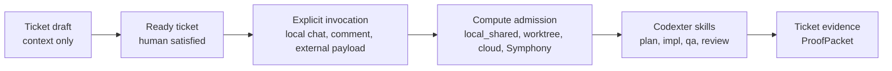

# TASK-0120: reframe Codexter as a ticket invocation layer

## Summary
Rename the working mental model from board orchestrator to ticket invocation
layer across the canonical docs. Codexter should be described as normal Codex
plus installed skills, ticket context, compute admission, and proof packets;
Symphony, Codex Cloud, and future systems remain optional external compute or
board-entry surfaces.

## Scope
- In:
  - Update canonical docs to say ticket existence never implies execution.
  - Make explicit invocation the control point: local chat, ticket comment,
    external runner payload, or future shared-board action.
  - Keep `WORKFLOW.md`, `BoardAdapter`, `ComputeSelector`,
    `CodexterRunEnvelope`, and `ProofPacket` as the useful Symphony imports.
  - Clarify that Codexter does not poll boards, claim remote work, run retries,
    or own long-running scheduling.
  - Mark `TASK-0081` as superseded or deferred by this thinner invocation
    framing instead of implementing it as a runtime-scaling system.
- Out:
  - No code changes to launch Codex, Codex Cloud, Symphony, or worktrees.
  - No Linear, Notion, or webhook implementation.
  - No background daemon, polling loop, or auto-run on ticket creation.

## Plan
- `Change:` Rewrite the public architecture language so Codexter is a ticket
  invocation/proof layer, not a board orchestrator or compute platform.
- `Why:` The Symphony comparison taught useful structure, but also showed that
  copying a scheduler daemon would fight the user's actual workflow: tickets
  are often drafts until the user explicitly invokes an agent.
- `Before -> After:`
  - Before: docs mix board/compute orchestration language with future
    Symphony-shaped scheduling, which makes local Codexter sound heavier than
    it should be.
  - After: docs consistently say tickets store context, invocation expresses
    intent, compute selection admits or blocks a handoff, and ProofPackets
    close the loop.
- `Touch:`
  - `docs/specs/board-compute-orchestration.md`
  - `docs/specs/symphony-compatible-codexter-runner.md`
  - `README.md`
  - `ARCHITECTURE.md`
  - `WORKFLOW.md`
  - `tickets/README.md`
  - `skills/codexter-invocation/SKILL.md`
  - `tickets/TASK-0081/ticket.md` only to mark the old runtime-scaling plan
    as deferred or superseded, not to implement it.
- `Inspect:`
  - `docs/specs/runtime-surface.md`
  - `docs/specs/orchestrator-subagent-loop.md`
  - `docs/MEMORY.md`
  - `tickets/archive/TASK-0111/ticket.md`
  - `tickets/archive/TASK-0119/ticket.md`
  - `bin/codexter_invocation.py`
  - `skills/ralph/SKILL.md`
- `Signature delta:`
  - `docs/specs/board-compute-orchestration.md / Core Decision`
  - `docs/specs/symphony-compatible-codexter-runner.md / Decision Boundaries`
  - `tickets/README.md / Field Meanings`
  - `skills/codexter-invocation/SKILL.md / Boundaries`
- `Type Sketch:`
  - `Ticket`: durable context and readiness fields; does not trigger work by
    itself.
  - `Invocation`: explicit human or external request to act on one ticket.
  - `ComputeDecision`: admission result for the chosen target; not a launcher.
  - `ProofPacket`: machine-readable result that external callers can inspect.
- `Typed flow example:`
  1. Human creates `TASK-0124` with a rough title and `ready: false`.
  2. No worker starts because ticket creation is not invocation.
  3. Human later says `@codexter implement TASK-0124` or asks local Codex to
     run the ticket.
  4. Codexter builds or reads a `CodexterRunEnvelope`.
  5. `ComputeSelector` accepts `local_shared` or blocks unsupported external
     targets.
  6. Existing phase skills run and write ticket evidence plus a `ProofPacket`.
- `Execution steps:`
  1. Replace board-orchestrator phrasing with ticket-invocation phrasing in
     the canonical docs.
  2. Add an invariant: no agent starts only because a ticket exists.
  3. Update Symphony references to say Symphony is an optional caller/daemon,
     while Codexter remains the installed Codex skill/proof layer.
  4. Update Codex Cloud references to say Codex Cloud is an external compute
     lane that Codexter may prepare payloads for later.
  5. Park `TASK-0081` as stale or deferred so it does not look like the next
     architecture milestone.
  6. Run doc parity, harness invariants, ticket metadata, and targeted greps for
     stale "board orchestrator" or auto-run wording.
- `Recommendation:` Land this docs-first reset before more runtime tickets.
  It prevents the next implementation pass from rebuilding Symphony by
  accident.
- `Options considered:`
  - Keep current language: zero work, but it keeps confusing board storage with
    execution intent.
  - Rename only in chat: fastest, but the next agent will rediscover the same
    ambiguity from docs.
  - Canonical docs reset: recommended; one small pass makes future tickets much
    easier to evaluate.
- `Blast radius:` public README, architecture map, specs, ticket contract,
  invocation skill, and any future planning ticket that reads these docs.
- `Risks:`
  - Overcorrecting and losing useful shared-board future language. Containment:
    keep BoardAdapter and Symphony as future callers, not live orchestrators.
  - Touching too many docs. Containment: update only canonical surfaces and use
    parity checks.

## Gap Analysis
- `Current state:` The repo now has the right primitives, but names still imply
  a heavier board/compute orchestration story in places.
- `Production expectation:` A reliable harness should make trigger semantics
  unambiguous: draft tickets do nothing; explicit invocations run work.
- `Missing gaps:` no single canonical phrase distinguishes ticket storage,
  invocation intent, compute admission, and external runner ownership.
- `Comparable implementations:` Symphony's daemon spec, Codex Cloud task
  commands, Codexter's `codexter-invocation` skill, and Ralph's serial selector.
- `Recommendation:` Reframe now; defer runtime automation until a real need
  appears.

## Diagram

## Acceptance Criteria
- [x] Docs consistently say ticket creation/state alone does not trigger
  execution.
- [x] Codexter is described as an installed Codex skill/proof layer, not a
  standalone daemon or replacement for Symphony/Codex Cloud.
- [x] `TASK-0081` is visibly parked, superseded, or rewritten so it is not the
  implied next milestone.
- [x] Future Symphony and Codex Cloud integration remain framed as external
  invocation/compute paths.

## Verification
- `Tests:`
  - `python3 tickets/scripts/check_ticket_metadata.py`
  - `python3 bin/check_doc_parity.py`
  - `python3 bin/check_harness_invariants.py`
- `Manual checks:`
  - `rg -n "board orchestrator|auto-spawn|auto-run|polling daemon|ticket invocation" README.md ARCHITECTURE.md docs/specs tickets/README.md skills/codexter-invocation/SKILL.md`
  - `python3 skills/ralph/scripts/select_next_ticket.py --root . --json`
- `Evidence required:`
  - Review artifact showing the language no longer implies Codexter owns
    background scheduling.

## Autonomy Readiness
- `Human inputs/assets:` user approval of this terminology reset.
- `Credentials / external access:` none.
- `Compute/runtime needs:` local docs/test commands only.
- `Tooling gaps:` none.
- `QA risks:` docs may drift from live helper behavior; use greps plus parity
  checks.
- `Human gates:` approval required before changing canonical docs.
- `Agent decision boundaries:` may reword docs and park stale tickets; may not
  implement new runners or adapters.

## Refs
- [board-compute orchestration](/Users/kenjipcx/coding-harness/Codexter/docs/specs/board-compute-orchestration.md)
- [Symphony-compatible runner spec](/Users/kenjipcx/coding-harness/Codexter/docs/specs/symphony-compatible-codexter-runner.md)
- [Codexter invocation skill](/Users/kenjipcx/coding-harness/Codexter/skills/codexter-invocation/SKILL.md)
- [TASK-0081](/Users/kenjipcx/coding-harness/Codexter/tickets/TASK-0081/ticket.md)

## Evidence
- `Artifacts:`
  - [next-batch plan review](/Users/kenjipcx/coding-harness/Codexter/tickets/archive/TASK-0120/artifacts/review/2026-05-06-next-batch-plan-review.json)
  - [implementation review](/Users/kenjipcx/coding-harness/Codexter/tickets/archive/TASK-0120/artifacts/review/2026-05-06-impl-review.json)
- `Commands:`
  - `python3 tickets/scripts/check_ticket_metadata.py`
  - `python3 bin/check_doc_parity.py`
  - `python3 bin/check_harness_invariants.py`
  - `python3 skills/ralph/scripts/select_next_ticket.py --root . --json`
  - `git diff --check -- README.md ARCHITECTURE.md WORKFLOW.md AGENTS.md docs/HISTORY.md docs/MEMORY.md docs/specs/README.md docs/specs/board-compute-orchestration.md docs/specs/symphony-compatible-codexter-runner.md tickets/README.md skills/codexter-invocation/SKILL.md tickets/TASK-0081/ticket.md tickets/TASK-0120/ticket.md`
  - `rg -n "board orchestrator|auto-run|polling daemon|ticket creation.*trigger|ticket existence.*trigger|ticket creation.*start|ready.*start|board/compute orchestration|Board and compute orchestration" README.md ARCHITECTURE.md WORKFLOW.md docs/specs/README.md docs/specs/board-compute-orchestration.md docs/specs/symphony-compatible-codexter-runner.md tickets/README.md skills/codexter-invocation/SKILL.md AGENTS.md`
- `Result summary:`
  - Canonical docs now distinguish ticket storage from explicit invocation.
  - `TASK-0081` is parked as premature runtime-scaling work.
  - Ralph skips `TASK-0081` as blocked and skipped `TASK-0120` while it was
    claimed for this build pass.
  - Stale-language grep only returned the new negative guardrail wording, not
    stale auto-run claims.

## Blockers
- none

## Handoff
- Closed by reframing Codexter as an explicit ticket invocation/proof layer and
  by parking runtime-scaling work that would rebuild background agents too
  early.
