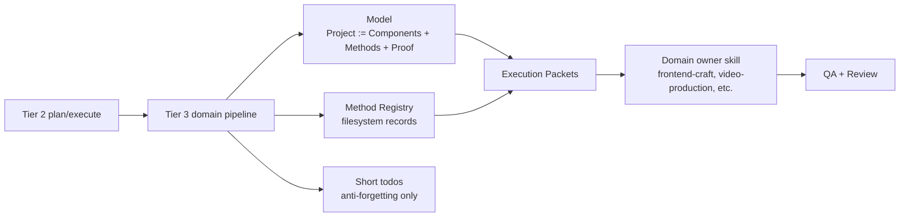

# TASK-0165: add algebraic tier 3 pipeline model and frontend pilot

## Summary
Codify the pattern from the landing-page/composed-scroll discussion into a
reusable Tier 3 skill-authoring convention: represent domain pipelines with a
compact algebraic model, a component matrix, method registries, per-component
selection, execution packets, and proof. Then pilot the convention on
`landing-page` and `frontend-craft` instead of bulk-rewriting every Tier 3
skill.

## Scope
- In:
  - update `skill-creator` with a compact algebraic/project-matrix convention
    for Tier 3 pipeline skills
  - update `skill-maintenance` with an audit/rollout rule for algebraic model
    adoption
  - add a shared reference or template for `Project`, `Component`, `Method`,
    `MethodSelection`, `ExecutionPacket`, and `Proof`
  - refactor `landing-page` toward short todos plus algebra/model/reference
    files
  - add method-selection guidance that lets `landing-page` choose
    `frontend-craft:composed-scroll-animation` only when the section matrix
    warrants it
  - update `frontend-craft` with the `composed-scroll-animation` method
    contract from `TASK-0159`
  - add small smoke fixtures or examples proving an agent can select a method
    from filesystem-backed records without rereading long prose
- Out:
  - bulk migration of all Tier 3 skills in one pass
  - adding `README.md` to every skill package
  - creating a new generic project-router skill
  - changing Tier 1/Tier 2 hierarchy or making `impl-plan` universal for every
    domain
  - implementing a deterministic validator for algebra adoption unless the
    pilot reveals a repeated mechanical failure

## Plan
- `Change:` introduce a reusable algebraic model convention for Tier 3 pipeline
  skills, then apply it to the landing-page/frontend-craft path as the pilot.
- `Why:` the current prose-heavy skill style makes domain pipelines harder to
  scan. The useful pattern is generic: a domain skill turns a brief into a
  component matrix, chooses methods for each component, emits execution packets,
  and proves outputs. This should be represented syntactically instead of only
  as long narrative instructions.
- `Before -> After:`
  - Before: Tier 3 pipeline skills often contain long prose recipes; method
    choice is described textually and can be hard to scan.
  - After: complex Tier 3 skills expose a compact algebra/model block,
    filesystem-visible method registries or references, short todos, and
    domain-specific execution/proof packets.
- `Touch:`
  - `skills/skill-creator/SKILL.md`
  - `skills/skill-creator/references/tier3-pipeline-model.md`
  - `skills/skill-maintenance/SKILL.md`
  - `skills/landing-page/SKILL.md`
  - `skills/landing-page/todos.md`
  - `skills/landing-page/references/planner-executor.md`
  - optional `skills/landing-page/references/model.md`
  - optional `skills/landing-page/references/section-matrix.md`
  - `skills/frontend-craft/SKILL.md`
  - `skills/frontend-craft/todos.md`
  - `skills/frontend-craft/references/composed-scroll-animation.md`
  - `docs/skills/README.md`
  - `docs/skills/registry.jsonl` through registry sync
  - `docs/HISTORY.md`
  - `tickets/TASK-0165/ticket.md`
- `Inspect:`
  - `skills/plan/SKILL.md`
  - `skills/execute/SKILL.md`
  - `skills/spec-to-ticket/SKILL.md`
  - `skills/impl-plan/SKILL.md`
  - `skills/skill-creator/SKILL.md`
  - `skills/skill-maintenance/SKILL.md`
  - `skills/landing-page/SKILL.md`
  - `skills/frontend-craft/SKILL.md`
  - `docs/skills/README.md`
  - `docs/specs/harness-engineering-doctrine.md`
- `Signature delta:`
  - `skill-creator/references/tier3-pipeline-model.md / Tier3Pipeline := Model + MethodRegistry + TodoRecipe + Templates + Proof`
  - `landing-page/references/model.md / LandingPage := Offer + Audience + StoryArc + SectionMatrix + AssetPlan + MotionPlan + ProofPlan`
  - `landing-page/references/model.md / Section := Job + Claim + Layout + AssetCarrier + MotionLever + ProofPayload + QA`
  - `landing-page/references/model.md / MethodSelection(section, methods, constraints): ChosenMethod`
  - `frontend-craft/references/composed-scroll-animation.md / ComposedScrollAnimation(component): ExecutionPacket`
- `Type Sketch:`
  - `Project`: `brief`, `component_matrix`, `method_set`, `constraints`,
    `execution_packets`, `proof_plan`
  - `Component`: `id`, `job`, `claim`, `inputs`, `levers`,
    `candidate_methods`, `chosen_method`, `owner_skill`, `output`, `proof`
  - `Method`: `id`, `use_when`, `avoid_when`, `inputs`, `outputs`, `cost`,
    `risk`, `proof`
  - `ExecutionPacket`: `component_id`, `owner_skill`, `method_id`, `inputs`,
    `ordered_steps`, `expected_artifacts`, `qa`
  - `ProofPlan`: `component_checks`, `whole_project_checks`, `review_rubrics`,
    `evidence`
- `Typed flow example:`
  - `landing-page` receives a product homepage request.
  - It builds `SectionMatrix` rows for Hero, Problem, Solution, Proof, CTA.
  - For Hero, it filters method records and compares three complete directions:
    static generated hero, cinematic frame sequence, composed scroll animation.
  - It chooses `composed-scroll-animation` only if the hero needs 6-12 layers,
    generated/cutout assets, scroll/timed phases, and source-frame QA.
  - It emits an execution packet to `frontend-craft:composed-scroll-animation`.
  - `frontend-craft` implements and `visual-qa`/landing QA prove the result.
- `Execution steps:`
  1. Add a compact Tier 3 pipeline model reference to `skill-creator`.
  2. Update `skill-maintenance` so future bulk work can audit whether a
     complex Tier 3 pipeline has a short algebra/model, method registry or
     reference, short todos, and proof contract.
  3. Refactor `landing-page/todos.md` into a short recipe that points to
     model/section-matrix/effect-stack references.
  4. Add or tighten `landing-page` model docs for `LandingPage`, `Section`,
     method selection, and execution packet handoff.
  5. Add `frontend-craft:composed-scroll-animation` as a method/reference with
     layer manifest, asset generation/cutout routing, timeline phases, debug
     hooks, source-frame QA, and gap report requirements.
  6. Add a small smoke example showing Hero method selection from filesystem
     method records.
  7. Run skill registry, todo tier, capability, and ticket metadata checks.
  8. Run review and write the result to this ticket.
- `Recommendation:` do one foundation-plus-pilot ticket. Do not bulk-transform
  all Tier 3 skills yet. The pilot should prove the notation is faster to read
  and does not weaken first-load execution.
- `Options considered:`
  1. Add a new generic `project-pipeline` skill: rejected because `plan` and
     `execute` already provide the Tier 2 interface, and another router would
     be hard to manage.
  2. Add an algebraic Tier 3 pipeline convention to `skill-creator` and pilot it
     on landing-page/frontend-craft: chosen because it keeps the hierarchy
     intact and proves the pattern where the need is clearest.
  3. Bulk migrate every Tier 3 skill now: rejected because it is too large,
     risks shallow mechanical rewrites, and gives weak proof that the convention
     actually helps.
- `Blast radius:`
  - skill authoring conventions
  - skill maintenance checks and expectations
  - landing-page planning flow
  - frontend-craft method routing
  - future Tier 3 pipeline migrations
- `Risks:`
  - over-mathematizing simple skills and making them less usable
  - creating new files that duplicate `SKILL.md`
  - turning method selection into a hidden router tree
  - making `todos.md` too abstract for agents to execute
  - prematurely migrating all Tier 3 skills without domain-specific proof

## Gap Analysis
- `Current state:` Codexter already has generic Tier 2 `plan` and `execute`,
  coding-specific Tier 3 `spec-to-ticket`, `impl-plan`, and `$impl`, plus rich
  domain Tier 3 skills. `landing-page` already has planner/executor and method
  registries, but the model is spread across long prose, todos, JSON records,
  and references.
- `Production expectation:` complex Tier 3 skills should be readable as a small
  algebra: domain object, components, method set, selection rule, execution
  packet, and proof contract. Detailed domain recipes should live in references
  or method records.
- `Missing gaps:` no common Tier 3 pipeline model guide, no shared notation for
  component matrices and method selection, and no first pilot that binds this
  model to landing-page plus frontend-craft.
- `Recommendation:` add the guide and pilot first, then decide whether other
  Tier 3 skills deserve migration.

## Diagram

## Acceptance Criteria
- [x] `skill-creator` documents the algebraic Tier 3 pipeline convention
      without requiring `README.md` files inside skills.
- [x] `skill-maintenance` documents how to audit complex Tier 3 skills for
      model/method/todo/proof structure.
- [x] `landing-page` has a compact model/reference for landing page variables,
      section matrix, method selection, and execution packet handoff.
- [x] `landing-page/todos.md` is shortened to a readable recipe that points to
      model/method references.
- [x] `frontend-craft` exposes `frontend-craft:composed-scroll-animation` with
      a method/reference contract.
- [x] The landing-page route explains when to choose composed scroll animation
      versus GSAP/frame sequence/Three.js/static media.
- [x] A smoke example proves method selection can be tested from Markdown/JSON
      artifacts without relying on long prose.
- [x] Skill registry and todo-tier checks pass.

## Verification
- `Tests:`
  - `python3 skills/skill-maintenance/scripts/check_skills.py --write`
  - `python3 bin/sync_skill_registry.py --check`
  - `python3 bin/check_skill_todo_tiers.py --allow-peer-tier3`
  - `python3 tickets/scripts/check_ticket_metadata.py`
- `Manual checks:`
  - Read only each changed `SKILL.md` plus short todos and confirm the base
    workflow still executes.
  - Read the algebra/model reference and confirm it makes the domain pipeline
    faster to scan than the previous prose-only shape.
  - Run the landing Hero method-selection smoke example and confirm it selects
    `frontend-craft:composed-scroll-animation` only for the right section
    constraints.
- `Evidence required:`
  - changed skill/model files
  - smoke fixture
  - validation command outputs
  - review artifact

## Proof Contract
- `Metrics:`
  - `Primary metric:` tier3_pipeline_model_validation_passed
  - `Direction:` pass/fail
  - `Verify:` skill checks plus smoke fixture inspection
  - `Guard:` no bulk Tier 3 migration and no required `README.md` files
  - `Min acceptable result:` foundation guide plus landing/frontend pilot pass
    checks and review
  - `Autoresearch warranted:` no
  - `Autoresearch session:` none
- `Review Rubrics:`
  - `spec-contract >= 4.0`
  - `implementation-plan >= 4.0`
  - `evidence-quality >= 4.0`
  - `integration-readiness >= 4.0`
- `Required Evidence:`
  - skill-system checks
  - landing/frontend smoke example
  - review artifact

## Autonomy Readiness
- `Human inputs/assets:` none beyond the accepted plan; no paid assets needed
- `Credentials / external access:` none
- `Compute/runtime needs:` local skill-check scripts only
- `Tooling gaps:` no validator until a repeated mechanical failure appears
- `QA risks:` notation may become too abstract; first-load contract must still
  work from `SKILL.md`
- `Human gates:` approval before bulk migration beyond landing/frontend pilot
- `Agent decision boundaries:` agents may edit the pilot skills and guide; they
  may not migrate all Tier 3 skills in this ticket

## Evidence Checklist
- [x] Skill creator guide:
  `skills/skill-creator/references/tier3-pipeline-model.md`
- [x] Skill maintenance update:
  `skills/skill-maintenance/SKILL.md`
- [x] Landing model/reference:
  `skills/landing-page/references/model.md`
- [x] Frontend composed-scroll method:
  `skills/frontend-craft/references/composed-scroll-animation.md`
- [x] Smoke fixture:
  `skills/landing-page/references/method-selection-smoke.md`
- [x] Validation logs:
  `python3 skills/skill-maintenance/scripts/check_skills.py --write`,
  `python3 bin/sync_skill_registry.py --check`,
  `python3 bin/check_skill_todo_tiers.py --allow-peer-tier3`, and
  `python3 tickets/scripts/check_ticket_metadata.py`
- [x] Review report:
  `tickets/TASK-0165/artifacts/review/2026-05-22-impl-plan-review.md`
  `tickets/TASK-0165/artifacts/review/2026-05-22-impl-review.md`

## Refs
- `skills/skill-creator/SKILL.md`
- `skills/skill-maintenance/SKILL.md`
- `skills/plan/SKILL.md`
- `skills/execute/SKILL.md`
- `skills/spec-to-ticket/SKILL.md`
- `skills/impl-plan/SKILL.md`
- `skills/landing-page/SKILL.md`
- `skills/frontend-craft/SKILL.md`
- `tickets/TASK-0159/ticket.md`

## Evidence
- `Artifacts:`
  - `tickets/TASK-0165/artifacts/review/2026-05-22-impl-plan-review.md`
  - `tickets/TASK-0165/artifacts/review/2026-05-22-impl-review.md`
- `Commands:`
  - `python3 tickets/scripts/check_ticket_metadata.py`
  - `python3 skills/skill-maintenance/scripts/check_skills.py --write`
  - `python3 bin/sync_skill_registry.py --check`
  - `python3 bin/check_skill_todo_tiers.py --allow-peer-tier3`
- `Result summary:`
  - algebraic Tier 3 pipeline guide added
  - landing-page model and short todos added
  - frontend-craft composed-scroll method contract added
  - validation and implementation review passed

## Closeout
- `Outcome:` archive and publish as the TASK-0165 slice.
- `Final checks:` skill registry sync, skill-system maintenance check, todo
  tier check, ticket metadata check, and diff whitespace check.
- `Commit scope:` TASK-0165 skill/model/ticket artifacts only; unrelated dirty
  telemetry, self-healing, and previous TASK-0158 files remain unstaged.

## Blockers
- none
