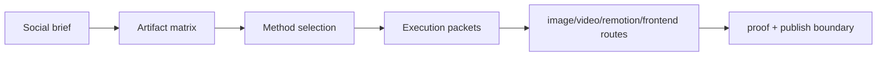

# TASK-0167: apply tier 3 pipeline model to social-content

## Summary
Refactor `social-content` into the compact Tier 3 pipeline pattern proven by
`TASK-0165`. The skill already has method addresses, but its first-load
workflow and todos still read like a long ordered recipe rather than a
component/method/output model.

The recommended shape is: the base skill owns the router, algebra, short
anti-forgetting todos, and registry-visible methods; method references stay as
supporting packets for platform-specific constraints, examples, and proof. Do
not create separate subskill packages or per-reference `todos.md` files for
each method.

## Scope
- In:
  - add compact `SocialContent := Brief + PlatformSet + ArtifactMatrix + MethodSet + AssetPlan + ProofPlan`
    model to `skills/social-content/SKILL.md`
  - add `skills/social-content/references/model.md` with artifact matrix,
    method selection, handoff packets, and proof rules
  - shorten `skills/social-content/todos.md` so it points to the model and
    method references instead of duplicating the full recipe inline
  - keep existing method addresses:
    `social-content:cross-platform`, `social-content:carousel`,
    `social-content:linkedin`, and `social-content:twitter-thread`
  - add a small method-selection smoke reference that proves the router picks
    carousel, thread, LinkedIn, or cross-platform based on artifact constraints
  - update generated skill registry and durable docs as required by
    `close-ticket`
- Out:
  - creating new standalone social subskills
  - rewriting the upstream reference docs unless a method-specific checklist is
    missing and materially useful
  - publishing, scheduling, posting, commenting, DMing, or uploading content
  - changing external generation tools

## Plan
- `Change:` migrate `social-content` from recipe-heavy first-load instructions
  to a compact model plus method-selection packet, preserving current method
  addresses.
- `Why:` social content is a Tier 3 router skill: it decomposes a brief into
  platforms, artifacts, copy/assets, routes, and proof. The algebraic shape
  makes that faster to scan without losing platform-specific references.
- `Before -> After:`
  - Before: `SKILL.md` and `todos.md` describe a long sequence of classification,
    reference loading, routing, generation, and proof steps.
  - After: `SKILL.md` states the model and method router; `todos.md` is short;
    `references/model.md` carries the artifact matrix and execution packet
    shape; method refs are loaded only when they matter.
- `Touch:`
  - `skills/social-content/SKILL.md`
  - `skills/social-content/todos.md`
  - `skills/social-content/references/model.md`
  - `skills/social-content/references/method-selection-smoke.md`
  - `docs/skills/registry.jsonl`
  - `docs/HISTORY.md`
- `Inspect:`
  - `skills/skill-creator/references/tier3-pipeline-model.md`
  - `skills/landing-page/references/model.md`
  - `skills/social-content/SKILL.md`
  - `skills/social-content/todos.md`
  - `skills/social-content/references/upstream-social.md`
  - `skills/social-content/references/upstream-carousel.md`
  - `skills/social-content/references/upstream-linkedin.md`
  - `skills/social-content/references/upstream-twitter.md`
  - `docs/skills/README.md`
- `Signature delta:`
  - `skills/social-content/SKILL.md / methods: social-content:*`
  - `skills/social-content/references/model.md / SocialContent(brief): ArtifactMatrix`
  - `skills/social-content/references/model.md / MethodSelection(artifact, methods, constraints): ExecutionPacket`
  - `skills/social-content/todos.md / checklist(model, method, proof): done`
- `Type Sketch:`
  - `SocialContent`: `brief`, `platform_set`, `artifact_matrix`, `method_set`,
    `asset_plan`, `handoff_packets`, `proof_plan`
  - `Artifact`: `id`, `platform`, `format`, `audience`, `message_job`,
    `copy_payload`, `asset_carrier`, `candidate_methods`, `chosen_method`,
    `owner_skill`, `proof`
  - `SocialMethod`: `id`, `use_when`, `avoid_when`, `inputs`, `outputs`,
    `platform_constraints`, `proof`
  - `ExecutionPacket`: `artifact_id`, `method_id`, `platform_specs`,
    `draft_steps`, `asset_route`, `publish_boundary`, `qa`
- `Typed flow example:`
  - User asks for an Instagram/LinkedIn launch carousel.
  - `social-content` builds two artifact rows: Instagram carousel and LinkedIn
    carousel adaptation.
  - Method selection chooses `social-content:carousel` as primary and
    `social-content:linkedin` as supporting only for platform voice and
    professional formatting.
  - The execution packet routes slide assets through `imagegen` or
    `image-generation`, precise HTML slide rendering through `frontend-craft`
    when needed, and proof through `execute`.
- `Execution steps:`
  1. Add the compact model prelude to `SKILL.md`.
  2. Add `references/model.md` with artifact matrix, method set, selection
     rule, execution packet, and proof plan.
  3. Add `references/method-selection-smoke.md` with positive and negative
     examples for carousel/thread/LinkedIn/cross-platform routing.
  4. Shorten `todos.md` to ground, model, select method, draft, route assets,
     prove, and respect publish boundaries.
  5. Keep upstream references as method detail; add local method-specific
     checklists inside `model.md` only if a method needs extra proof.
  6. Regenerate and validate skill registry.
  7. Run review and update evidence.
- `Recommendation:` keep one base router skill with method-addressed references.
  Do not create subskill packages or `todos.md` files under references.
- `Options considered:`
  1. Per-method subskills: rejected because social methods share one workflow
     surface and would create unnecessary routing overhead.
  2. Base router plus method references: chosen because it keeps the registry
     readable and allows method-specific proof without duplicating the whole
     checklist.
  3. Leave as-is: rejected because social-content is exactly the kind of
     pipeline-shaped Tier 3 skill the new model was meant to clarify.
- `Blast radius:`
  - social content planning
  - social content asset routing
  - generated skill registry method visibility
  - downstream image/video/remotion/frontend handoffs
- `Risks:`
  - making the model too abstract for quick caption/post requests
  - weakening platform-specific guardrails by over-shortening todos
  - accidentally implying publish permission when only planning/generation is
    authorized

## Gap Analysis
- `Current state:` `social-content` already has method addresses and upstream
  references, but no compact domain model or method-selection smoke proof.
- `Production expectation:` social/campaign workflows should make platform,
  format, message job, asset route, publish boundary, and proof explicit before
  content generation.
- `Missing gaps:` artifact matrix, model reference, smoke examples for method
  selection, and a shorter first-load todo list.
- `Comparable implementations:` local `landing-page` model and
  `frontend-craft:composed-scroll-animation` method contract from `TASK-0165`.
- `Recommendation:` land this as a focused docs/skill-structure change with
  no external generation.

## Diagram

## Acceptance Criteria
- [ ] `social-content` exposes a compact algebra/model in `SKILL.md`.
- [ ] `references/model.md` defines artifact matrix, method set, selection
      rule, execution packet, and proof plan.
- [ ] `todos.md` is shorter and points to model/method refs instead of
      duplicating full recipes.
- [ ] A smoke reference proves method selection for at least carousel,
      Twitter/X thread, LinkedIn, and cross-platform cases.
- [ ] Existing method addresses remain registry-visible.
- [ ] Skill registry, todo-tier, capability, and ticket metadata checks pass.

## Verification
- `Tests:`
  - `python3 skills/skill-maintenance/scripts/check_skills.py --write`
  - `python3 bin/sync_skill_registry.py --check`
  - `python3 bin/check_skill_todo_tiers.py --allow-peer-tier3`
  - `python3 bin/check_skill_capabilities.py validate`
  - `python3 tickets/scripts/check_ticket_metadata.py`
- `Manual checks:`
  - Inspect `social-content` first-load path and confirm quick post requests
    still have a simple path.
  - Inspect smoke examples and confirm method choice is based on complete
    artifact directions, not isolated variables.
- `Evidence required:`
  - changed skill/model/smoke files
  - regenerated registry diff
  - validation command outputs
  - review artifact

## Proof Contract
- `Metrics:`
  - `Primary metric:` social_content_pipeline_model_validation_passed
  - `Direction:` pass/fail
  - `Verify:` skill-system checks plus smoke reference inspection
  - `Guard:` no publish/post/upload side effects
  - `Min acceptable result:` model, short todos, method smoke, registry pass
  - `Autoresearch warranted:` no
  - `Autoresearch session:` none
- `Review Rubrics:`
  - `spec-contract >= 4.0`
  - `integration-readiness >= 4.0`
  - `evidence-quality >= 4.0`
- `Required Evidence:`
  - skill validation logs
  - method-selection smoke reference
  - review artifact

## Autonomy Readiness
- `Human inputs/assets:` none
- `Credentials / external access:` none
- `Compute/runtime needs:` local validators only

## Closeout
- Added the social content model reference, method-selection smoke cases, and a
  shorter model-first todo list while preserving existing method addresses.
- Verification passed:
  - `python3 skills/skill-maintenance/scripts/check_skills.py --write`
  - `python3 tickets/scripts/check_ticket_metadata.py`
  - `git diff --check`

## Evidence
- Review:
  `tickets/archive/TASK-0170/artifacts/review/2026-05-22-profile-tier3-batch-review.md`
- `Tooling gaps:` no deterministic parser for Markdown smoke examples
- `QA risks:` docs-only skill changes can look plausible without preserving
  quick-path usability
- `Human gates:` approval before execution
- `Agent decision boundaries:` agent may edit social-content skill docs and
  references; agent may not publish, post, or run paid generation

## Evidence Checklist
- [ ] Model reference:
- [ ] Method-selection smoke:
- [ ] Registry validation:
- [ ] Review report:

## Refs
- `skills/social-content/SKILL.md`
- `skills/social-content/todos.md`
- `skills/skill-creator/references/tier3-pipeline-model.md`
- `skills/landing-page/references/model.md`
- `tickets/archive/TASK-0165/ticket.md`

## Evidence
- `Artifacts:`
- `Commands:`
- `Result summary:`

## Blockers
- none
