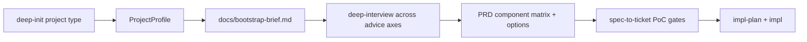

# TASK-0170: add profile-driven project planning

## Summary
Add a profile-driven planning layer so Codexter can initialize different project
types with component matrices, advice axes, prototype gates, and pipeline
handoffs before PRD and ticketization. The goal is to move exploration and
creative option generation earlier, then let Tier 3 domain pipelines consume a
clear profile-shaped PRD/spec instead of inventing the project structure during
implementation.

This is a coordinated harness planning change, not a new super-router.
`deep-init-project` owns the project profile reference and bootstrap template;
`deep-interview` asks along profile axes; `prd` writes component/options/PoC
sections; `spec-to-ticket` slices with prototype gates before broad build
tickets.

## Scope
- In:
  - add `skills/deep-init-project/references/project-profiles.md`
  - update the bootstrap brief template with project profile, components,
    advice axes, prototype gates, and pipeline handoff fields
  - update `deep-init-project` to describe project profiles as bootstrap
    context, not full domain pipelines
  - update `deep-interview` so bootstrap/profile mode asks across profile
    components and advice axes when a profile exists
  - update `prd` and PRD references so PRDs can include component matrices,
    explored options, selected directions, and early prototype/PoC gates
  - update `spec-to-ticket` so profile-driven specs create PoC/proof tickets
    before full production tickets when the profile declares a prototype gate
  - update skill docs/feature registry/history as required by closeout
  - make `TASK-0167` through `TASK-0169` depend on this ticket
- Out:
  - creating a new `project-pipeline` skill
  - adding hooks, validators, or subagents for this judgment-heavy planning
    behavior
  - implementing every project profile as a full domain pipeline
  - creating production assets or running model generation

## Plan
- `Change:` introduce a profile contract that seeds `deep-init-project`,
  `deep-interview`, `prd`, and `spec-to-ticket` with project-type components,
  advice axes, prototype gates, and pipeline handoffs.
- `Why:` the current flow has the right stages, but the project-type structure
  appears too late. Creative/profile exploration belongs before implementation,
  not inside `impl-plan`.
- `Before -> After:`
  - Before: bootstrap captures stack/testability and PRD captures generic
    requirements, while domain skills later infer components and options.
  - After: bootstrap carries a `ProjectProfile`; deep interview explores its
    advice axes; PRD records explored options and selected directions;
    spec-to-ticket turns high-risk prototype gates into early proof tickets.
- `Touch:`
  - `skills/deep-init-project/SKILL.md`
  - `skills/deep-init-project/todos.md`
  - `skills/deep-init-project/references/BOOTSTRAP_BRIEF_TEMPLATE.md`
  - `skills/deep-init-project/references/project-profiles.md`
  - `skills/deep-interview/SKILL.md`
  - `skills/deep-interview/todos.md`
  - `skills/prd/SKILL.md`
  - `skills/prd/todos.md`
  - `skills/prd/references/prd-template.md`
  - `skills/prd/references/requirements-discovery.md`
  - `skills/spec-to-ticket/SKILL.md`
  - `skills/spec-to-ticket/todos.md`
  - `docs/skills/README.md`
  - `docs/features/registry.jsonl`
  - `docs/HISTORY.md`
  - `tickets/TASK-0167/ticket.md`
  - `tickets/TASK-0168/ticket.md`
  - `tickets/TASK-0169/ticket.md`
- `Inspect:`
  - `skills/skill-creator/references/tier3-pipeline-model.md`
  - `skills/landing-page/references/model.md`
  - `skills/deep-init-project/SKILL.md`
  - `skills/deep-interview/SKILL.md`
  - `skills/prd/SKILL.md`
  - `skills/spec-to-ticket/SKILL.md`
  - `docs/specs/harness-engineering-doctrine.md`
  - `docs/skills/README.md`
  - `docs/features/registry.jsonl`
- `Signature delta:`
  - `project-profiles.md / ProjectProfile(project_type): ComponentSet + AdviceAxes + PrototypeGates + PipelineHandoff`
  - `BOOTSTRAP_BRIEF_TEMPLATE.md / Project Profile section`
  - `deep-interview / profile-aware interview(profile, answers): profile-shaped brief`
  - `prd / profile-shaped PRD(profile, options, directions): docs/prd.md`
  - `spec-to-ticket / prototype gate(profile, spec): PoCTicket before production tickets`
- `Type Sketch:`
  - `ProjectProfile`: `type`, `purpose`, `component_set`, `advice_axes`,
    `prd_todos`, `prototype_gates`, `pipeline_handoff`, `proof_surfaces`,
    `human_gates`
  - `Component`: `id`, `job`, `advice_axes`, `candidate_options`,
    `selected_direction`, `prototype_risk`, `proof`
  - `AdviceAxis`: `id`, `question`, `option_shape`, `default_count`,
    `synthesize_into`
  - `PrototypeGate`: `risk`, `poc_artifact`, `pass_signal`,
    `ticket_before_full_build`
  - `PipelineHandoff`: `owner_skill`, `method`, `inputs`, `output_packet`
- `Typed flow example:`
  - User starts `deep-init video project`.
  - `deep-init-project` selects `video-project` profile and writes profile
    fields into `docs/bootstrap-brief.md`.
  - `deep-interview` asks about hook, scene, asset, sound, motion, edit, CTA,
    export, and proof axes.
  - `prd` records explored options and selected complete directions.
  - `spec-to-ticket` creates an early proof ticket for the riskiest scene or
    motion/sound prototype before broader production tickets.
- `Execution steps:`
  1. Add the project profile reference with coding app, landing page, video
     project, social campaign, and product-photo shoot profiles.
  2. Extend the bootstrap brief template with profile, component matrix,
     advice axes, prototype gates, and pipeline handoff sections.
  3. Update `deep-init-project` docs/todos to select and preserve profiles.
  4. Update `deep-interview` docs/todos to ask along profile axes when present.
  5. Update `prd` docs/todos/templates to capture component options,
     synthesized directions, and early prototype gates.
  6. Update `spec-to-ticket` docs/todos to create PoC/proof tickets before
     production tickets when profile gates require them.
  7. Update `TASK-0167` through `TASK-0169` dependencies.
  8. Regenerate and validate skill registry and ticket metadata.
  9. Run review and write evidence.
- `Recommendation:` add profile-driven planning as one coordinated feature
  across existing skills; do not introduce a new router skill.
- `Options considered:`
  1. Put full recipes inside `deep-init-project`: rejected because it would
     duplicate domain skills and bloat bootstrap.
  2. Add a profile contract consumed by existing planning skills: chosen
     because it keeps ownership clean and pushes exploration earlier.
  3. Create a new `project-pipeline` skill: rejected because it would compete
     with `deep-init-project`, `prd`, `spec-to-ticket`, and Tier 3 domain
     skills.
- `Blast radius:`
  - bootstrap briefs
  - deep interview bootstrap/profile mode
  - PRD template and discovery flow
  - spec-to-ticket slicing rules
  - Tier 3 content-project rollout tickets
- `Risks:`
  - overfitting profiles into a universal project framework
  - making simple coding bootstrap feel heavier
  - creating prototype tickets mechanically when no real uncertainty exists

## Gap Analysis
- `Current state:` Codexter has a discovery funnel, bootstrap brief, PRD,
  spec-to-ticket, and Tier 3 pipeline model. They are not yet connected by a
  project-type profile contract.
- `Production expectation:` different project types should shape the questions,
  PRD sections, prototype gates, and ticket split strategy before build.
- `Missing gaps:` profile reference, bootstrap fields, profile-aware interview
  and PRD guidance, prototype-gate ticketization rule, and downstream ticket
  dependencies.
- `Comparable implementations:` `TASK-0165` Tier 3 model and local
  `landing-page` model show how component matrices make domain planning faster.
- `Recommendation:` land the profile contract first, then execute the first
  wave of domain-skill rollouts.

## Diagram

## Acceptance Criteria
- [ ] `deep-init-project` has a project-profile reference with at least five
      profiles.
- [ ] Bootstrap brief template captures profile, components, advice axes,
      prototype gates, and pipeline handoff.
- [ ] `deep-interview` instructs profile-aware questioning when a profile is
      present.
- [ ] `prd` template/discovery supports component matrices, explored options,
      synthesized directions, and early PoC gates.
- [ ] `spec-to-ticket` instructs agents to create early PoC/proof tickets
      before full production tickets when profile gates require them.
- [ ] `TASK-0167`, `TASK-0168`, and `TASK-0169` depend on `TASK-0170`.
- [ ] Skill registry, todo-tier, capability, and ticket metadata checks pass.

## Verification
- `Tests:`
  - `python3 skills/skill-maintenance/scripts/check_skills.py --write`
  - `python3 bin/sync_skill_registry.py --check`
  - `python3 bin/check_skill_todo_tiers.py --allow-peer-tier3`
  - `python3 bin/check_skill_capabilities.py validate`
  - `python3 tickets/scripts/check_ticket_metadata.py`
- `Manual checks:`
  - Read project profiles and confirm they seed PRD/deep-interview without
    duplicating full domain pipelines.
  - Confirm prototype gates are conditional on real risk, not automatic
    ticket spam.
- `Evidence required:`
  - changed profile/planning files
  - regenerated registry
  - ticket metadata output
  - review artifact

## Proof Contract

## Closeout
- Added the project profile reference, bootstrap profile fields, profile-aware
  deep-interview/PRD/spec-to-ticket guidance, and registry/history docs.
- Updated downstream rollout tickets to depend on this profile foundation.
- Verification passed:
  - `python3 skills/skill-maintenance/scripts/check_skills.py --write`
  - `python3 tickets/scripts/check_ticket_metadata.py`
  - `git diff --check`

## Evidence
- Review:
  `tickets/archive/TASK-0170/artifacts/review/2026-05-22-profile-tier3-batch-review.md`
- `Metrics:`
  - `Primary metric:` profile_driven_planning_validation_passed
  - `Direction:` pass/fail
  - `Verify:` skill checks and ticket metadata
  - `Guard:` no new router skill, hook, validator, or subagent
  - `Min acceptable result:` profiles plus planning-skill consumption rules
  - `Autoresearch warranted:` no
  - `Autoresearch session:` none
- `Review Rubrics:`
  - `spec-contract >= 4.0`
  - `integration-readiness >= 4.0`
  - `evidence-quality >= 4.0`
- `Required Evidence:`
  - validation logs
  - review artifact

## Autonomy Readiness
- `Human inputs/assets:` none
- `Credentials / external access:` none
- `Compute/runtime needs:` local validators only
- `Tooling gaps:` no deterministic validator for profile quality yet
- `QA risks:` profile docs may become abstract unless PRD/spec-to-ticket
  consumers are updated in the same ticket
- `Human gates:` approval before execution; no deploy/publish/spend
- `Agent decision boundaries:` agent may edit local planning skills and docs;
  agent may not introduce a new public router skill without a follow-up

## Evidence Checklist
- [ ] Project profile reference:
- [ ] Bootstrap brief template update:
- [ ] PRD/spec-to-ticket consumer updates:
- [ ] Registry and ticket metadata checks:
- [ ] Review report:

## Refs
- `skills/deep-init-project/SKILL.md`
- `skills/deep-interview/SKILL.md`
- `skills/prd/SKILL.md`
- `skills/spec-to-ticket/SKILL.md`
- `skills/skill-creator/references/tier3-pipeline-model.md`
- `tickets/archive/TASK-0165/ticket.md`

## Evidence
- `Artifacts:`
- `Commands:`
- `Result summary:`

## Blockers
- none
